[toc]

# 分层模型

- `Runtime`

  `Flink` 程序的最底层入口。提供了基础的核心接口完成流、状态、事件、时间等复杂操作，功能灵活。

- `DataStream API`

  面向开发者，基于`Runtime`层的抽象。

- `Table API`

  统一`DataStream/DataSet`，抽象成带有 `Schema`信息的表结构. 通过表操作和注册表完成数据计算。 

- `SQL`

  面向数据分析和开发人员，抽象为`SQL`操作。

# 计算模型

- `source`  支持多数据源输入
- `transformation` 数据的转换过程
- `sink` 数据的输出

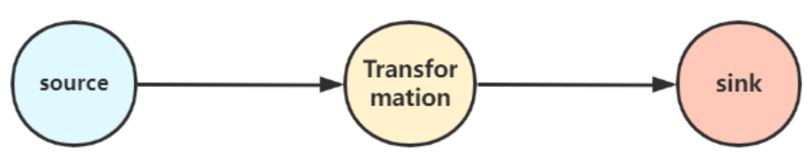

# 分布式缓存

目的是在本地读取文件，并把他放在`TaskManager`节点中，防止`task`重复拉取

```
object Distribute_cache {
  def main(args: Array[String]): Unit = {
    val env = ExecutionEnvironment.getExecutionEnvironment
    //1"开启分布式缓存
    val path = "hdfs://hadoop01:9000/score"
    env.registerCachedFile(path , "Distribute_cache")
    //3:开始进行关联操作
    DS<String>.map(new MyJoinmap()).print()
  }
}
class MyJoinmap() extends RichMapFunction[Clazz , ArrayBuffer[INFO]]{
  private var myLine = new ListBuffer[String]
  override def open(parameters: Configuration): Unit = {
    val file = getRuntimeContext.getDistributedCache.getFile("Distribute_cache")
  }

  //在map函数下进行关联操作
  override def map(value: Clazz):  ArrayBuffer[INFO] = {
  }
}
```

# 管理内存

`Flink` 并不是将大量对象存在堆上，而是将对象都序列化到一个预分配的内存块上。此外，`Flink`大量的使用了堆外内存。如果需要处理的数据超出了内存限制，则会将部分数据存储到硬盘上。`Flink` 为了直接操作二进制数据实现了自己的序列化框架。

- 堆内内存

  `Flink`程序在创建对象后，`JVM`会在堆内内存中`分配`一定大小的空间，创建`Class对象`并返回对象引用，`Flink`保存对象引用，同时记录占用的内存信息。

- 堆外内存

  堆外内存其底层调用`基于C`的`JDK Unsafe`类方法，通过`指针`直接进行内存的操作，包括内存空间的申请、使用、删除释放等

## `JobManager` 内存管理

```
# JobManager总进程内存
jobmanager.memory.process.size:

# 作业管理器的 JVM 堆内存大小
jobmanager.memory.heap.size：

#作业管理器的堆外内存大小。此选项涵盖所有堆外内存使用。
jobmanager.memory.off-heap.size：
```

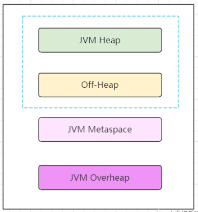

## `TaskManager` 内存

`TaskManager`内存同样包含`JVM`堆内内存、`JVM`堆外内存以及`JVM MetaData`内存三大块。

- `JVM`堆内内存又包含`Framework Heap`和`Task Heap`，即框架堆内存和任务`Task`堆内存。
- `JVM`堆外内存包含
  - `Memory memory`托管内存，主要用于保存排序、结果缓存、状态后端数据等。
  - `Direct Memory`直接内存
    - `Framework Off-Heap Memory`：`Flink`框架的堆外内存，即`Flink`中`TaskManager`的自身内存，和`slot`无关。
    - `Task Off-Heap`：`Task`的堆外内存
    - `Network Memory`：网络内存

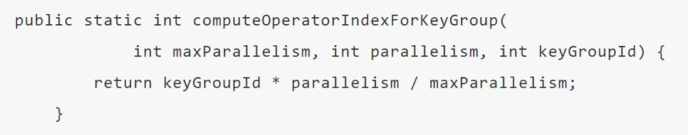

```
/ tm的框架堆内内存
taskmanager.memory.framework.heap.size=

// tm的任务堆内内存
taskmanager.memory.task.heap.size

// Flink管理的原生托管内存
taskmanager.memory.managed.size=
taskmanager.memory.managed.fraction=

// Flink 框架堆外内存
taskmanager.memory.framework.off-heap.size=

// Task 堆外内存
taskmanager.memory.task.off-heap.size=

// 网络数据交换所使用的堆外内存大小
taskmanager.memory.network.min: 64mb
taskmanager.memory.network.max: 1gb
taskmanager.memory.network.fraction: 0.1
```

# `window`出现的数据倾斜

`window`产生数据倾斜指的是数据在不同的窗口内堆积的数据量相差过多。本质上产生这种情况的原因是数据源头发送的数据量速度不同导致的。

1. 在数据进入窗口前做预聚合
2. 重新设计窗口聚合的key
3. 使用再平衡算子rebalance等

# 使用聚合函数处理热点数据

1. 对热点数据单独处理
2. 对热点数据进行拆分聚合；
3. 参数设置，设置微批模型，使缓存数据到达一定数量后触发。

# `Flink` `vs` `Spark`

|                        Spark                         |                         Flink                          |
| :--------------------------------------------------: | :----------------------------------------------------: |
|                       RDD模型                        |                基于数据流，基于事件驱动                |
|        微批处理（一个批完成后才能计算下一个）        | 无界实时流处理（事件在一个节点吹完成后发往下一个节点） |
|                       处理时间                       |               事件时间，，处理时间，水印               |
|                 窗口必须是批的整数倍                 |                    窗口类型多，灵活                    |
|                       没有状态                       |                         有状态                         |
|                     没有流式SQL                      |                       有流式SQL                        |
| 均提供统一的批处理和流处理API，支持高级编程语言和SQL |  均提供统一的批处理和流处理API，支持高级编程语言和SQL  |
|                都基于内存计算，速度快                |                 都基于内存计算，速度快                 |
|               都支持Exactly-once一致性               |                都支持Exactly-once一致性                |
|                都有完善的故障恢复机制                |                 都有完善的故障恢复机制                 |

# 泛型擦除

`Flink` 具有一个类型提取系统，可以分析函数的输入和返回类型，自动获取类型信息，从而获得对应的序列化器和反序列化器。由于泛型擦除的存在，在某些情况下，自动提取的信息不够精细，需要采取显式提供类型信息，才能使应用程序正常工作。

# 集群角色

- 客户端`Client`：代码由客户端获取并装换，然后提交给 `JobManager`;
- `JobManager`：对作业进行调度管理，并对作业进行转换任务，并将任务发送给`TaskManager`， 对失败任务做出反应，协调`checkpoint`
- `TaskManager`：处理数据任务，缓存和交换数据流（数据从一个tm传到另一个tm）
- `RecourceManager`：负责集群中的资源提供、回收、分配、管理`Task slots`
- `Dispatcher`：提交 `Flink` 应用程序执行，为每个提交的作业启动一个新的 `JobMaster`
- `JobMaster`：管理单个`JobGraph`的执行，每个作业都有自己的 `JobMaster`
- `task slot`：资源调度的最小单位，表示并发可以处理 task 的数量，一个 task slot 中可以执行多个算子。

# 部署模式

- ***会话模式***

  所有任务共享集群内的`JobManager`，所有作业会竞争集群中的资源

  节省作业提交资源开销（集群已存在），减少资源和线程切换工作。但是所有作业**共享一个`JobManager`**，导致`JobManager`压力激增，同时一旦某`Job`发生故障时会影响到其他作业（中断或重启）。一般仅适用于`短周期`、`小容量`作业。

  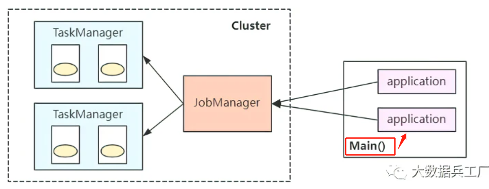

  ```
  bin/flink run -c  com.wc.SocketStreamWordCount  FlinkTutorial-1.0.jar
  ```

- ***单作业模式***

  每个提交的作业启动集群，各集群间相互独立，并在各自作业完成后销毁，最大限度保障资源隔离。每个`Job`均衡分发自身的`JobManager`，单独进行job的调度和执行。

  资源隔离，但是**每个`job`均维护一个集群**，启动、销毁以及资源请求消耗时间长，因此比较适用于长时间的任务执行（批处理任务）。

  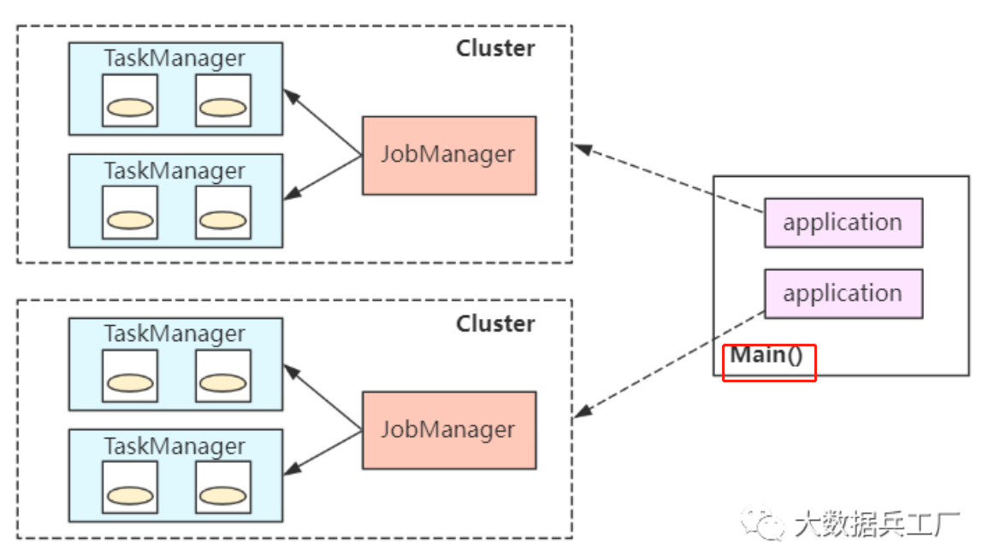

  ```
  bin/flink run -d -t yarn-per-job -c  com.wc.SocketStreamWordCount  FlinkTutorial-1.0.jar
  ```

- 应用模式

  将应用直接提交到`JobManager`上，每个应用都会启动一个`JobManager`，**但`Application`与`JobManager`合二为一。`Main`方法此时在`JobManager`中执行**，即在`JobManager`中完成`文件下载`、`jobGraph解析`、`提交资源`等事项。前面两种模式的`main`方法在`Client`端执行，该模式将大大减少`Client`压力。

  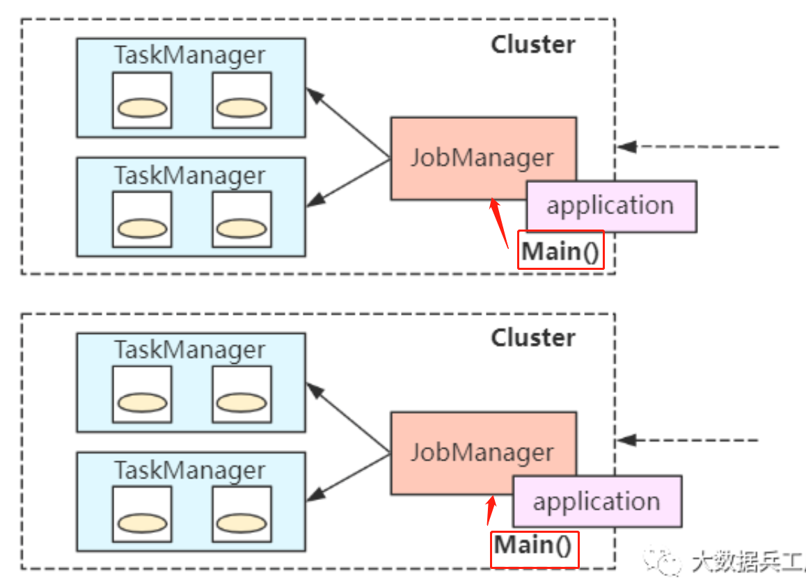
  
  ```
  bin/flink run-application -t yarn-application -c com.wc.SocketStreamWordCount FlinkTutorial-1.0.jar
  ```

# `Yarn` 运行模式

`YARN` 上部署的过程是：客户端把 `Flink` 应用提交给 `Yarn` 的 `ResourceManager`，`Yarn` 的`ResourceManager` 会向 `Yarn` 的 `NodeManager` 申请容器。在这些容器上，`Flink` 会部署`JobManager` 和 `TaskManager` 的实例，从而启动集群。`Flink` 会根据运行在 `JobManger` 上的作业所需要的 `Slot` 数量动态分配 `TaskManager` 资源。

# `Flink on K8s` 

`k8s`是一个强大的，可移植的高性能的容器编排工具。这里的容器指的是 docker 容器化技术，它通过将执行环境和配置打包成镜像服务，在任务环境下快速部署docker容器，提供基础的环境服务。解决之前部署服务速度慢，迁移难，高成本的问题。

`k8s`提供了一套完整地容器化编排解决方案，实现容器发现和调度，负载均衡，弹性扩容，数据卷挂载等服务。

`Flink on k8s`与`Flink on yarn`提交比较类似，`TaskManager`和`JobManager`等组件变成了`k8s pod`角色

1. `K8s`集群根据提交的配置文件启动`K8sMaster`和`TaskManager`（`K8s Pod`对象）
2. 依次启动`Flink`的`JobManager`、`JobMaster`、`Deploy`和`K8sRM`进程（K8s Pod对象）；过程中完成`slots请求`和`ExecutionGraph`的生成动作。
3. `TaskManager`注册`Slots`、`JobManager`请求`Slots`并分配任务
4. 部署`Task`执行并反馈状态

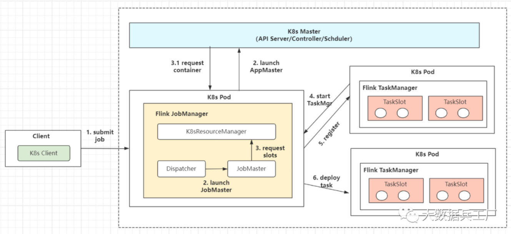

# 执行图有哪几种

- `StreamGraph`  (`Client`)

  编写的流程图，通过`Stream API`生成，是执行图的最原始拓扑数据结构

- `JobGraph` (`Client` -> `JobManager`)

  `StreamGraph`在`Client`中经过算子`chain`链做合并优化，将其转换为`JobGraph`拓扑图。并被提交到 `JobManager`。

- `ExecutionGraph` (`JobManager` )

  `JobManager`中将`JobGraph`进一步转换为`ExecutionGraph`，此时`ExecutuonGraph`根据算子配置的并行度转变为并行化的Graph拓扑结构。
  
- 物理执行图 （`JobManager` -> `TaskManager`）
  
  `JobManager`进行`Job`调度，`TaskManager`最终部署Task的图结构。

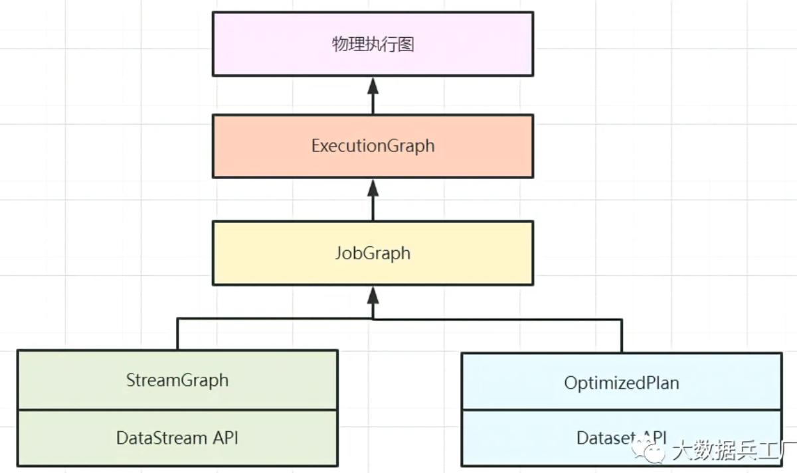

# 分区
建议在使用 `Flink` 消费 `Kafka` 数据时，最好保持上下游并行度一致。也就是说，尽量将 `Kafka` 的分区数设置为 `Flink Consumer` 的并行度。

但是在某些情况下，为了提高数据处理速度，您可能需要将 `Flink` 消费者的并行度设置得大于 `Kafka` 的分区数。如果不进行任何设置，可能会导致某些 `Flink Consumer` 线程无法消费到数据。因此，需要进行 `Flink` 的重新分配（`Redistributing`）操作，即对数据进行重分配。

- 随机分配 -- `shuffle`

  数据随机的分配到下游算子的并行任务中，服从均匀分布，数据随机打乱，均匀传递到下游任务分区。每次`shuffle`在子分区内会得到不同的结果

- 轮询分配 -- `rebalance`

  按照数据的先后顺序将数据依次分发，按照轮询的方式，将输入流数据平均分配到下游的并行任务中。

- 重缩放 -- `rescala`

  只会将数据轮询发送到下游并行任务的一部分中

- 广播 -- `broadcast`

  数据会在不同的分区都保留一份，可能进行重复处理

- 全局分区 -- `global`

  输入流数据都发送到下游算子的第一个并行子任务中去

- 自定义分区 -- `partitioner`

# 任务槽`Task slot`

为了控制并发量，我们需要在TaskManager 上对每个任务运行所占用的资源做出明确的划分，这就是任务槽（task slots）.

任务槽决定了`TaskManager`能够并行处理的任务数量。

每个任务槽（task slot）表示了 TaskManager 拥有固定大小集合的计算资源，这些资源就是用来独立执行一个子任务的。

slot 目前仅仅用来隔离内存，不会涉及 CPU 的隔离。在具体应用时，可以将 slot数量配置为机器的 CPU核心数，尽量避免不同任务之间对 CPU的竞争

TaskManager具有的并发执行能 力，可以通过参数 `taskmanager.numberOfTaskSlots` 进行配置

# 并行度

一个特定算子的子任务（subtask）的个数被称之为其并行度（parallelism）

包含并行子任务的数据流，就是并行数据流，它需要多个分区（stream partition）来分配并行任务。

并行度是动态概念，也就是 TaskManager 运行程序时实际使用的并发能力，可以通过参数 `parallelism.default`进行配置

# 窗口理解

窗口可以理解成一个桶， 在`Flink`中，窗口可以把流切割成有限大小的多个“存储桶”（`bucket`)；每个数据都会分发到对应的桶中，当到达窗口结束时间时，就对每个桶中收集的数据进行计算处理。

`Flink` 中窗口并不是静态准备好的，而是动态创建——当有落在这个窗口区间范围的数据达到时，才创建对应的窗口。

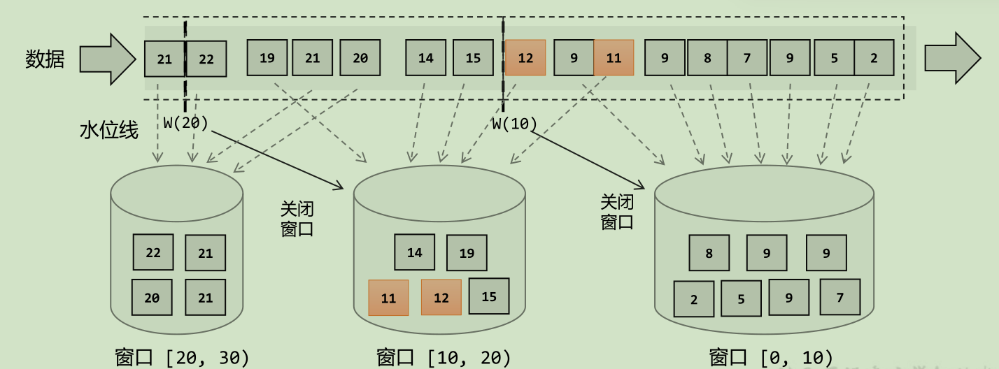
- 滚动窗口
- 滑动窗口
- 会话窗口
- 全局窗口
# `Flink SQL` 是如何实现的

1. `SQL query` 经过 `Calcite`解析转换成`SQL`节点树，通过验证后构建成`Calcite`的抽象语法树（Logical plan）。
2. `Table API`上的调用会构建成`Table API`的抽象语法树，并通过`Calcite`提供的`RelBuilder`转变成`Calcite`的逻辑计划（Logical plan）。
3. 逻辑计划被优化器优化后，转化成物理计划和 `JobGraph`；
4. 在提交任务后会分发到各个 `TaskManager` 中运行，在运行时会使用 `Janino` 编译器编译代码后运行。

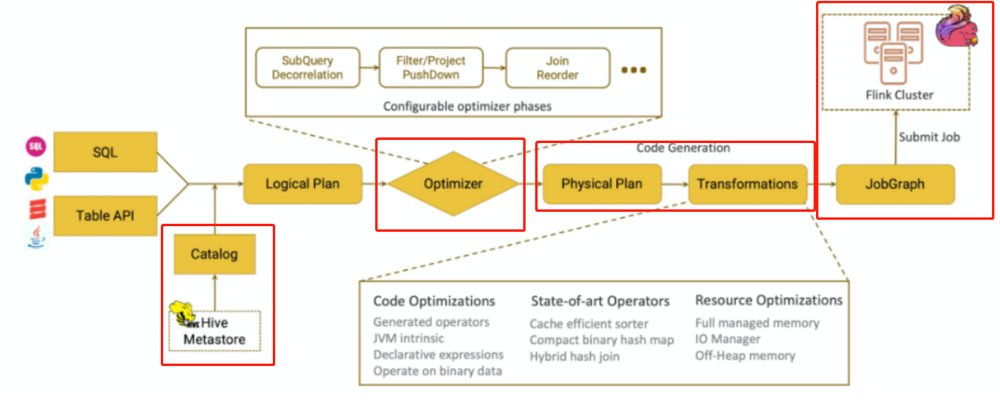

解析 -> 编译 -> 优化 -> 执行

抽象语法树 -> 逻辑计划 -> 执行计划

# 海量数据的高效去重

1. 基于状态后端，内存去重。采用`Hashset`等数据结构，读取数据中类似主键等唯一性标识字段，在内存中存储并进行去重判断。
2. 基于`HyperLog`，不是精准的去重
3. 基于布隆过滤器；快速判断一个key是否存在于某容器，不存在就直接返回。
4. 基于`BitMap`；用一个bit位来标记某个元素对应的`Value`，而`Key`即是该元素。由于采用了Bit为单位来存储数据，因此可以大大节省存储空间。
5. 基于外部数据库；选择使用`Redis`或者`HBase`存储数据，我们只需要设计好存储的`Key`即可，不需要关心`Flink`任务重启造成的状态丢失问题。使用`Redis Key`去重。借助Redis的`Hset`等特殊数据类型，自动完成`Key`去重。
6. `DataFrame/SQL`场景，使用`group by`、`over`、`window`开窗等`SQL`函数去重
7. 利用`groupByKey`等聚合算子去重

# `Flink`中`Task`如何做到数据交换

在一个 `Flink Job` 中，数据需要在不同的 task 中进行交换，整个数据交换是有 `TaskManager` 负责的，`TaskManager` 的网络组件首先从缓冲 `buffer` 中收集 `records`，然后再发送。`Records` 并不是一个一个被发送的，是积累一个批次再发送，`batch` 技术可以更加高效的利用网络资源。

# `Flink`设置并行度的方式
1. 代码层面：操作算子层面`map().setParallelism(10)`
2. 执行环境层面 `./flink -p 10`
3. 客户端层面`env.setParallelism(10)`
4. 系统层面`fink-conf.yaml`

优先级**依次降低**

# 水印`watermark`
`Flink`中的水印是处理延迟数据的优化机制。当这类数据因为某些原因导致乱序或是延迟到达，这类数据不能丢弃也不能无限等待。

在一个窗口内，当位于窗口（最大事件时间戳 - watermark）>= (当前窗口最小时间戳 + 窗口大小) 的数据到达后，表明该窗口内的所有数据均已到达，此时不会再等待，直接触发窗口计算。

## 作用
1. 规定了数据延迟处理的最优判定，即`watermark`时间间隔；
2. 较为完善的处理了数据乱序问题，从而输出预期结果；
3. 结合最大延迟时间和侧输出流机制，彻底解决数据延迟。

## 形式
- 有序流中内置水位线设置
  对于有序流，主要特点就是时间戳单调增长，所以永远不会出现迟到的数据。`WatermarkStrategy.forMonotonousTimestamps()`

- 乱序流中内置水位线设置
  由于乱序流中需要等待迟到数据到齐，所以必须设置一个固定的延迟时间。`WatermarkStrategy. forBoundedOutOfOrderness(Duration.ofSeconds(3))`

- 自定义水位线生成器
  - 周期性水位线生成器（Periodic Generator）
    周期性生成器一般是通过 `onEvent()`观察判断输入的事件，而在 `onPeriodicEmit()`里发出水位线。
  - 断点式水位线生成器 （Punctuated Generator）
    断点式生成器会不停地检测 `onEvent()`中的事件，当发现带有水位线信息的事件时，就会立即 发出水位线。

  - 在数据源中发送水位线
    自定义的数据源中抽取事件时间，然后发送水位线

## 水位线的传递
在流处理中，上游任务处理完水位线、时钟改变之后，要把当前的水位线再次发出，广播给所有的下游子任务。而当一个任务接收到多个上游并行任务传递来的水位线时，应该以最小的那个作为当前任务的事件时间。

比如：有两条流在进行`join`时，A流的时间为1，B流的时间为2，那么此时当前的事件时间最小为1。接下来A流时间为3，而B流的时间没有变，那么此时当前的事件时间最小为2。当前的事件时间只会递增而不是减少。

# 分布式快照
分布式快照 ，一致性检查点 `Checkpoint`，某个时间点上所有任务（一个完整的`Job`）状态的一份拷贝，该时间点也是所有任务刚好处理完一个相同数据的时间。该行为是采取一步插入`barrier`检查点的方式。

1. 触发检查点：`JobManager`向`source`发送`barrier`;
2. `barrier`发送：向下游广播发送；
3. `barrier`**对齐**：下游需要收到上游所有并行度传递过来的`barrier`才可以做状态的保存；
4. 状态保存：有状态的算子将状态保存持久化；
5. 先处理缓冲区的数据（在等待其他`barrier`时的，该分区已经来的数据，在对齐`barrier`分区中不会被处理后面`barrier`的数据，除非其他`barrier`都已经完成，完成快照后），然后再正常继续处理。
6. 当`JobManager`收到**所有算子任务**成功保存状态的信息，就可以确认当前检查点已经保存成功了。

- 对齐`barrier`
  等待上游多个`barrier`全部到齐处理后，才能将该算子进行状态的保存。
  
- 非对齐`barrier`

  当流速快的Barrier流到下游算子当中，此时不理会此`Barrier`，正常进行后续数据的计算。当流速慢的`Barrier`到来的时候，才完成进行快照，但是不会将后续数据快照，而是仍作为后续的`Barrier`中的数据。

# 状态机制
- 状态：本质上是数据，包括 `MapState`，`ValueState`，`ListState`
- 状态后端：`HashState`，`RocksDB`；
- 状态管理：定时将状态后端中存储的状态同步到远程的存储系统的组件中，可以在任务故障转移时，从远程将状态数据恢复到任务中。

`RocksDB`只会影响任务中的 `keyed-state`存储的方式和地方，对 `operator-state`不会受到影响。

- `keyed-state` 键值状态

  以 `k-v`形式存储，状态值和`key`绑定，紧跟在 `keyBy` 之后才能使用的状态。 

- `operator-state` 操作状态

  非`k-v` 形式的算子结构，状态值与算子绑定，如 `kafka` `offset` 被保存在 `ListState`

# 状态后端的选择

- `MemoryStateBackend`

  - 运行时的状态数据保存在 `TaskManager JVM` 堆上内存 (保证`TaskManager`的堆上内存可用)

  - 执行`Checkpoint`时，将快照数据保存到`JobManager`进程的内存中 （需要保证`JobManager`的内存可用）

  - 在执行`Savepoint`时，将快照存储到文件系统。

  使用环境：在本地开发调试测试，生产环境基本不用。

- `FSStateBackend`

  - 运行时将状态数据保存到 `TaskManager`的内存中；

  - `Checkpoint`时，将状态快照保存到配置的文件系统中；
  - `TaskManager`异步将状态数据写入外部存储

  使用环境：用于处理小状态、短窗口、或者小键值状态的有状态处理任务

- `RocksDBStateBackend`

  - 使用本地数据库 `RocksDB` 将流计算数据状态存储在本地磁盘中
  - `Checkpoint` 时，将整个 `RocksDB` 中保存的 `State` 数据全量或者增量持久化到配置的文件系统中

  使用环境：处理大状态、长窗口，或大键值状态的有状态处理任务；唯一支持增量检查点的后端；大状态的任务都建议直接使用 `RocksDB` 状态后端

# 状态的过期机制

`Flink`的过期机制支持`onCreateAndWrite`和`onReadAndWrite` 两种，默认为 `onCreateAndWrite`

- `onCreateAndWrite` 在创建和写入时更新 `TTL`
- `onReadAndWrite` 在访问和写入时更新 `TTL`

# 状态的区别

|                         keyed state                          |                        operator state                        |
| :----------------------------------------------------------: | :----------------------------------------------------------: |
|                    仅`keyedStream`的算子                     |                           所有算子                           |
| `ValueState`：简单的存储一个变量，不要保存集合之类的，这样序列化和反序列化成本很高。TTL针对整个 Value<br/>`ListState`<br/>`MapState`：和HashMap的使用方式一样，TTL只针对一个key<br/> `ReducingState`<br/>`AggregatingState` | `ListState`：均匀划分到算子的每个 sub-task 上，每个状态的数据不相同<br/>`BroadcastState`：每个 sub-task 的广播状态都一样，每个状态的数据相同<br/>`UnionListState`：合并后的数据每个算子都有一份全量状态数据，每个状态的数据相同 |
|               `RichFunction` 从 `context` 获取               |       重写`Checkpointed Function`或`ListCheckpointed`        |
|                 以单`key`粒度访问、变更状态                  |                以单算子并发粒度访问，变更状态                |
| 状态随`keyGroup`在算子上进行重分配。当任务并行度变化时，会将 key-group 重新划分到算子不同的 sub-task 上，任务启动后，任务数据在做 keyby 进行数据 shuffle 时，依然能够按照当前数据的 key 发到下游能够处理这个 key 的 key-group 中进行处理 |                均匀分配，合并后到每个得到全部                |

# 状态的TTL

1. 更新TTL的时机；
2. 访问到已过期数据的数据可见性；
3. 只支持处理时间语义；
4. lazy处理，后台线程

```
StateTtlConfig.Builder builder = StateTtlConfig
                // ttl 时长
                .newBuilder(Time.milliseconds(1))
                // 更新类型
                .setUpdateType(StateTtlConfig.UpdateType.OnCreateAndWrite)
                // 创建和写入更新
                .updateTtlOnCreateAndWrite()
                // 读取和写入更新
                .updateTtlOnReadAndWrite()
                // 过期状态的访问可见性
                .setStateVisibility(StateTtlConfig.StateVisibility.NeverReturnExpired)
                // 如果还没有被删除就返回
                .returnExpiredIfNotCleanedUp()
                // 过期的永远不返回
                .neverReturnExpired().cleanupFullSnapshot()
                // 过期的时间语义
                .setTtlTimeCharacteristic(StateTtlConfig.TtlTimeCharacteristic.ProcessingTime)
                .useProcessingTime()
                // 清除策略
                // 从 cp 或 sp 恢复时清除过期状态
                .cleanupFullSnapshot()
                // 增量删除，只有有状态记录访问时，才会做删除，并且他会加大任务处理时延
                // 增量删除仅仅支持 HeapStateBeckend, 不支持 Rocksdb
                // 每访问1次State，遍历相应次数删除
                .cleanupIncrementally(1000)
                // Rocksdb状态后端在rocksdb做compaction时清除过期状态
                //做compaction时每隔3个entry，重新更新时间戳，（用于判断是否过期）
                .cleanupInRocksdbCompactFilter(3)
                // 禁用 cleanup
                .disableCleanupInBackground()
                .build();
```

# 状态过期数据处理

- 如果状态`State TTL` 没有设置时， 直接将数据存储在`State`
- 如果状态`State TTL`设置时，会以`<value,  ts>`保存，`ts` 是时间戳

任务设置了 `State TTL` 和不设置 `State TTL` 的状态是不兼容的，防止出现任务从 `Checkpoint` 恢复不了的情况。但是你可以去修改 `TTL` 时长，因为修改时长并不会改变 `State` 存储结构。

- 懒删除策略

  访问 `State` 的时候根据时间戳判断是否过期，如果过期则主动删除 `State` 数据。

  这个删除策略是不需要用户进行配置的，只要你打开了 `State TTL` 功能，就会默认执行。

- 全量快照清除策略

  从状态恢复（`checkpoint`、`savepoint`）的时候采取做过期删除，但是不支持 `rocksdb` 增量 `ck`

- 增量快照清除策略

  访问 `state` 的时候，主动去遍历一些 `state` 数据判断是否过期，如果过期则主动删除 `State` 数据

  - 如果没有 `state` 访问，也没有处理数据，则不会清理过期数据。
  - 增量清理会增加数据处理的耗时。
  - 现在仅 `Heap state backend` 支持增量清除机制。在 `RocksDB state backend` 上启用该特性无效。
  - 因为是遍历删除 `State` 机制，并且每次遍历的条目数是固定的，所以可能会出现部分过期的 `State` 很长时间都过期不掉导致 `Flink` 任务 `OOM`。

- `rocksdb`合并清除策略

  `rockdb` 做 `compaction` 的时候遍历进行删除。仅仅支持 `rocksdb`

  `rocksdb compaction` 时调用 `TTL` 过滤器会降低 `compaction` 速度。因为 `TTL` 过滤器需要解析上次访问的时间戳，并对每个将参与压缩的状态进行是否过期检查。对于集合型状态类型（比如 `ListState` 和 `MapState`），会对集合中每个元素进行检查。

# `Flink/Spark/Hive SQL`的执行原理

## `Hive SQL`
`Hive SQL`是`Hive`提供的`SQL`查询引擎，底层是`MR`实现的，`Hive`根据输入的`SQL`语句执行词法分析、语法树构建、编译、逻辑计划、优化逻辑计划、物理计划，转化为`MR Task`最终交由`MR`引擎执行。

- 执行引擎。具有`mapreduce`的一切特性，适合大批量数据离线处理，相较于`Spark`而言，速度较慢且`IO`操作频繁
- 有完整的`hql`语法，支持基本`sql`语法、函数和`udf`
- 对表数据存储格式有要求，不同存储、压缩格式性能不同

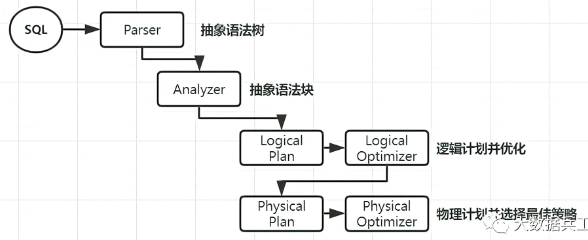

## `Spark SQL`

Spark SQL底层基于`Spark`引擎，使用`Antlr`解析语法，编译生成逻辑计划和物理计划。

- 输入编写的`Spark SQL`
- `SqlParser`分析器。进行语法检查、词义分析，生成未绑定的`Logical Plan`逻辑计划(未绑定查询数据的元数据信息，比如查询什么文件，查询那些列等)
- `Analyzer`解析器。查询元数据信息并绑定，生成完整的逻辑计划。此时可以知道具体的数据位置和对象，`Logical Plan` 形如`from table -> filter column -> select` 形式的树结构
- `Optimizer`优化器。选择最好的一个`Logical Plan`，并优化其中的不合理的地方。常见的例如谓词下推、剪枝、合并等优化操作
- `Planner`使用`Planing Strategies`将逻辑计划转化为物理计划，并根据最佳策略选择出的物理计划作为最终的执行计划
- 调用`Spark Plan` `Execution`执行引擎执行`Spark RDD`任务

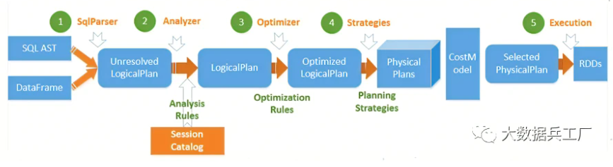

## `Flink SQL`

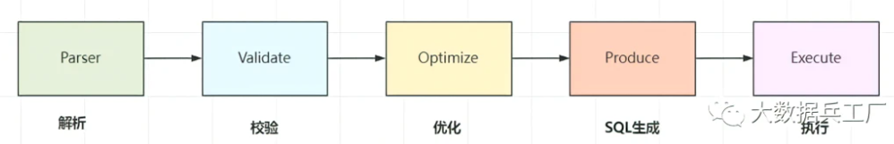
- `Parser`：`SQL解析`。底层通过`JavaCC`解析`SQL`语法，并将`SQL`解析为未经校验的`AST`语法树。
- `Validate`：`SQL校验`。这里会校验`SQL`的合法性，比如`Schema`、字段、数据类型等是否合法（`SQL`匹配程度），过程需要与`sql`存储的元数据结合查验。
- `Optimize`：`SQL优化`。`Flink`内部使用多种优化器，将前面步骤的语法树进一步优化，针对`RelNode`和生成的逻辑计划，随后生成物理执行计划。
- `Produce`：`SQL生成`。将物理执行计划生成在特定平台的可执行程序。
- `Execute`：`SQL执行`。执行`SQL`得到结果。

## 总结

均存在解析、校验、编译生成语法树、优化生成逻辑计划等步骤，都是将物理执行计划使用相应的引擎做计算

# 反压（背压）

## 表现

1. 运行时是正常的，但是会出现大量`Task`任务等待;
2. 少数`Task`任务开始报`checkpoint`超时问题；
3. 大量`Kafka`数据堆积，导致消费不及时；
4. `WEB UI`的`BackPressure`页面会显示`High`标识

## 原因

- **算子性能问题**：`当前Task`任务处理速度慢，比如`task`任务中调用算法处理等复杂逻辑，导致上游申请不到足够内存。
- **数据倾斜问题**：`下游Task`任务处理速度慢，比如多次`collect()`输出到下游，导致当前节点无法申请足够的内存。

## 影响

频繁反压会导致流处理作业数据延迟增加，同时还会影响到`Checkpoint`。

`Checkpoint`时需要进行`Barrier`对齐，此时若某个`Task`出现`反压`，`Barrier`流动速度会下降，导致`Checkpoint`变慢甚至超时，任务整体也变慢。

## 机制

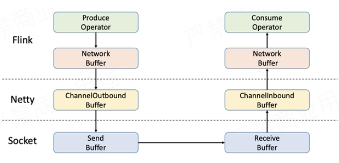

反压时一般下游速度慢于上游速度，数据`久积成疾`，需要做限流。`Task`任务需要保持上下游动态反馈，如果下游速度慢，则上游限速；否则上游提速。实现动态自动反压的效果。

1. 每个`TaskManager`都有一个`Network buffer pool`，该内存实在堆外内存申请的；
2. 同时每个`Task`创建自身的`Local BufferPool`（本地内存），并于`Network BufferPool` 交换内存；
3. 上游`Record Writer`向`Local BufferPool`申请内存写数据，如果该内存不足，则向共享内存`Network BufferPool`申请内存写数据，如果使用完毕，则会释放。
4. 本次`Task`任务会将内存中的发送到网络，然后下游端按照类似的机制进行处理；
5. 当下游申请`buffer`失败，表示当前节点内存不足（反压了），则发送反压信号给上游，上游减慢数据的处理发送，直到下游恢复。

**总结**：下游由于各种原因导致当前任务申请内存不足，使得上游数据无法发送过来。这个过程就是反压上传。

## 处理

### 缓解处理

**OK**: `0 <= Ratio <= 0.10`，表示状态良好正；

**LOW**: `0.10 < Ratio <= 0.5`，表示有待观察；

**HIGH**: `0.5 < Ratio <= 1`，表示要处理了（增加并行度/`subTask`/检查是否有数据倾斜/增加内存）

- 事前：解决上述介绍到的 `数据倾斜`、`算子性能` 问题。
-  事中：在出现反压时：
  - **限制数据源的消费数据速度**。比如在事件时间窗口的应用中，可以自己设置在数据源处加一些限流措施，让每个数据源都能够够匀速消费数据，避免出现有的 `Source` 快，有的 `Source` 慢，导致窗口 `input pool` 打满，`watermark` 对不齐导致任务卡住。
  - **关闭 Checkpoint**。关闭 `Checkpoint` 可以将 `barrier` 对齐这一步省略掉，促使任务能够快速回溯数据。我们可以在数据回溯完成之后，再将 `Checkpoint` 打开。

### 处理过程

- 查看`Flink UI`界面，定位哪些`Task`出现反压问题
- 查看代码和数据，检查是否出现数据倾斜
- 如果发生数据倾斜，进行预聚合`key`或拆分数据
- 加大执行内存，调整并发度和分区数

# 一致性的保持

- 输入端

  保证数据可重复读，不丢失数据。

  对数据进行持久化保存，并且可以重设数据的读取位置

  `Flink`通过内部记录维护`Kafka`的`offset`, 可以实现精确一次的处理语义 

- 转换端

  基于**一致性快照机制**，实现一致性语义

  通过定期自动执行一致性检查点。异步在数据中插入`barrier`检查点分界线，整个流程所有操作均会进行`barrier对齐`->`数据完成确认`->`checkpoints状态保存`，从而保证数据被精确一次处理。

- 输出端

  保证**幂等**性或**事务**性，可以使用二阶段实物提交机制来实现。

  **`幂等`**写入就是多次写入会产生相同的结果，结果具有不可变性。在`Flink`中`saveAsTextFile`算子就是一种比较典型的幂等写入。其需要限制在于外部存储系统必须支持这样的幂等写入。

  **事务**用一个事务来进行数据向外部系统的写入，这个事务是与检查点绑定在一起的。当 Sink 任务遇到 barrier 时，开始保存状态的同时就开启一个事务，接下来所有数据的写入都在这个事务中；待到当前检查点保存完毕时，将事务提交，所有写入的数据就真正可用了
  
  `二阶段提交`则对于每个`checkpoint`创建事务，先预提交数据到`sink`中，然后等所有的`checkpoint`全部完成后再真正提交请求到`sink`, 并把状态改为已确认，从而保证数据仅被处理一次（先开启事务，等到数据到了`sink`端后，完成预提交，接着等到真正提交，提交完成后，当前事务也关闭了。）。

**总结**：

1. ***Source 引擎可以重新消费，比如 Kafka 可以重置 offset 进行重新消费***
2. ***Flink 任务配置 exactly-once，保证 Flink 任务 State 的 exactly-once***
3. ***Sink 算子支持两阶段或者可重入，保证产出结果的 exactly-once***
   - `Sink` 两阶段：由于两阶段提交是随着 `Checkpoint` 进行的，假设 `Checkpoint` 是 `5min` 做一次，那么数据对下游消费方的可见性延迟至少也是 `5min`，所以会有数据延迟等问题，目前用的比较少。
   - `Sink` 支持可重入：举例：
     -  `Sink` 为 `MySQL`：可以按照 `key update` 数据
     - `Sink` 为 `Druid`：聚合类型可以选用 `longMax`
     - `Sink` 为 `ClickHouse`：查询时使用 `longMax` 或者使用 `ReplacingMergeTree` 表引擎将重复写入的数据去重，可能会担心 `ReplacingMergeTree` 会有性能问题，其实性能影响不会很大，因为 `failover` 导致的数据重复其实一般情况下是小概率事件，并且重复的数据量也不会很大，也只是一个 `Checkpoint` 周期内的数据重复，所以使用 `ReplacingMergeTree` 是可以接受的）
     - `Sink` 为 `Redis`：按照 `key` 更新数据

## `Flink`怎么保证`exactly-once`

端到端的`exactly-once`对`sink`要求比较高，具体实现主要有**幂等写入**和**事务性写入**两种方式。

- 幂等写入的场景依赖于业务逻辑，更常见的是用事务性写入。

- 事务性写入又有预写日志（`WAL`）和两阶段提交（`2PC`）两种方式。

如果外部系统不支持事务，那么可以用**预写日志**的方式，把结果数据先当成**状态保存**，然后在收到 `checkpoint` 完成的通知时，**一次性写入** `sink` 系统。

## 二阶段提交

**开始事务**：创建一个临时文件夹，来写把数据写入到这个文件夹里面

**预提交**：将内存中缓存的数据写入文件并关闭

**正式提交**：将之前写完的临时文件放入目标目录下。这代表着最终的数据会有一些延迟

**丢弃**：丢弃临时文件

若失败发生在预提交成功后，正式提交前。可以根据状态来提交预提交的数据，也可删除预提交的数据。

# 延迟数据的处理

`Flink`中`watermark` 和`window`机制解决了流式数据的乱序问题，对于因为延迟而顺序有误的数据，可以根据事件时间进行业务处理，对于延迟的数据`Flink`也有自己的解决办法，主要的办法是给定一个允许延迟的时间，在该时间范围内仍可以接受处理延迟数据：

1. `Flink`内置`watermark`机制，可在一定程度上允许数据延迟
2. 程序可在`watermark`的基础上再配置最大延迟时间
3. 开启**侧输出流**，将延迟的数据输出到侧输出流
4. 程序内部控制，延迟过高的数据单独进行后续处理

**具体操作**：

- 设置允许延迟的时间是通过`allowedLateness(lateness: Time)`设置；
- 保存延迟数据则是通过`sideOutputLateData(outputTag: OutputTag[T])`保存；
- 获取延迟数据是通过`DataStream.getSideOutput(tag: OutputTag[X])`获取。

# 双流`join`

实现原理：底层原理依赖`Flink`的`State状态存储`，通过将数据存储到`State`中进行关联`join`, 最终输出结果。

- **基于原生`State`的`connect`算子**

  对两个`DataStream`执行`connect`操作，将其转化为`ConnectedStreams`, 生成的`Streams`可以调用不同方法在两个实时流上执行，且双流之间可以共享状态。

  两个数据流被`connect`之后，只是被放在了同一个流中，内部依然保持各自的数据和形式，两个流相互独立。

  ```
  orderStream.connect(orderDetailStream)
  ```

- **窗口`join`**

  将两条实时流中元素分配到同一个时间窗口中完成`Join`。两条实时流数据缓存在`Window State`中，当窗口触发计算时执行`join`操作。

  ```
  orderDetailStream
    .coGroup(orderStream)
    .where(r -> r.getOrderId())
    .equalTo(r -> r.getOrderId())
    .window(TumblingProcessingTimeWindows.of(Time.seconds(60)))
    
  orderStream.join(orderDetailStream)
      .where(r => r._1)  //订单id
      .equalTo(r => r._2) //订单id
      .window(TumblingProcessTimeWindows.of(Time.seconds(60)))
  ```

- **间隔`join`**

  根据右流相对左流偏移的时间区间(`interval`)作为关联窗口，在偏移区间窗口中完成`join`操作。根据一条流的某个数据，基于这个数据的时间点，在另一条流上选择这个时间段区间的所有数据关联

  ```
  orderStream.keyBy(_.1)
      // 调用intervalJoin关联
      .intervalJoin(orderDetailStream._2)
      // 设定时间上限和下限
      .between(Time.milliseconds(-30), Time.milliseconds(30))  
      .process(new ProcessWindowFunction())
  ```

## 双流可能问题

1. 为什么我的双流`join`时间到了却不触发，一直没有输出

   ```
   检查一下watermark的设置是否合理，数据时间是否远远大于watermark和窗口时间，导致窗口数据经常为空
   ```

2. `state`数据保存多久，会内存爆炸吗

   ```
   state自带有ttl机制，可以设置ttl过期策略，触发Flink清理过期state数据。建议程序中的state数据结构用完后手动clear掉。
   ```

3. 我的双流`join`倾斜怎么办

   ```
   join倾斜三板斧: 过滤异常key、拆分表减少数据、打散key分布。当然可以的话我建议加内存！加内存！加内存！！
   ```

4. 想实现多流`join`怎么办

   ```
   目前无法一次实现，可以考虑先union然后再二次处理；或者先进行connnect操作再进行join操作
   ```

5. `join`过程延迟、没关联上的数据会丢失吗

   ```
   这个一般来说不会，join过程可以使用侧输出流存储延迟流；如果出现节点网络等异常，Flink checkpoint也可以保证数据不丢失。
   ```

# 数据倾斜

数据倾斜一般都是数据`Key`分配不均，比如某一类型`key`数量过多，导致`shuffle`过程分到某节点数据量过大，内存无法支撑。

## 排查

监控某任务`Job`执行情况，可以去`Yarn UI`或者`Flink UI`观察，一般会出现如下状况：

- 发现某`subTask`执行时间过慢
- 传输数据量和其他`task`相差过大
- `BackPressure`页面出现反压问题（红色`High`标识）

结合以上的排查定位到具体的`task`中执行的算子，一般常见于`Keyed`类型算子：比如`groupBy`、`rebance`等产生`shuffle`过程的操作。

## 处理

- 数据拆分。如果能定位的数据倾斜的`key`，总结其规律特征。比如发现包含某字符，则可以在代码中把该部分数据`key`拆分出来，单独处理后拼接。
- `key`二次聚合。两次聚合，第一次将`key`加前缀聚合，分散单点压力；随后去除前缀后再次聚合，得到最终结果。
- 调整参数。加大`TaskManager`内存、`keyby`均衡等参数，一般效果不是很好。
- 自定义分区或聚合逻辑。继承分区划分、聚合计算接口，根据数据特征和自定义逻辑，调整数据分区并均匀打散数据`key`。

总结： **在数据进入窗口前做预聚合、重新设计窗口聚合的key、使用再平衡算子rebalance等**

## 算子

- 数据读取：`fromElements`、`readTextFile`、`socketTextStream`、`createInput`
- 处理数据：`map`、`flatMap`、`filter`、`keyBy`、`reduce`、`window`、`connect`

# `Flink`任务延时高，如何入手

主要的手段是资源调优和算子调优。

- 资源调优即是对作业中的 `Operator` 的并发数`parallelism`、`CPU`、堆内存`heap_memory`等进行调优。
- 作业参数调优包括：并行度的设置，`State` 的设置，`checkpoint` 的设置。

# 算子链

为了更高效地分布式执行，`Flink` 会尽可能地将 `operator` 的 `subtask` 链接`chain`在一起形成`task`。每个 `task` 在一个线程中执行。将`operators` 链接成 `task` 是非常有效的优化：它能减少线程之间的切换，减少消息的序列化/反序列化，减少数据在缓冲区的交换，减少了延迟的同时提高整体的吞吐量。这就是我们所说的算子链。

# `Flink CEP`编程中当状态没有到达的时候会将数据保存在哪里

在流式处理中，`CEP` 当然是要支持`EventTime`的，那么相对应的也要支持数据的迟到现象，也就是`watermark`的处理逻辑。`CEP`对未匹配成功的事件序列的处理，和迟到数据是类似的。在`Flink CEP`的处理逻辑中，状态没有满足的和迟到的数据，都会存储在一个**`Map`数据结构**中，也就是说，如果我们限定判断事件序列的时长为5分钟，那么内存中就会存储5分钟的数据。

#  aggregate 和 process 计算区别

- **aggregate：**是**增量聚合**，来一条数据计算完了存储在累加器中，不需要等到窗口触发时计算，性能较好；
- **process：全量函数**，缓存全部窗口内的数据，满足窗口触发条件再触发计算，同时还提供定时触发，窗口信息等上下文信息；
- ***应用场景：***`aggregate` 一个一个处理的聚合结果向后传递一般来说都是有信息损失的，而 `process` 则可以更加定制化的处理。

# 序列化

摒弃了`Java`原生的序列化方法，以独特的方式处理数据类型和序列化，包含自己的类型描述符，泛型类型提取和类型序列化框架。

`TypeInformation` 是所有类型描述符的基类。它揭示了该类型的一些基本属性，并且可以生成序列化器。

## 为什么 `Flink` 要用到 `Java` 序列化机制。和 `Flink` 类型系统的数据序列化机制的用途有啥区别

`Flink` 写的函数式编程代码或者说闭包，需要 `Java` 序列化从`JobManager` 分发到 `TaskManager`，而 `Flink` 类型系统的数据序列化机制是为了分发数据，不是分发代码，可以用非`Java`的序列化机制，比如`Kyro`。

## 非实例化的变量没有实现 `Serializable` 为啥就不报错，实例化就报错

编译期不做序列化，所以不实现 `Serializable` 不会报错，但是运行期会执行序列化动作，没实现 `Serializable` 接口的就报错了

## 为啥加`transient` 就不报错

`Flink DataStream API` 的 `Function` 作为闭包在网络传输，必须采用 `Java` 序列化，所以要通过 `Serializable` 接口标记，根据 `Java` 序列化的规定，内部成员变量要么都可序列化，要么通过 `transient` 关键字跳过序列化，否则`Java` 序列化的时候会报错。静态变量不参与序列化，所以不用加 `transient`。

# 任务的并行度的评估

`Flink` 任务并行度合理行一般根据峰值流量进行压测评估，并且根据集群负载情况留一定量的 `buffer` 资源。

1. 如果数据源已经存在，则可以直接消费进行测试
2. 如果数据源不存在，需要自行造压测数据进行测试

对于一个`Flink`任务来说，一般可以按照以下方式进行细粒度设置并行度：

- ***source 并行度配置***：以 `kafka` 为例，`source` 的并行度一般设置为`kafka` 对应的 `topic` 的分区数
- ***transform（比如 `flatmap`、`map`、`filter` 等算子）并行度的配置***：这些算子一般不会做太重的操作，并行度可以和`source`保持一致，使得算子之间可以做到`forward`传输数据，不经过网络传输
- *** `keyby`之后的处理算子***：建议最大并行度为此算子并行度的整数倍，这样可以使每个算子上的`keyGroup` 是相同的，从而使得数据相对均匀`shuffle`到下游算子，如下图为`shuffle`策略
- ***sink 并行度的配置***：`sink` 是数据流向下游的地方，可以根据`sink`的数据量及下游的服务抗压能力进行评估。如果`sink`是`kafka`，可以设为`kafka`对应`topic`的分区数。注意`sink`并行度最好和`kafka partition` 成倍数关系，否则可能会出现如到`kafka partition`数据不均匀的情况。但是大多数情况下`sink`算子并行度不需要特别设置，只需要和整个任务的并行度相同就行。

# 合理评估任务最大并行度

- 前提：并行度必须 <= 最大并行度
- 最大并行度的作用：合理设置最大并行度可以缓解数据倾斜的问题
- 根据具体场景的不同，最大并行度大小设置也有不同的方式：

- 在 `key` 非常多的情况下，最大并行度适合设置比较大（几千），不容易出现数据倾斜，以 `Flink SQL` 场景举例：`row_number = 1 partition key user_id` 的 `Deduplicate` 场景（`user_id` 一般都非常多）
- 在 `key` 不是很多的情况下，最大并行度适合设置不是很大，不然会加重数据倾斜，以 `Flink SQL` 场景举例：`group by dim1,dim2` 聚合并且维度值不多的 `group agg` 场景（`dim1，dim2` 可以枚举），如果依然有数据倾斜的问题，需要自己先打散数据，缓解数据倾斜
- 最大并行度的使用限制：最大并行度一旦设置，是不能随意变更的，否则会导致检查点或保存点失效；最大并行度设置会影响 `MapState` 状态划分的 `KeyGroup` 数，并行度修改后再从保存点启动时，`KeyGroup` 会根据并行度的设定进行重新分布。
- 最大并行度的设置：最大并行度可以自己设置，也可以框架默认生成；默认的算法是取当前算子并行度的 1.5 倍和 2 的 7 次方比较，取两者之间的最大值，然后用上面的结果和 2 的 15 次方比较，取其中的最小值为默认的最大并行度，非常不建议自动生成，建议用户自己设置。

# 保障实时指标的质量

- ***事前：***
  -  ***任务层面：***根据峰值流量进行压力测试，并且留一定 `buffer`，用于事前保障任务在资源层面没有瓶颈
  - ***指标层面：***根据业务要求，上线实时指标前进行相同口径的实时、离线指标的验数，在实时指标的误差不超过业务阈值时，才达到上线要求

- ***事中：***
  - ***任务层面：***贴源层监控 `Kafka` 堆积延迟等报警检测手段，用于事中及时发现问题。比如的普罗米修斯监控 Lag 时长
  - ***指标层面：***根据指标特点实时离线指标结果对比监控。检测到波动过大就报警。比如最简单的方式是可以通过将实时结果导入到离线，然后定时和离线指标对比

- ***事后：***
  - ***任务层面：***对于可能发生的故障类型，构建用于故障修复、数据回溯的实时任务备用链路
  - ***指标层面：***构建指标修复预案，根据不同的故障类型，判断是否可以使用实时任务进行修复。如果实时无法修复，构建离线恢复链路，以便使用离线数据进行覆写修复

# CDC

监测并捕获数据库的变动（包括数据或数据表的插入、更新以及删除等），将这些变更按发生的顺序完整记录下来，写入到消息中间件中以供其他服务进行订阅及消费。

# 保存点

- 保存点的原理和算法与检查点完全相同，只是多了一些额外的元数据。

- 必须由用户明确地手动触发保存操作，所以就是“手动存盘”。
- 保存点能够在程序更改的时候依然兼容，前提是状态的拓扑结构和数据类型不变
- 保存点中状态都是以算子 ID-状态名称这样的 key-value 组织起来的，需要.uid()方法来进行指定
- 如果停止作业时，忘了触发保存点也不用担心，现在版本的 flink 支持从保留在外部系统的 checkpoint恢复作业，但是恢复时不支持切换状态后端。（需保留ck最后一次）
