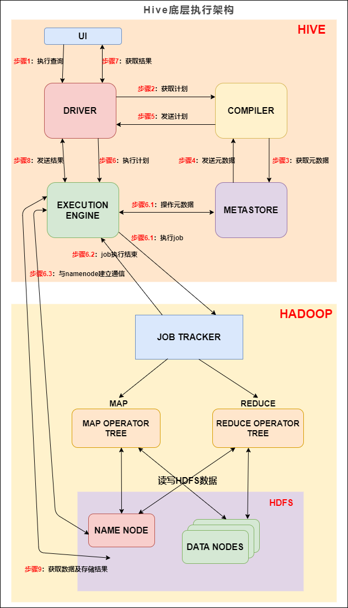
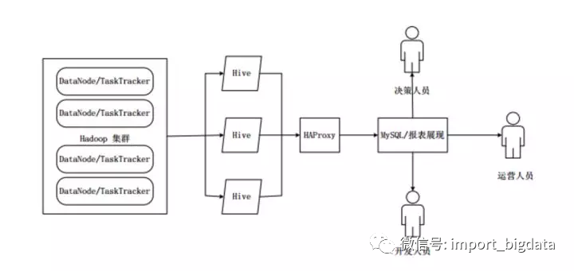

[toc]

# 特点

|  对比项  |                             Hive                             |                          传统数据库                          |
| :------: | :----------------------------------------------------------: | :----------------------------------------------------------: |
| 数据插入 |                         支持批量导入                         |                      支持单条和批量导入                      |
|   索引   | 有限索引功能，可在某些列上建索引，加速查询，创建的索引数据会被保存在另外的表中 |                             支持                             |
|  分区表  | 可以根据分区形式进行组织，根据`分区列`的值对表进行粗略划分，加快数据的查询速度 | 提供分区功能来改善大型以及具有各种访问模式的表的可伸缩性，可管理性，以及提高数据库效率 |
| 数据更新 |                            不支持                            |                             支持                             |
| 执行延迟 |              高，需要将SQL转成MR，索引延迟很高               |                低，传统SQL的延迟一般少于1秒。                |
|  扩展性  |            好，基于Hadoop集群，有很好的横向扩展性            |                   有限，横向和纵向扩展有限                   |
| 执行顺序 | **from -> on -> join -> where -> select  -> group by -> having-> order by -> limit** | **from -> on -> join -> where -> group by -> having -> select -> order by -> limit** |

# SQL查询转换成MR作业的过程

当`Hive`接收到一条`HQL`语句后，需要与`Hadoop`交互工作来完成该操作。`HQL`首先进入驱动模块，由驱动模块中的编译器**解析编译**，并由优化器对该操作进行**优化计算**，然后交给**执行器**去执行。执行器通常启动一个或多个**`MR`任务**，**有时也无需启动**（如`SELECT * FROM tb1`，全表扫描，不存在投影和选择操作）



由驱动模块中的**编译器**–`Antlr`语言识别工具，对用户输入的`SQL`语句进行词法和语法解析，将`HQL`语句转换成抽象语法树（`AST Tree`）的形式；

遍历抽象语法树，转化成`QueryBlock`查询单元。因为`AST`结构复杂，不方便直接翻译成`MR`算法程序。其中`QueryBlock`是一条最基本的`SQL`语法组成单元，包括输入源、计算过程、和输入三个部分；

遍历`QueryBlock`，生成`OperatorTree`（操作树），`OperatorTree`由很多逻辑操作符组成，如`TableScanOperator`、`SelectOperator`、`FilterOperator`、`JoinOperator`、`GroupByOperator`和`ReduceSinkOperator`等。这些逻辑操作符可在`Map`、`Reduce`阶段完成某一特定操作；

`Hive`驱动模块中的**逻辑优化器**对`OperatorTree`进行优化，变换`OperatorTree`的形式，合并多余的操作符，减少`MR`任务数、以及`Shuffle`阶段的数据量；

遍历优化后的`OperatorTree`，根据`OperatorTree`中的逻辑操作符生成需要执行的`MR`任务；

启动`Hive`驱动模块中的**物理优化器**，对生成的`MR`任务进行优化，生成最终的`MR`任务**执行计划**；

最后，有`Hive`驱动模块中的**执行器**，对最终的`MR`任务执行输出。

# HA基本原理

在实际应用中，`Hive`也暴露出不稳定的问题，在极少数情况下，会出现端口不响应或进程丢失问题。`Hive HA`（`High Availablity`）可以解决这类问题。



在`Hive HA`中，在`Hadoop`集群上构建的数据仓库是由多个`Hive`实例进行管理的，这些`Hive`实例被纳入到一个资源池中，由`HAProxy`提供统一的对外接口。客户端的查询请求，首先访问`HAProxy`，由`HAProxy`对访问请求进行转发。`HAProxy`收到请求后，会轮询资源池中可用的`Hive`实例，执行逻辑可用性测试。

如果某个`Hive`实例逻辑可用，就会把客户端的访问请求转发到`Hive`实例上；

如果某个实例不可用，就把它放入黑名单，并继续从资源池中取出下一个`Hive`实例进行逻辑可用性测试。

对于黑名单中的`Hive`，`Hive HA`会每隔一段时间进行统一处理，首先尝试重启该`Hive`实例，如果重启成功，就再次把它放入资源池中。

由于`HAProxy`提供统一的对外访问接口，因此，对于程序开发人员来说，可把它看成一台超强`Hive`。

# 内部表 & 外部表 & 分区表 & 分桶表

## 内部表

内部表的数据放在默认目录，所以在加载数据时，会产生数据的移动。如果在建表时指定了表的位置，那么不会进行数据的移动。当删除表时，会将元数据和数据都删除。所以对于需要复用的数据，一定要小心内部表的删除。

数据加载通过`hdfs dfs -put`文件或者通过`load data`

```
create table stu(id int,name string);
```

## 外部表

外部表因为是指定其他的`hdfs`路径的数据加载到表当中来，所以`hive`表会认为自己不完全独占这份数据，所以删除`hive`表的时候，数据仍然存放在`hdfs`当中，不会删掉，只会删除表的元数据

数据加载通过`hdfs dfs -put`文件或者通过`load data`

```
create external table student (s_id string,s_name string) row format delimited fields terminated by '\t';
```

|                         内部表                         |                            外部表                            |
| :----------------------------------------------------: | :----------------------------------------------------------: |
|                 不需要 `external` 修饰                 |                      需要`external`修饰                      |
|                  数据由`Hive`自身管理                  |                       数据由`HDFS`管理                       |
| 数据存在`Hive`配置的位置`hive.metastore.warehouse.dir` | 数据的存储位置由自己制定（如果没有`LOCATION`，`Hive`将在`HDFS`上       的`/user/hive/warehouse`文件夹下以外部表的表名创建一个文件夹，并将属于这个表的数据存放在这里 |
|            删除表时，数据和元数据都会被删除            |              删除表时，只会删除元数据，不会删表              |

## 分区表

`hive`表创建的时候可以用`location`指定一个文件或者文件夹，当指定文件夹时，`hive`会加载文件夹下的所有文件，**当表中无分区时，这个文件夹下不能再有文件夹**，否则报错（在分区对应的是文件夹，文件夹内名是分区名）
当表是分区表时，比如 `partitioned by (day string)`， 则这个文件夹下的每一个**文件夹**就是一个分区，且文件夹名为 `day=20201123` 这种格式，然后使用：`msck re1pair table score`; 修复表结构，成功之后即可看到数据已经全部加载到表当中去了。

```
create table score2 (s_id string, s_score int) partitioned by (year string,month string,day string);
```

# 分桶表

将数据按照指定的字段进行分成多个桶中去，就是按照分桶字段进行**哈希**划分到多个文件当中去
***分区就是分文件夹，分桶就是分文件***

桶表的数据加载：只能通过`insert overwrite` 进行加载
所以把文件加载到桶表中，需要先创建普通表，并通过`insert overwrite`的方式将普通表的数据通过查询的方式加载到桶表当中去

```
create table course (c_id string,c_name string) clustered by(c_id) into 3 buckets;
```

桶表专门用于抽样查询，是很专业性的，不是日常用来存储数据的表，需要抽样查询时，才创建和使用桶表。

| 分区表                                 | 分桶表                                       |
| -------------------------------------- | -------------------------------------------- |
| 文件夹下的文件夹就是一个分区           | 文件夹下的多个文件                           |
| 通过指定字段写入到一个文件夹中（分区） | 基于字段的哈希将数据写入到一个文件（分桶）   |
| 查询时，只要指定分区速度快             | 做join时，可以对两个分桶数据进行join，速度快 |

# `DQL`语法

```
SELECT [ALL | DISTINCT] select_expr, select_expr, ... 
FROM table_reference
[WHERE where_condition] 
[GROUP BY col_list [HAVING condition]] 
  [CLUSTER BY col_list 
  | [DISTRIBUTE BY col_list] [SORT BY| ORDER BY col_list] 
] 
[LIMIT number]
```

- `order by` 会对输入做**全局排序**，因此只有**一个`reducer`**，会导致当输入规模较大时，需要较长的计算时间。
- `sort by`不是全局排序，其在数据进入reducer前完成排序。因此，如果用sort by进行排序，并且设置`mapred.reduce.tasks>1`，则`sort by`只保证**每个`reducer`的输出有序**，不保证全局有序。
- `distribute by`(字段)根据指定的字段将数据分到不同的`reducer`，且分发算法是`hash`散列。
- `Cluster by`(字段) 除了具有`Distribute by`的功能外，还会对该字段进行排序。因此，如果分桶和sort字段是同一个时，此时，`cluster by = distribute by + sort by`

# 性能优化

## `SQL`语句优化

- `union all`

  ```
  from ... insert into ... ，这个语法将from前置，作用就是使用一张表，可以进行多次插入操作
  
  ---------------------------------------
  from into table student
  
  insert into table student
  select min(age) 
  
  insert into table student
  select max(age)
  ```

- `distinct`

  ```
  select count(distinct age) from student
  
  上面进行去重的字段是年龄字段，要知道年龄的枚举值是非常有限的，这个数量是很小的。
  
  distinct的命令会在内存中构建一个hashtable，查找去重的时间复杂度是O(1)；
  
  group by在不同版本间变动比较大，有的版本会用构建hashtable的形式去重，有的版本会通过排序的方式, 排序最优时间复杂度无法到O(1)。
  
  另外，(group by)去重会转化为两个任务，会消耗更多的磁盘网络I/O资源。
  
  最新的Hive 3.0中新增了 count(distinct) 优化，通过配置 hive.optimize.countdistinct，即使真的出现数据倾斜也可以自动优化，自动改变SQL执行的逻辑。
  
  (distinct)比(group by)代码简洁，表达的意思简单明了，如果没有特殊的问题，代码简洁就是优！
  ```

## 数据格式化

| 数据格式       | 特点                                                         |
| -------------- | ------------------------------------------------------------ |
| `TextFile`     | 行存储，数据不做压缩，数据不做切分，无法进行并行操作，序列化反序列化开销大 |
| `SequenceFile` | 行存储，可分割，可压缩                                       |
| `parquent`     | 列存储，可压缩                                               |
| `ORCFile`      | 行分块，列存储，可压缩                                       |
| `RCFile`       | 行分块，列存储，可压缩                                       |

# `ORC, Parquet`列式存储

- `ORC`
  - **内置了自己的压缩算法，同时也支持Snappy和LZO等其他压缩算法。**
  - **同样采用列存储方式，并使用了更多的优化技术，如跳过未读取的列、字典编码、位图、索引等**
  - **具有优秀的查询性能，尤其擅长处理大型数据集和高并发查询**
  - **在Hive和Impala中具有良好的兼容性**
  - **高性能的列式存储格式，能够提供优异的数据压缩和查询性能**
- `Parquet`
  - **支持多种压缩算法，如Snappy、Gzip、LZO等，可以根据需求选择适合的压缩算法。**
  - **采用了一种高度优化的列存储方式，将数据按列存储，每个列值使用独立的压缩和编码方式**
  - **Parquet在查询性能方面表现较好，尤其适用于分析型查询和复杂的数据分析**
  - **Parquet在多个大数据生态系统中得到广泛支持**
  - **高性能的列式存储格式，能够提供优异的数据压缩和查询性能**

**总结：**都是高性能的列式存储、数据压缩和查询性能，`orc`诞生于`hive`，对`hive`具有良好的兼容性，而`parquet`在大数据领域得到了支持，同时他们的存储细节不同，`parquet`对每个列值都进行了独立的压缩和编码，`orc`采用了更多的优化技术，比如索引和位图。

## 小文件过多优化

```
小文件如果过多，对 hive 来说，在进行查询时，每个小文件都会当成一个块，启动一个Map任务来完成，而一个Map任务启动和初始化的时间远远大于逻辑处理的时间，就会造成很大的资源浪费。而且，同时可执行的Map数量是受限的。

1.动态分区插入数据，产生大量的小文件，从而导致map数量剧增。
2.reduce数量越多，小文件也越多(reduce的个数和输出文件是对应的)。
3.数据源本身就包含大量的小文件。

1.从Hive的角度看，小文件会开很多map，一个map开一个JVM去执行，所以这些任务的初始化，启动，执行会浪费大量的资源，严重影响性能。
2.在HDFS中，每个小文件对象约占150byte，如果小文件过多会占用大量内存。这样NameNode内存容量严重制约了集群的扩展。

小文件问题的解决方案 从小文件产生的途经就可以从源头上控制小文件数量，方法如下：
1.使用Sequencefile作为表存储格式，不要用textfile，在一定程度上可以减少小文件
2.减少reduce的数量(可以使用参数进行控制)
3.少用动态分区，用时记得按distribute by分区

对于已有的小文件，我们可以通过以下几种方案解决：
1.使用hadoop archive命令把小文件进行归档
2.重建表，建表时减少reduce数量
3.通过参数进行调节，设置map/reduce端的相关参数，如下：

//每个Map最大输入大小(这个值决定了合并后文件的数量)  
set mapred.max.split.size=256000000;    
//一个节点上split的至少的大小(这个值决定了多个DataNode上的文件是否需要合并)  
set mapred.min.split.size.per.node=100000000;  
//一个交换机下split的至少的大小(这个值决定了多个交换机上的文件是否需要合并)    
set mapred.min.split.size.per.rack=100000000;  
//执行Map前进行小文件合并  
set hive.input.format=org.apache.hadoop.hive.ql.io.CombineHiveInputFormat;
设置map输出和reduce输出进行合并的相关参数：
//设置map端输出进行合并，默认为true  
set hive.merge.mapfiles = true  
//设置reduce端输出进行合并，默认为false  
set hive.merge.mapredfiles = true  
//设置合并文件的大小  
set hive.merge.size.per.task = 256*1000*1000  
//当输出文件的平均大小小于该值时，启动一个独立的MapReduce任务进行文件merge。
set hive.merge.smallfiles.avgsize=16000000
```

**总结：**小文件过多会导致`namenode`内存占用过多，也会导致在做`Hive`时，开启过多的`map`来处理，影响性能。其能采取的方式包括在建表时采用`sequencefile`作为表的存储格式，可以减少`reduce`的数量，减少小文件生成过多，还可以通过hadoop命令对小文件来处理。

## 并行执行优化

```
Hive会将一个查询转化成一个或者多个阶段。这样的阶段可以是MapReduce阶段、抽样阶段、合并阶段、limit阶段。或者Hive执行过程中可能需要的其他阶段。默认情况下，Hive一次只会执行一个阶段。不过，某个特定的job可能包含众多的阶段，而这些阶段可能并非完全互相依赖的，也就是说有些阶段是可以并行执行的，这样可能使得整个job的执行时间缩短。如果有更多的阶段可以并行执行，那么job可能就越快完成。

默认情况下，一次只执行一个阶段。不过，如果某些阶段不是互相依赖，是可以并行执行的。

set hive.exec.parallel=true; //打开任务并行执行
set hive.exec.parallel.thread.number=16; //同一个sql允许最大并行度，默认为8。
```

**总结：**对没有相互依赖的阶段，可以采取并行执行来提高处理数据的能力，减少执行时间。

## JVM 优化

```
hadoop的默认配置通常是使用派生JVM来执行map和Reduce任务的。这时JVM的启动过程可能会造成相当大的开销，尤其是执行的job包含有成百上千task任务的情况。JVM重用可以使得JVM实例在同一个job中重新使用N次。N的值可以在Hadoop的mapred-site.xml文件中进行配置。通常在10-20之间，具体多少需要根据具体业务场景测试得出。

set mapred.job.reuse.jvm.num.tasks=10; //这个设置来设置我们的jvm重用

开启JVM重用将一直占用使用到的task插槽，以便进行重用，直到任务完成后才能释放。如果某个“不平衡的”job中有某几个reduce task执行的时间要比其他Reduce task消耗的时间多的多的话，那么保留的插槽就会一直空闲着却无法被其他的job使用，直到所有的task都结束了才会释放。
```

**总结：**开启`JVM`重用，保证多个任务复用一个`JVM`，可以不用反复开启`JVM`。

## 推测执行

```
在分布式集群环境下，因为程序bug（包括Hadoop本身的bug），负载不均衡或者资源分布不均等原因，会造成同一个作业的多个任务之间运行速度不一致，有些任务的运行速度可能明显慢于其他任务（比如一个作业的某个任务进度只有50%，而其他所有任务已经运行完毕），则这些任务会拖慢作业的整体执行进度。

为了避免这种情况发生，Hadoop采用了推测执行（Speculative Execution）机制，它根据一定的法则推测出“拖后腿”的任务，并为这样的任务启动一个备份任务，让该任务与原始任务同时处理同一份数据，并最终选用最先成功运行完成任务的计算结果作为最终结果。

set hive.mapred.reduce.tasks.speculative.execution=true
```

**总结：**当某个任务显著慢于其他任务，那么就可开启一个新任务来执行这个很慢的任务。只是对于那种持久化数据不适合开启。

## 行列过滤

- 列处理：在`SELECT`中，只拿需要的列，如果有，尽量使用分区过滤，少用`SELECT *`。
- 行处理：在分区剪裁中，当使用外关联时，如果将副表的过滤条件写在`Where`后面，那么就会先全表关联，之后再过滤。

**总结：**减少数据量，缩小不需要的列，能优化查询。

## `limit` 限制

```
hive.limit.optimize.enable=true --- 开启对数据源进行采样的功能 
hive.limit.row.max.size --- 设置最小的采样容量 
hive.limit.optimize.limit.file --- 设置最大的采样样本数

缺点：有可能部分数据永远不会被处理到
```

## 本地模式(开启MR，单机)

```
对于大多数这种情况在对于小数据集，hive可以通过本地模式在单台机器上处理所有的任务。执行时间会明显被缩短

set hive.exec.mode.local.auto=true;
当一个job满足如下条件才能真正使用本地模式：

1.job的输入数据大小必须小于参数：hive.exec.mode.local.auto.inputbytes.max(默认128MB) 　　
2.job的map数必须小于参数：hive.exec.mode.local.auto.tasks.max(默认4) 　　
3.job的reduce数必须为0或者1

可用参数hive.mapred.local.mem(默认0)控制child jvm使用的最大内存数。
```

## `Fetch` 拉取(不用开启MR)

```
Fetch抓取是指在Hive中对某些情况的查询可以不使用MapReduce计算。

Fetch抓取在hive-site.xml中对应的配置信息：
set hive.fetch.task.conversion more
```

## `join`优化

```
1) 将大表放后头 Hive假定查询中最后的一个表是大表。它会将其它表(join前面的表)缓存起来，然后扫描最后那个表。因此通常需要将小表放前面，或者标记哪张表是大表：/streamtable(table_name) /

2) 使用相同的连接键 当对3个或者更多个表进行join连接时，如果每个on子句都使用相同的连接键的话，那么只会产生一个MapReduce job。

3) 尽量尽早地过滤数据 减少每个阶段的数据量,对于分区表要加分区，同时只选择需要使用到的字段。

4) 尽量原子化操作 尽量避免一个SQL包含复杂逻辑，可以使用中间表来完成复杂的逻辑
```

**总结：**尽量减少数据，尽量减少复杂操作，尽量将小表放在左边。

## 严格模式

```
对分区表进行查询，在where子句中没有加分区过滤的话，将禁止提交任务(默认：nonstrict)

set hive.mapred.mode=strict;

注：使用严格模式可以禁止3种类型的查询：
（1）对于分区表，不加分区字段过滤条件，不能执行 
（2）对于order by语句，必须使用limit语句 
（3）限制笛卡尔积的查询（join的时候不使用on，而使用where的）
```

## 动态调整分区

```
动态分区属性：设置为true表示开启动态分区功能（默认为false）
hive.exec.dynamic.partition=true;

动态分区属性：设置为nonstrict,表示允许所有分区都是动态的（默认为strict） 设置为strict，表示必须保证至少有一个分区是静态的
hive.exec.dynamic.partition.mode=strict;

动态分区属性：每个mapper或reducer可以创建的最大动态分区个数
hive.exec.max.dynamic.partitions.pernode=100;

动态分区属性：一个动态分区创建语句可以创建的最大动态分区个数
hive.exec.max.dynamic.partitions=1000;

动态分区属性：全局可以创建的最大文件个数
hive.exec.max.created.files=100000;

控制DataNode一次可以打开的文件个数 这个参数必须设置在DataNode的$HADOOP_HOME/conf/hdfs-site.xml文件中
<property>
    <name>dfs.datanode.max.xcievers</name>
    <value>8192</value>
</property>
```

***总结：***数据存储及压缩；通过调参优化；大表拆分成子表；结合使用外部表和分区表；SQL优化

# 数据倾斜

***表现：***任务进度长时间维持在99%（或100%），查看任务监控页面，发现只有少量（1个或几个）`reduce`子任务未完成。

因为其处理的数据量和其他`reduce`差异过大。

单一`reduce`的记录数与平均记录数差异过大，通常可达到3倍甚至更多。最长时长远大于平均时长。

***原因***

- `key`分布不均匀
- 业务数据本身的特性
- 建表时考虑不周
- 某些`SQL`语句本身就有数据倾斜

## 设置合理`Map`数

是不是`map`数越多越好? 答案是否定的。如果一个任务有很多小文件（远远小于块大小128m），则每个小文件也会被当做一个块，用一个`map`任务来完成，而一个`map`任务启动和初始化的时间远远大于逻辑处理的时间，就会造成很大的资源浪费。而且，同时可执行的`map`数是受限的。

**总结：** 设置太多，资源浪费；设置太少，处理不及时。控制map数量需要遵循两个原则：使大数据量利用合适的`map`数；使单个`map`任务处理合适的数据量。对于文件要合并小文件，同时要对大文件拆分成小文件。

## 设置合理的`reduce`数

```
调整reduce个数方法一
每个Reduce 处理的数据量默认是256MB
hive.exec.reducers.bytes.per.reducer=256123456

每个任务最大的reduce数，默认为1009
hive.exec.reducers.max=1009

计算reducer数的公式
N=min(参数2，总输入数据量/参数1)
```

```
调整reduce个数方法二
在hadoop的mapred-default.xml文件中修改 设置每个job的Reduce个数
set mapreduce.job.reduces = 15;
```

- 过多的启动和初始化`reduce`也会消耗时间和资源；
- **有多少个`reduce`，就会有多少个输出文件**，如果生成了很多个小文件，那么如果这些小文件作为下一个任务的输入，则也会出现小文件过多的问题。

**总结:** 在设置`reduce`个数的时候也需要考虑这两个原则：处理大数据量利用合适的`reduce`数；使单个`reduce`任务处理数据量大小要合适。

## 负载均衡

```
决定是否可以在 Map 端进行聚合操作
set hive.map.aggr=true;

有数据倾斜的时候进行负载均衡
set hive.groupby.skewindata=true;

开启两阶段的聚合，局部聚合和全局聚合，这个会开启两个 MR 任务，分别做局部和全局。
```

**总结：**主要还是开启两阶段的聚合。

## 空值引起

```
第一种：可以直接不让null值参与join操作，即不让null值有shuffle阶段
select * from a join b on a.id = b.id and a.is is not null
union all
select * from a where a.id is null

第二种：因为null值参与shuffle时的hash结果是一样的，那么我们可以给null值随机赋值，这样它们的hash结果就不一样，就会进到不同的reduce中：
select * from a  left join b on case when a.id is null then concat('hive_', rand()) else a.id end = b.id
```

**总结：**对于不需要的数据，直接提前过滤。如果是需要的数据，加一个随机前缀。

## 不同数据类型引起

```
如果key字段既有string类型也有int类型，默认的hash就都会按int类型来分配，那我们直接把int类型都转为string就好了，这样key字段都为string，hash时就按照string类型分配了：
select * from a left join b on a.id = cast(b.id as string)
```

## 不可拆分大文件引发

```
这种数据倾斜问题没有什么好的解决方案，只能将使用GZIP压缩等不支持文件分割的文件转为bzip和zip等支持文件分割的压缩方式。
所以，我们在对文件进行压缩时，为避免因不可拆分大文件而引发数据读取的倾斜，在数据压缩的时候可以采用bzip2和Zip等支持文件分割的压缩算法。

采取合适的压缩方式。
```

**总结：**对于不能拆分的文件，那么需要提前采取合理的压缩方式。。

## 数据膨胀引发

```
在Hive中可以通过参数 hive.new.job.grouping.set.cardinality 配置的方式自动控制作业的拆解，该参数默认值是30。表示针对grouping sets/rollups/cubes这类多维聚合的操作，如果最后拆解的键组合大于该值，会启用新的任务去处理大于该值之外的组合。如果在处理数据时，某个分组聚合的列有较大的倾斜，可以适当调小该值。

对于大数据导致的问题，使用更多的任务来处理
```

**总结：**设置更多的任务来处理

## 表连接引发

```
通常做法是将倾斜的数据存到分布式缓存中，分发到各个Map任务所在节点。在Map阶段完成join操作，即MapJoin，这避免了 Shuffle，从而避免了数据倾斜。

mapjoin 避免shuffle
```

## 无法减少数据量引发

```
这类问题最直接的方式就是调整reduce所执行的内存大小。
调整reduce的内存大小使用mapreduce.reduce.memory.mb这个配置。

增加 reduce 的内存
```

# 运维如何对`Hive`进行调度

```
1. 将hive的sql定义在脚本当中；
2. 使用azkaban或者oozie进行任务的调度；
3. 监控任务调度页面。
```

# 解析JSON串

```
Hive处理json数据总体来说有两个方向的路走：
a.将json以字符串的方式整个入Hive表，然后通过使用UDF函数解析已经导入到hive中的数据，比如使用LATERAL VIEW json_tuple的方法，获取所需要的列名。(自定义UDF函数解析)

b.在导入之前将json拆成各个字段，导入Hive表的数据是已经解析过的。这将需要使用第三方的 SerDe（第三方解析再写入）。
```

-  将 json 以字符串的方式整个入 Hive 表，然后通过使用 **UDF 函数**解析已经导入到 hive 中的数据，
-  **导入之前**将 json 拆成各个字段，导入 Hive 表的数据是已经解析过的

# 两张表如何关联，使用MR是如何实现

- **大表&小表**

  如果其中有一张表为小表，直接使用**`map`端`join`**的方式（`map`端加载小表）进行聚合。

- **大表&大表**

  采用联合`key`，联合`key`的第一个组成部分是`join on`中的公共字段，第二部分是一个`flag`，`0`代表表`A`，`1`代表表`B`，由此让`Reduce`区分客户信息和订单信息；在`Mapper`中同时处理两张表的信息，将`join on`公共字段相同的数据划分到同一个分区中，进而传递到一个`Reduce`中，然后在`Reduce`中实现聚合。

  - 在`map`端将数据写入同一个分区/分桶，然后在`reduce`处理

# 底层与数据库交互

`Hive` 的查询功能是由`HDFS`和`MapReduce`结合起来实现的，对于大规模数据查询还是不建议在`hive`中，因为过大数据量会造成查询十分缓慢。`Hive`与`MySQL`的关系：只是借用`MySQL`来存储`hive`中的表的元数据信息，称为 `metastore`（元数据信息）。

# 如何更新数据1

通过找出对应的需要修改的数据，重新写入数据

```
insert into/overwrite table tb_name
select * from tb_name_1 where id = '1'
union all
select * from tb_name_1 where id !='1'
```

# 开窗函数使用`order by`

- 当为排序函数（`rank`，`row_number`）

  在窗口内排序

- 当为聚合函数 （`max`， `min`， `count`）

  不仅起到窗口内排序，还对窗口内从当前行到之前所有行的聚合

  不加则对整个分区聚合

# 在什么情况下会只使用一个 reduce

- 假如只有一个`key`的情况下，在做完shuffle，只会进入到一个reduce中
- 假如仅仅设置一个reduce，那么肯定只有一个reduce
- 如果在 order by 时，那么数据进入同一个 reduce中进行排序
