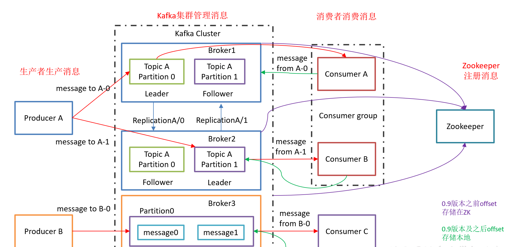
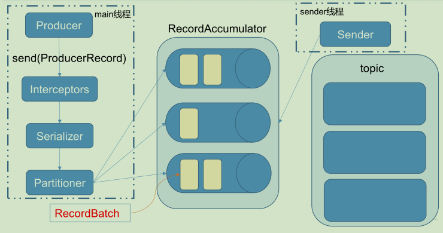

[toc]

# 如果副本在`ISR`中停留了很长时间表明什么

`ISR` 是一组与 `leader`完全同步的消息副本，也就是说`ISR`中包含了所有提交的消息。`ISR`应该总是包含所有副本，直到出现真正的故障。如果一个副本从`leader`中脱离，那将会被`ISR`删除。

如果一个副本在`ISR`中保留很长的事件，说明该副本可以向`leader`收集数据那样快速地获取数据。

如果首选副本不在`ISR`中，`controller` 将无法从`leadership`转移到首选副本。

#  如果首选副本不在`ISR`中会发生什么

如果首选副本不在`ISR`中，那么`controller`无法将`leadership`转移到首选副本。

# 有可能在生产后收到消息偏移

作为生产消息的用户，可以通过返回的`RecordMetadata `来获取到偏移量，分区等信息

# 主要组件

# 主题的特点

主题是消息的分类，主题是一种逻辑概念，用于将相关消息分组在一起，从而让生产者和消费者可以根据关注的内容而生产或消费。消息必须指定主题。

- 可以划分多个分区，用于实现高吞吐、负载均衡和容错。
- 可以设置副本，保证数据的持久性和可用性。
- 数据保留策略，允许对数据的保留时间或大小进行设置。
- 消费者订阅，消费者可以订阅一个或多个主题。

# 分区与副本

- 分区

  分区用于实现并行处理和负载均衡。每个主题可以被划分为一个或多个分区，分区可以位于不同的节点上。分区内消息是有序的，并且根据接受分配了唯一的偏移量。

- 副本

  副本是实现数据容错的关键机制。每个分区可以有多个副本，副本可以分布在不同的节点上。

# 分区

生产者分区器根据参数来区分数据要发往的分区：

1. **有 `Partition`**：直接将数据存入对应的分区
2. **没有 `Partition` 有 Key**：将通过 Key的Hash值 % 主题的分区数 来得到一个 Partition 值
3. **没有 Partition 没有 Key**：采用 Sticky Partition（粘性分区器），会随机选择一个分区，并尽可能的一直使用这个分区，待该分区的 `ProducerBatch` 满了或者已完成，再随机选择其他的分区（不会重复使用上一次的分区）

# 分区分配策略

- `RoundRobin`

  轮询分区策略，是把所有的 `partition` 和所有的 `consumer` 都列出来，然后按照 `hascode` 进行排序，最后通过**轮询算法**来分配 `partition` 给到各个消费者

- `Range`

  首先对同一个 `topic` 里面的分区按照序号进行排序，并对消费者按照字母顺序进行排序。假如现在有 10 个分区，3 个消费者，排序后的分区将会是`0,1,2,3,4,5,6,7,8,9`；消费者排序完之后将会是`C1-0,C2-0,C3-0`。通过 `partitions数/consumer数` 来决定每个消费者应该消费几个分区。如果除不尽，那么前面几个消费者将会多消费 1 个分区。

# 数据的有序性的保证

`Kafka`只能保证分区内有序，无法保证全局有序。

- 单分区方案

  如果要保证数据有序，那么需要**生产者只有一个，且仅写入一个分区**，这样就能保证数据在`Kafka`内部是有序的。但是这个方案是不可取的，性能太差。

- 多分区方案

  在实际项目中，如果数据根据`key`来分区，将**相同`key`的数据写入同一个分区**，那么每个分区内的基于`key`的数据是有序的。

**总结**：这个问题主要考察分区特点和分区写入，故而可以从这两个角度回答。

# `Kafka`的数据持久性

- **数据写入磁盘**：当消息从生产者写入集群时，消息会被持久化在磁盘。
- **副本机制**：为了保证数据的可用性，提供副本机制，制造数据冗余，防止节点失效而丢失数据
- **数据保留策略**：当消息达到保留期限或者达到指定大小时，Kafka会自动删除这些消息。
- **消费者偏移量**：Kafka使用偏移量（Offset）来表示消费者在分区内已处理的消息位置。消费者可以将偏移量提交到Kafka或外部存储系统，以实现消息处理进度的持久化和恢复。

# 幂等性和事务

- **幂等性**

  幂等性是指一个操作可以重复执行多次，但结果仍然与执行一次一样。在`Kafka`中，幂等生产者是为了解决可能导致数据重复或丢失的问题。

- **事务**

  `Kafka`的事务功能允许生产者和消费者在跨多个分区的情况下，实现原子性地读取和写入消息。

  事务生产者可以通过开始事务、发送消息、提交事务或终止事务来实现跨分区的原子写入。要么事务成功消息全部被写入，要么事务失败/中止消息都会被丢弃。

# 部署性能

## 磁盘性能瓶颈

- `Kafka`严重依赖磁盘性能，当磁盘速度不足时，可能导致吞吐量降低和延迟增加。

- 使用更高性能的磁盘，如固态硬盘（SSD）；优化磁盘的I/O调度和缓存策略；监控磁盘使用情况，确保有足够的空间和IOPS。

## 网络性能瓶颈

- 网络带宽不足或延迟较高可能导致Kafka性能下降。
- 升级网络设备；优化网络配置，如调整TCP参数；监控网络带宽和延迟，确保网络连接的稳定性。

## 生产者/消费者处理能力不足

- 优化生产者和消费者的配置，如调整批量大小（`batch.size`）、`Linger`时间（`linger.ms`）、发送缓冲区（`send.buffer.bytes`）等；
- 提高生产者和消费者的处理能力，如使用多线程或升级硬件；
- 监控生产者和消费者的性能指标，如延迟、吞吐量等。

## 集群负载不均衡

- Kafka集群中的某些Broker承担了过多的分区负载，导致性能下降。
- 重新分配分区以实现负载均衡；
- 根据负载情况添加更多的Broker节点；
- 优化分区分配策略，如通过手动或自动分配分区来实现负载均衡。

## Kafka配置不合理

- 根据具体场景优化`Kafka`配置，调整日志保留策略（`log.retention.hours`、`log.retention.bytes`等）、消费者拉取策略（`fetch.min.bytes`、`fetch.max.wait.ms`等）；
- 根据实际需求设置合适的复制因子(`replication.factor`)和最小同步副本数(`min.insync.replicas`)

## 虚拟机性能

- 优化`JVM`配置，如调整堆大小（`-Xms` 和`-Xmx`）、垃圾回收策略（如使用`G1`垃圾回收器）；监控`JVM`性能指标，如垃圾回收时间、堆使用情况等，以便发现潜在问题并进行优化；
- 升级`Java`版本以获得性能改进。

## 消费者消费不均衡

- 优化消费者配置，如调整拉取策略（`fetch.min.bytes`、`fetch.max.wait.ms`）；
- 提高消费者的处理能力，如使用多线程或升级硬件；
- 调整消费者组中的消费者数量以实现更好的负载均衡。

## 低效的数据压缩和序列化

- 使用高效的数据压缩算法（如`Snappy`、`LZ4`等）以减小数据传输量；
- 优化数据序列化和反序列化方法，如使用高效的序列化库（如`Avro`、`Protobuf`等）；
- 根据数据特点选择合适的压缩和序列化策略

# 故障转移和恢复

故障转移和恢复依赖于集群的分区副本机制。分区副本可以在多个节点上进行复制，确保在发生故障时可以快速切换到可用副本。

当一个分区的`Leader`副本发生故障时，`Kafka`会从`ISR`中选择一个`Follower`副本作为新的`Leader`副本。这个过程就是故障转移。

当故障的节点恢复正常后，`Kafka`会尝试将该节点上的副本与其他副本同步，用于恢复数据一致性。同步完成后，这些副本将重新加入`ISR`。在副本同步过程中，`Kafka`会优先同步最新的数据，最大程度上减少恢复时间和数据丢失风险。

# 数据压缩

1. 配置 `Kafka Broker`：在 `Kafka Broker` 的配置文件中设置 `compression.type` 参数来指定压缩算法，例如设置为 `"gzip"` 表示使用 `Gzip` 压缩算法。
2. 配置 `Kafka Producer`：在 `Kafka Producer` 的配置文件中设置 `compression.type` 参数来指定压缩算法，例如设置为 `"snappy"` 表示使用 `Snappy` 压缩算法。如果要禁用压缩，则设置 `compression.type` 为`"none"`。
3. 配置 `Kafka Consumer`：在 `Kafka Consumer` 的配置文件中设置 `fetch.message.max.bytes` 参数来指定最大消息大小，该参数应该考虑到消息压缩前和压缩后的大小。
4. 发送压缩数据：使用 `Kafka Producer` 发送消息时，可以将消息压缩后再发送，例如使用 `Gzip` 压缩算法可以使用 `GzipOutputStream` 对消息进行压缩。
5. 接收压缩数据：使用 `Kafka Consumer` 接收消息时，可以使用解压器对消息进行解压缩，例如使用 `GzipInputStream` 对 `Gzip` 压缩的消息进行解压缩。

# `Kafka`写入性能

- **顺序写**：往磁盘上写数据时，就是追加数据
- **多分区**
- **零拷贝**：中间不需要通过用户态将数据发送到网卡
  1. 消费者发送请求给`Kafka`服务；
  2. `Kafka`服务从`OS cache`缓存读取数据（如果没有数据就去读取磁盘）；
  3. 从磁盘读取了数据到`OS cache`缓存中；
  4. `OS cache`直接将数据发送给网卡；
  5. 通过网卡将数据传输给消费者。

# Kafka 日志形式

日志文件基于主题的分区来创建文件目录，每个目录中有一定数量的文件：

- 日志文件：每个日志文件大小默认`1G`，超过该大小则会进行分段，生成多个文件。
- 索引文件：索引文件名为该最开始的`offset`

`Kafka`里的每一条消息，都有自己的`offset`（偏移量）。当通过`Offset`来查找文件时，首先根据索引文件名来定位文件的位置，然后再在索引文件内部查找。整个过程就是**二分查找**

# 生产环境的搭建

- 假如每天有 10 亿数据量写到`Kafka`

  基于二八定律，`80%`的数据量在主要时间段内产生的。

  8亿数据在16个小时内完成的，2亿数据在另外的8小时内完成的。

  在16个小时范围内，差不多有`80%` (6 亿)数据量在`20%`时间内处理数据：
  $$
  8 * 0.8 / (16 * 0.2) = 5w/s
  $$

  > 10 亿数据 * 2kb = 2T 数据，每天需要存储 2T左右的数据。

如果是有两个副本，保留三天
$$
2T * 2 * 3 / (0.7) = 17T
$$
`Kafka`的设计，没有把很多数据结构都放在`jvm`里面。所以我们的这个`jvm`不需要太大的内存。根据经验，给个`10G`就可以了。

# 基本架构

1. **`Producer`**  ：消息生产者，就是向 `kafka broker` 发消息的客户端；
2. **`Consumer`**  ：消息消费者，向 `kafka broker` 取消息的客户端；
3. **`Consumer Group  （CG ）`**：消费者组，由多个 consumer 组成。 消费者组内每个消费者负责消费不同分区的数据，一个分区只能由一个 组内 消费者消费；消费者组之间互不影响。所有的消费者都属于某个消费者组，即 消费者组是逻辑上的一个订阅者。
4. **`Broker`**  ：一台 `kafka` 服务器就是一个 `broker`。一个集群由多个 `broker` 组成。一个 `broker`可以容纳多个 `topic`。
5. **`Topic`** ： ：可以理解为一个队列，个 生产者和消费者面向的都是一个 `topic`；
6. **`partition`**：为了实现扩展性，一个非常大的 `topic` 可以分布到多个 `broker`（即服务器）上， 一个 `topic`  可以分为多个 `partition`，每个 `partition` 是一个**有序的队列**；
7. **`Replica`**：副本，为保证集群中的某个节点发生故障时，该节点上的 `partition` 数据不丢失，且 `kafka` 仍然能够继续工作，`kafka` 提供了副本机制，一个 `topic` 的每个分区都有若干个副本，一个 `leader` 和若干个 `follower`。
8. **`leader`** ：每个分区多个副本的“主”，生产者发送数据的对象，以及消费者消费数据的对象都是 `leader`。
9. **`follower`** ：每个分区多个副本中的“从”，实时从 `leader` 中同步数据，保持和 `leader` 数据的同步。`leader` 发生故障时，某个 `follower` 会成为新的 `follower`。

# 数据的可靠性

为保证 `producer` 发送的数据，能可靠的发送到指定的 `topic`，`topic` 的每个 `partition` 收到 `producer` 发送的数据后，都需要向 `producer` 发送 `ack`。如果 `producer` 收到 `ack`，就会进行下一轮的发送，否则重新发送数据。

`Leader` 维护了一个动态的 `in-sync replica set (ISR)`，意为和 `leader` 保持同步的 `follower` 集合。当 `ISR` 中的 `follower` 完成数据的同步之后，`leader` 就会给 `follower` 发送 `ack`。如果 `follower`长 时 间 未 向 `leader` 同 步 数 据 ， 则 该 `follower` 将 被 踢 出 `ISR` ， 该 时 间 阈 值 由 `replica.lag.time.max.ms` 参数设定。`Leader` 发生故障之后，就会从 `ISR` 中选举新的 `leader`。

| ack    | 说明                                                         | 导致问题 |
| ------ | ------------------------------------------------------------ | -------- |
| 0      | `producer` 不等待 `broker` 的 `ack`，broker 一接收到还没有写入磁盘就已经返回， | 数据丢失 |
| 1      | `producer` 等待 `broker` 的 `ack`，`partition` 的 `leader` 落盘成功后返回 `ack`。 | 数据丢失 |
| -1/all | `producer` 等待 `broker` 的 `ack`，`partition` 的` leader` 和 `follower` 全部落盘后才返回 `ack`。 | 数据重复 |

# LEO & HW

- **LEO** ：指的是每个副本最大的 `offset` ；
- **HW** ：指的是消费者能见到的最大的 `offset` ，`ISR`  队列中最小的 `LEO`。

# 精确一次的语义

-  **至少一次**

  将服务器的 `ACK` 级别设置为 `-1`，可以保证 `Producer` 到 `Server` 之间不会丢失数据，即 `At Least Once` 语义。

  - 可以保证数据不丢失，但是不能保证数据不重复

- **至多一次**

  将服务器 `ACK` 级别设置为 `0`，可以保证生产者每条消息只会被发送一次，即 `At Most Once` 语义。

  - 可以保证数据不重复，但是不能保证数据不丢失

- **有且一次**

  `0.11` 版本的 `Kafka`，引入了一项重大特性：幂等性。所谓的幂等性就是指 `Producer` 不论向 `Server` 发送多少次重复数据，`Server` 端都只会持久化一条。幂等性结合 `At Least Once` 语义，就构成了 `Kafka` 的 `Exactly Once` 语义。即：
  $$
  At Least Once + 幂等性 = Exactly Once
  $$

  - 只需要将 Producer 的参数中 `enable.idompotence` 设置为 true 即可

`Kafka` 的幂等性实现其实就是将原来下游需要做的**去重放在了数据上游**。开启幂等性的 `Producer` 在初始化的时候会被分配一个 `PID`，发往同一 `Partition` 的消息会附带 `Sequence Number`。而 `Broker` 端会对 `<PID, Partition, SeqNumber>` 做缓存，当具有相同主键的消息提交时，`Broker` 只会持久化一条。但是 `PID` 重启就会变化，同时不同的 `Partition` 也具有不同主键，所以幂等性无法保证跨分区跨会话的 `Exactly Once`。

为了实现**跨分区跨会话的事务**，需要引入一个全局唯一的 `Transaction ID`，并将 `Producer` 获得的`PID`和`Transaction ID` 绑定。这样当`Producer` 重启后就可以通过正在进行的 `Transaction ID` 获得原来的 `PID`。

# offset 的存储位置

- `Kafka 0.9` 之前，消费者默认将 `offset` 保存在 `Zookeeper` 中；
- `kafka 0.9`之后，消费者默认将`offset`保存在`Kafka` 内置的`topic`中，该`topic`为`__consumer_offsets`。