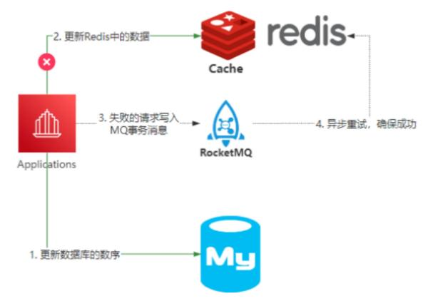
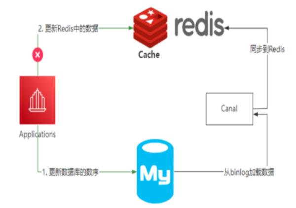

[toc]

# 数据库三范式

**第一范式：** 列不可以再分；

**第二范式：**在第一范式的基础上，列不可部分依赖，必须完全依赖于主键；

**第三范式：**在第二范式的基础上，列不可传递依赖，只依赖于主键，不能依赖于非主键。

# `MySQL`权限的表

`MySQL`服务器通过权限表来控制用户对数据库的访问，权限表放在`mysql`数据库里，由`mysql_install_db`脚本初始化。这些权限表分别`user`, `db`, `table_priv`, `columns_priv`和`host`。

- `user`：全局级，允许连接到服务器的用户账号信息。
- `db`：各账号在数据库的操作权限。
- `table_priv`：表级的操作权限。
- `columns_priv`：列级的操作权限。
- `host`：对给定主机的数据库级操作权限

# `binlog`的录入格式

- `statement`：每一条会修改数据的`SQL`会记录在`binlog`中。`SQL`的执行有上下文信息，在保存的时候需要保存相关信息，同时使用了函数之类的语句。减少`binlog`日志量
- `row`：不记录`SQL`上下文信息，仅保存哪条记录被修改，记录了单元的每一行的改动。`binlog`日志量较大
- `mixed`：普通操作使⽤`statement`记录，当⽆法使⽤`statement`的时候使⽤`row`。

# 存储引擎

- **`Innodb`引擎**：`Innodb`引擎提供了对数据库`ACID`事务的⽀持。并且还提供了⾏级锁和外键的约束。它的设计的⽬标就是处理⼤数据容量的数据库系统。
- `MyIASM`引擎(原本`Mysql`的默认引擎)：不提供事务的⽀持，也不⽀持⾏级锁和外键。
- `MEMORY`引擎：所有的数据都在内存中，数据的处理速度快，但是安全性不⾼。

# 主要引擎的区别

|                        | `MyISAM`                                                 | `Innodb`                                                     |
| ---------------------- | -------------------------------------------------------- | ------------------------------------------------------------ |
| 存储结构               | 每张表被存放在三个文件：表格定义文件、数据文件、索引文件 | 每张表都保存在同一个数据文件中。                             |
| 存储空间               | 可被压缩，存储空间较小                                   | 需要更多的内存和存储，在主内存中建⽴其专⽤的缓冲池⽤于⾼速缓冲数据和索引 |
| 移植备份               | 以文件的形式存储，跨平台转移方便                         | 拷贝数据文件、备份`binlog`                                   |
| 文件格式               | 数据和索引是分别存储的，分别在不同的文件中。             | 数据和索引是晋中存储                                         |
| 记录存储顺序           | 按记录插入顺序保存                                       | 按主键大小有序插入                                           |
| 外键                   | 不支持                                                   | 支持                                                         |
|                        | 不支持                                                   | 支持                                                         |
| 锁支持                 | 表锁定                                                   | 行锁定、表锁定                                               |
| select                 | 更优                                                     |                                                              |
| insert、update、delete |                                                          | 更优                                                         |
| count(*)               | 维护了一个计数器                                         |                                                              |
| 索引实现               | `B+`树索引，堆表                                         | `B+`树索引，索引组织表                                       |
| 哈希索引               | 不支持                                                   | 支持                                                         |
| 全文索引               | 支持                                                     | 不支持                                                       |
| 聚簇索引               | 非聚簇索引                                               | 聚簇索引                                                     |
|                        | 叶子节点保存着行数据地址，需要再寻址一次找到数据         | 叶子结点保存着行数据                                         |
|                        |                                                          | 叶⼦节点存储的是主键和其他带索引的列数据                     |
|                        | 以读写插入为主的应用程序                                 | 更新频率高，保证数据的完整性，高并发，事务，外键             |

# 索引

索引是⼀种特殊的⽂件，包含着对数据表⾥所有记录的引⽤指针。

索引是⼀种数据结构， 是数据库管理系统中⼀个排序的数据结构，以协助快速查询、更新数据库表中数据。索引的实现通常使⽤B树及其变种B+树。

# 索引覆盖

如果要查询的字段都**建⽴过索引**，那么引擎会直接**在索引表中查询**⽽不会访问原始数据，这叫索引覆盖。因此我们需要尽可能的在select后只写必要的查询字段，以增加索引覆盖的⼏率。

# 使用索引原则

- **最左前缀匹配原则：** 组合索引会向右匹配直到遇到范围查询（>、<、between、like）就停止匹配。
- 频繁作为查询条件的字段才创建索引。
- 更新频繁的字段不适合创建索引，因为会导致索引频繁更新。
- 不能有效分区数据的列不适合做索引。比如一列只有两个值，那么就不适合做索引了。
- 尽可能的扩展索引，而不是新建索引。每新建一个索引，就需要多一份维护。
- 有外键的数据列一定要建立索引。
- 对于不频繁查询使用的列，不建议做索引。不使用没有表做索引而增加维护成本。
- text、image和bit的数据类型的列不要建⽴索引

# 索引类型

- **主键索引:** 数据列不允许重复，不允许为NULL，⼀个表只能有⼀个主键。
- **唯⼀索引:** 数据列不允许重复，允许为NULL值，⼀个表允许多个列创建唯⼀索引。
  - 可以通过 ALTER TABLE table_name ADD UNIQUE (column); 创建唯⼀索引
  - 可以通过 ALTER TABLE table_name ADD UNIQUE (column1,column2); 创建唯⼀组合索引
- **普通索引:**  基本的索引类型，没有唯⼀性的限制，允许为NULL值。
    - 可以通过ALTER TABLE table_name ADD INDEX index_name (column);创建普通索引
    - 可以通过ALTER TABLE table_name ADD INDEX index_name(column1, column2, column3);创建组合索引
- **全⽂索引：** 是⽬前搜索引擎使⽤的⼀种关键技术。
  - 可以通过ALTER TABLE table_name ADD FULLTEXT (column);创建全⽂索引


# 百万级别或以上的数据如何删除

由于索引需要额外的维护成本，因为索引⽂件是单独存在的⽂件，所以当我们对数据的增加、修改、删除都会产⽣额外的对索引⽂件的操作，这些操作需要消耗额外的IO，会降低增/改/删的执⾏效率。所以，在删除数据库百万级别数据的时候，查询MySQL官⽅⼿册得知删除数据的速度和创建的索引数量是成正⽐的。

1.  所以我们想要删除百万数据的时候可以先删除索引（此时⼤概耗时三分多钟）
2.  然后删除其中⽆⽤数据（此过程需要不到两分钟）
3.  删除完成后重新创建索引(此时数据较少了)创建索引也⾮常快，约⼗分钟左右。
4.  与之前的直接删除绝对是要快速很多，更别说万⼀删除中断,⼀切删除会回滚。那更是坑了。

**总结：**先删索引，再删数据，再建索引

# `ReadView`

InnoDB在事务开启后执行第一个查询时，会创建一个快照（下文称之为ReadView），这个ReadView包含了以下信息

```
m_ids: 活动事务id列表（活动事务指的是已经开始、尚未提交/回滚的事务）
min_trx_id: 最小活动事务id
max_trx_id:最大活动事务id
creator_trx_id:当前事务id
```

# 事务

事务是⼀个不可分割的数据库操作序列，也是数据库并发控制的基本单位，其执⾏的结果必须使数据库从⼀种⼀致性状态变到另⼀种⼀致性状态。事务是逻辑上的⼀组操作，要么都执⾏，要么都不执⾏。

- **原⼦性：** 事务是最⼩的执⾏单位，不允许分割。事务的原⼦性确保动作要么全部完成，要么完全不起作⽤；
- **⼀致性：** 执⾏事务前后，数据保持⼀致，多个事务对同⼀个数据读取的结果是相同的；
- **隔离性：** 并发访问数据库时，⼀个⽤户的事务不被其他事务所⼲扰，各并发事务之间数据库是独⽴的；
- **持久性：**⼀个事务被提交之后。它对数据库中数据的改变是持久的，即使数据库发⽣故障也不应该对其有任何影响。

# 脏读、不可重复读、幻读

- **脏读：**A事务**更新了**一份数据，B事务读取同一个数据。A事务回退后，B事务再次读取该数据时，前后两次读取的数据不一致了。(undo_log +`readView`   **读已提交隔离级别下，每次查询都会创建一个新的ReadView**)
- **不可重复读：**B事务读取**某一个**的数据，A事务**更新**这条新数据且事务暂未完成，B事务再次读取该条数据。后面的读取会读取到A事务**更新**的数据。(undo_log +`readView`  **可重复读隔离级别下，ReadView只会在第一次查询时创建，同一个事务中后续所有的查询共用一个ReadView**) 
- **幻读：** B事务查询了**⼏列(Row)数据**，⽽A事务却在此时**插⼊**了新的⼏列数据，B事务在接下来的查询中，就会发现有⼏列数据是它先前所没有的。(临键锁)

# 事务的隔离级别

`Mysql` 默认采⽤的 `REPEATABLE_READ`(RR)

| 隔离级别      | 脏读 | 不可重复读 | 幻读 |
| ------------- | ---- | ---------- | ---- |
| RU 读取未提交 | true | true       | true |
| RC 读取已提交 |      | true       | true |
| RR 可重复读   |      |            | true |
| 串行化        |      |            |      |

- **RU 读取未提交：**允许读取并发事务未提交的数据。
- **RC读取已提交：**只允许读取并发事务提交的数据，**每次查询都会创建一个新的ReadView**。
- **RR 可重复读：**对同一范围的多次读取的结果都是一样的， **同一个事务共用第一次查询时建立的ReadView**。
- **串行化：**所有的事务依次逐个执⾏，这样事务之间就完全不可能产⽣⼲扰

# 锁

当数据库有并发事务的时候，可能会产⽣数据的不⼀致，这时候需要⼀些机制来保证访问的次序，锁机制就是这样的⼀个机制。

## 隔离级别与锁

- **RU 读取未提交：**读取数据**不需要加共享锁**，这样就不会跟被修改的数据上的排他锁冲突。
- **RC读取已提交：**读操作**需要加共享锁**，但是在**语句执⾏完**以后释放共享锁。
- **RR 可重复读：**读操作**需要加共享锁**，但是在事务提交之前并不释放共享锁，必须等待**事务执⾏完毕**以后才释放共享锁。
- **串行化：** **锁定整个范围的键**，并⼀直持有锁，直到**事务完成**


事务提交之后直接把数据持久化到磁盘就行了，但是因为随机磁盘`IO` 的效率确实很低，所以 `InnoDB` 设计了`Buffer Pool` 缓冲区来优化，也就是数据发生变更的时候先更新内存缓冲区，然后在合适的时机再持久化到磁盘。

`InnoDB` 引入了 `Redo_LOG` 文件，这个文件存储了**数据被修改之后的值**，当我们通过事务对数据进行变更操作的时候，除了修改内存缓冲区里面的数据以外，还会把本次修改的值追加到 `REDO_LOG` 里面。

当提交事务的时候，直接把 `REDO_LOG` 日志刷到磁盘上持久化，一旦数据库出现宕机，在 `Mysql` 重启在以后可以直接用 `REDO_LOG` 里面保存的重写日志读取出来，再执行一遍从而保证持久性。

因此，在我看来，事务的实现原理的核心本质就是如何满足 `ACID` 的，在 `InnDB` 里面用到了 `MVCC`、行锁表锁、`UNDO_LOG`、`REDO_LOG` 等机制来保证。

## 锁的粒度

按照锁的粒度把数据库锁分为**⾏级锁**、**表级锁**和**⻚级锁**。

- **⾏级锁** ⾏级锁是锁定粒度**最细**的⼀种锁，表示只针对***当前操作的⾏***进⾏加锁。⾏级锁能⼤⼤减少数据库操作的冲突。其加锁粒度最⼩，但加锁的开销也最⼤。⾏级锁分为共享锁 和 排他锁。
- **表级锁** 表级锁是锁定粒度**最⼤**的⼀种锁，表示对当前操作的**整张表**加锁，它实现简单，资源消耗较少。表级锁定分为表共享读锁（共享锁）与表独占写锁（排他锁）
- **⻚级锁** ⻚级锁是锁定粒度**介于⾏级锁和表级锁中间**的⼀种锁。表级锁速度快，但冲突多，⾏级冲突少，但速度慢。所以取了折衷的⻚级，⼀次锁定**相邻的⼀组记录**。

## 共享锁和排它锁

- **共享锁:** ⼜叫做读锁。 当⽤户要进⾏**数据的读取**时，对数据加上共享锁。共享锁可以同时加上多个。
- **排他锁:** ⼜叫做写锁。 当⽤户要进⾏**数据的写⼊**时，对数据加上排他锁。排他锁只可以加⼀个，他和其他的排他锁，共享锁都相斥。

## `InnoDB`引擎的所算法

- **记录锁**：**单个行记录**上锁
- **间隙所**：**锁定一个范围**，但**不包括自身**
- **临键锁**：记录锁 + 临键锁，**锁定一个范围**，且**包含自身**

## 乐观锁和悲观锁

- **悲观锁：**假定**会发⽣并发冲突**，**屏蔽⼀切**可能违反数据完整性的操作。在**查询完数据**的时候就把**事务锁起来**，直到提交事务。实现⽅式：使⽤数据库中的锁机制
- **乐观锁：**假设**不会发⽣并发冲突**，只在**提交操作时检查**是否违反数据完整性。在**修改数据**的时候把**事务锁起来**，通过`version`版本的⽅式来进⾏锁定。实现⽅式：乐⼀般会使⽤版本号机制或CAS算法实现。

# **MVCC**

`MVCC`，全称`Multi-Version Concurrency Control`，即多版本并发控制。`MVCC`是一种并发控制的方法，一般在数据库管理系统中，实现对数据库的并发访问，在编程语言中实现事务内存。

在`Mysql`的`InnoDB`引擎中就是指在已提交读(`READ COMMITTD`)和可重复读(`REPEATABLE READ`)这两种隔离级别下的事务对于`SELECT`操作会访问版本链中的记录的过程。

这就使得别的事务可以修改这条记录，反正每次修改都会在版本链中记录。`SELECT`可以去版本链中拿记录，这就实现了读-写，写-读的并发执行，提升了系统的性能。

# **`ReadView`**

**已提交读**和**可重复读**的区别就在于它们生成`ReadView`的策略不同。

`ReadView`中主要就是有个列表来存储我们系统中当前活跃着的读写事务，也就是`begin`了还未提交的事务。通过这个列表来判断记录的某个版本是否对当前事务可见。假设当前列表里的事务id为[80,100]。

1. 如果你要访问的记录版本的事务id为50，比当前列表最小的id80小，那说明这个事务在之前就提交了，所以对当前活动的事务来说是可访问的。
2. 如果你要访问的记录版本的事务`i`d为90,发现此事务在列表`id`最大值和最小值之间，那就再判断一下是否在列表内，如果在那就说明此事务还未提交，所以版本不能被访问。如果不在那说明事务已经提交，所以版本可以被访问。
3.  如果你要访问的记录版本的事务`id`为110，那比事务列表最大`id100`都大，那说明这个版本是在`ReadView`生成之后才发生的，所以不能被访问。

这些记录都是去`undo log` 链里面找的，先找最近记录，如果最近这一条记录事务`id`不符合条件，不可见的话，再去找上一个版本再比较当前事务的`id`和这个版本事务`id`看能不能访问，以此类推直到返回可见的版本或者结束。


# `MySQL`性能优化

`MySQL`的性能优化可以从四个方面考虑：`硬件操作系统层面，架构设计层面，`MySQL`程序配置，`SQL`优化`

- ***硬件操作系统***

  从硬件层面来说：影响`MySQL`性能的因素包括：`CPU`、可用内存大小、磁盘读写速度。网络带宽等。

  从操作系统层面来说：应用文件句柄数、操作系统网络配置等

  在硬件基础资源的优化中，我们重点应该关注服务本身承载的体量，然后提出合理的指标要求，避免出现资源浪费！

- ***架构设计***

  `MySQL`是一个磁盘`IO`访问量非常频繁的关系型数据库，在高并发和高性能的场景中，`MySQL`数据库必然会承受巨大的并发压力。

  - 搭建主从集群，单个服务容易出现单点故障，一旦服务器宕机，将会导致依赖数据库的应用无法响应。主从集群可以保证服务的高可用。
  - 读写分离，在读多写少的场景中，通过读写分离的方案，可以避免读写冲突导致的性能问题。
  - 引入分库分表，通过分库可以降低单个服务器节点的`IO`压力，通过分表可以降低单表数据量，从而提升查询效率
  - 针对热点数据，可以引入更为高效的分布式数据库，如`Redis`，`MongoDB`，它们可以很好的缓存数据，缓解数据库压力，提升数据检索性能

- ***`MySQL`程序配置***

  - 修改最大连接数，在`my.cnf`中修改
  - 开启`binlog`日志
  - 配置的作用域，分为会话和全局级别
  - 是否支持热加载

- ***`SQL`优化***

  1. 慢查询的定位与排查；
  2. 执行计划分析 `explain`
  3. 使用`show profile`工具，查看`SQL`执行过程中所有的资源开销

  - `SQL` 的查询一定要基于索引来进行数据扫描
  - 避免索引列上使用函数或者运算,这样会导致索引失效
  - `where` 字句中 `like %`号,尽量放置在右边
  -  使用索引扫描,联合索引中的列从左往右,命中越多越好
  - 尽可能使用`SQL`语句用到的索引完成排序,避免使用文件排序的方式
  - 查询有效的列信息即可.少用 * 代替列信息
  - 永远用小结果集驱动大结果集。

# 如何解决幻读

`MySQL`有四种事务隔离级别，这四种隔离级别代表当存在多个事务并发冲突时，可能会出现 脏读，不可重复读，幻读

幻读是指同一个事务中，前后两次查询相同的范围时，得到的数据条数结果不一致。

`InnoDB`引入了间隙锁和`next-key lock`机制来解决幻读问题。索引采用的`B+ Tree`数结构，当我们通过主键索引查询一条记录，可以通过对这条记录加锁`for update`。这个时候会产生一个记录锁，即行锁，锁定这个索引。被锁定的记录在所释放之前，其他事务无法对这条索引记录做任何修改。

但是对于幻读来说，其主要是指对一个范围的数据查询，前后两次查询相同的范围内，其数量结果不一致。

因此不光要保证对一个点的锁定，还要对一个范围内的锁定。所以另一个事务再执行这样一条`insert`语句，需要被阻塞，直到前面获取所的事务释放。

也就是说其他事务对这个区间的数据进行插入、更新、删除都会被锁定。在对这个区间范围的索引加锁，也就是间隙锁。

如果针对一个范围（id > 10）这个条件加锁，那么它需要锁定多个索引区间，故而引入了`next-key lock`机制。

`next-key lock`相当于间隙锁和行锁的合集，间隙锁是记录行之间的间隙。行锁记录的锁定某一行。

每个数据行商的非唯一索引列都会存在一把`next-key lock`，当某个事务持有该数据行的`next-key lock`时，会锁住一段左开右闭区间的数据。

间隙锁和`next-key lock`的区别在于加锁的范围，间隙锁只锁定两个索引之间的引用索引，而`next-key lock`会锁定多个索引区间，它包含记录锁（行锁）和间隙锁。

当我们使用范围查询时，不仅仅命中了`Record`记录，还包含了`Gap`间隙，在这种情况下我们使用的就是邻键锁，它是`MySQL`里面默认的行锁算法。

# `B` 树 & `B+`数

二叉树，每个节点支持两个分支的树结构，相比于单向链表，多出了一个分支。

二叉查找树，在二叉树的基础上增加了一个规则，左子树的所有节点的值都小于它的根节点，右子树的所有节点的值都大于它的根节点。

二叉查找树会出现倾斜树的问题，导致时间复杂度增加，因而引入了平衡二叉树，它具有二叉查找树的所有特点，同时增加了一个规则：它的左右两个子树的高度差的绝对值不超过 1.平衡二叉树可以采取左旋、右旋的方式来实现平衡。

`B` 树是一种多路平衡查找树，它满足平衡二叉树的规则，但是它可以有多个子树，子树的数量取决于关键字的数量。

`B+`树主要在`B`树的基础上做增强。

`B`树的数据存储在每个节点上，而`B+`树中的数据是存储在叶子结点，并且通过链表的方式把叶子节点中的数据进行连接。

`B` 树和 `B+`树，一般都是应用在文件系统和数据库系统中，用来减少磁盘 `IO` 带来的性能损耗.

# `Redis` 与 `MySQL` 数据一致性

`Redis`用来实现应用和数据之间读操作的缓存层，主要目的是减少数据`IO`， 还可以提升数据的`IO`性能。

当应用程序需要去读取某个数据的时候，首先会尝试在`Redis`加载，如果命中就直接返回。如果没有命中，就从数据库中查找，查询到数据后再把这个数据缓存到`Reids`并返回。

当数据发生变化的时候，需要同时更新`Redis`和`MySQL`，由于更新有先后顺序，并且它不像`MySQL`中的多表事务操作，可以满足`ACID`特性（原子性，一致性，隔离性，持久）。所以就会出现数据一致性问题。

一般可以：

- 先更新数据库，再更新缓存
- 先删除缓存，再更新数据库

如果先更新数据库，再更新缓存。如果缓存更新失败，就会导致数据库与`Redis`中的数据不一致。

如果先删除数据，再更新数据库。理想情况下应用访问`Redis`的时候，缓存是没有数据的，就只能从数据库加载保存到缓存中，那么数据是一致性。但是在极端情况下，删除`Redis`和更新数据库这两个操作并不是原子性，所以如果有其他线程来访问时，会导致被删除数据的`Redis`重新加载更新前的数据，这依然会导致数据不一致的情况。（先删，再更，后删）

所以如果需要在极端情况下仍然保证`Redis`和`MySQL`的数据一致性，就只能采用最终一致性方案。

比如基于 `RocketMQ` 的可靠性消息通信，来实现最终一致性



还可以直接通过 `Canal` 组件，监控 `Mysql` 中 `binlog` 的日志，把更新后的数据同步到 `Redis` 里面。



因为这里是基于最终一致性来实现的，如果业务场景不能接受数据的短期不一致性，那就不能使用这个方案来做

# 聚集索引 & 非聚集索引

聚集索引：聚簇索引，基于主键创建的索引，每个索引节点都包含当前索引的全部数据。

非聚集索引：非聚簇索引，二级索引，非主键索引以外的其他索引。

在`InnoDB`引擎中，一张表的数据对应的物理文件本身是按照`B+`树来组织的一种索引结构，而聚集索引就是按照每张表的主键来构建一个`B+`树，然后叶子节点里面存储了这个表的每一行数据记录。所以聚集索引不仅仅是一种索引类型，还代表着一种数据的存储方式。

因此，在每一张表中，必须要有一个主键，如果没有主键，那么`InnoDB`引擎会默认选择或者添加一个隐藏列作为主键索引来存储这个表的数据表。一般情况下是建议使用自增`ID`作为主键，这样的话`ID`本身的自增性使得数据会按照顺序存储在磁盘上，写入性能和检索性能都很高。如果是使用`UUID`这种生成随机`ID`，那么在频繁插入数据的时候，就会导致随机磁盘`IO`，从而导致性能较低。

每张表中只能有一个`InnoDB`的聚集索引，如果存在多个聚集索引，那么意味着这个表里面有多个数据副本，造成磁盘空间的浪费和数据维护的困难。

对于非聚集索引中是指通过制定的字段进行索引，也是采用`B+`树结构，但是其叶子节点只有当前字段索引值和主键值。索引在查询非当前索引字段或全部值时，需要进行二次检索。（非聚集索引 -> 聚集索引）

# `MySQL`索引的优缺点

索引，是一种能够帮助 `Mysql` 高效从磁盘上检索数据的一种数据结构。
在 `Mysql` 中的 `InnoDB` 引擎中，采用了 `B+`树的结构来实现索引和数据的存储。

- 优点
  1. 通过 B+树的结构来存储数据，可以大大减少数据检索时的磁盘 IO 次数，从而提升数据查询的性能
  2. B+树索引在进行范围查找的时候，只需要找到起始节点，然后基于叶子节点的链表结构往下读取即可，查询效率较高。
  3. 通过唯一索引约束，可以保证数据表中每一行数据的唯一性

- 缺点
  1. 数据的增加、修改、删除，需要涉及到索引的维护，当数据量较大的情况下，索引的维护会带来较大的能开销。
  2. 一个表中允许存在一个聚簇索引和多个非聚簇索引，但是索引数不能创建太多，否则造成的索引维护成本过高。
  3. 创建索引的时候，需要考虑到索引字段值的分散性，如果字段的重复数据过多，
  4. 创建索引反而会带来性能降低。

# 事务的隔离级别

事务隔离级别是为了解决多个并行事务竞争导致的数据安全问题的一种规范。

***脏读：***假设两个事务同时执行，T1事务回读取到T2事务未提交的数据。但是未提交的T2事务的可能会回滚，就会导致T1事务前后读取到最终不一致。

***不可重复读：***假设两个事务同时执行，事务T1在不同的时刻读取同一行数据的时候结果是不一样的。

***幻读：***假设两个事务同时执行，事务T1执行范围查询或者范围修改的过程中，事务T2插入了一条属于事务T1范围内的数据并提交，那么事务T1再次查询时发现多了一条数据或者数据不一致。

基于这三种现象，在`SQL`标准中定义了四种隔离级别。

- 读未提交（`RU`）：可能会有：脏读、不可重复读、幻读。
- 读已提交（`RC`）：可能会有：不可重复读、幻读。
- 可重复读（`RR`）：可能会有：幻读
- 串行化：多个并行事务串行化执行，不会有安全性问题。

在`Mysql`里面，`InnoDB`引擎默认的隔离级别是`RR`(可重复读)，因为它需要保证事务 `ACID` 特性中的隔离性特征。

# 为什么使用`B+Tree`作为索引结构

首先，常规的数据库存储引擎，一般都是采用 `B` 树或者 `B+` 树来实现索引的存储。
因为 `B` 树是一种多路平衡树，用这种存储结构来存储大量数据，它的整个高度会相比二叉树来说，会矮很多。

对于数据库来说，所有的数据必然都是存储在磁盘上的，而磁盘 `IO` 的效率实际上是很低的，特别是在随机磁盘 `IO` 的情况下效率更低。所以树的高度能够决定磁盘 `IO` 的次数，磁盘 `IO` 次数越少，对于性能的提升就越大，这也是为什么采用 `B` 树作为索引存储结构的原因。

但是在 `Mysql` 的 `InnoDB` 存储引擎里面，它用了一种增强的 `B` 树结构，也就是 `B+` 树来作为索引和数据的存储结构。相比较于 `B` 树结构，`B+` 树做了几个方面的优化。`B+`  树的所有数据都存储在叶子节点，非叶子节点只存储索引。叶子节点中的数据使用双向链表的方式进行关联。

- `B+` 树非叶子节点不存储数据，所以每一层能够存储的索引数量会增加，意味着`B+`树在层高相同的情况下存储的数据量要比`B`树要多，使得磁盘`IO`次数更少。
- 在 `Mysql` 里面，范围查询是一个比较常用的操作，而 `B+` 树的所有存储在叶子节点的数据使用了双向链表来关联，所以在查询的时候只需查两个节点进行遍历就行，而 `B` 树需要获取所有节点，所以 `B+` 树在范围查询上效率更高。
- 在数据检索方面，由于所有的数据都存储在叶子节点，所以 `B+`树的 `IO` 次数会更加稳定一些。
- 因为叶子节点存储所有数据，所以 `B+` 树的全局扫描能力更强一些，因为它只需要扫描叶子节点。但是 `B` 树需要遍历整个树。
- 基于 `B+`树这样一种结构，如果采用自增的整型数据作为主键，还能更好的避免增加数据的时候，带来叶子节点分裂导致的大量运算的问题。

总的来说，技术方案的选型，更多的是去解决当前场景下的特定问题，并不一定是说 `B+` 树就是最好的选择，就像 `MongoDB` 里面采用 `B` 树结构，本质上来说，其实是关系型数据库和非关系型数据库的差异

# 事务的实现原理

`Mysql` 里面的事务，满足 `ACID` 特性，`Mysql` 的事务实现原理，就是 `InnoDB` 是如何保证 `ACID` 特性的。

首先，`A`表示`Atomic`原子性，也就是需要保证多个`DML`操作是原子的，要么都成功，要么都失败。那么，失败就意味着要对原本执行成功的数据进行回滚，所以 `InnoDB` 设计了一个 `UNDO_LOG` 表，在事务执行的过程中，把修改之前的数据快照保存到 `UNDO_LOG` 里面，一旦出现错误，就直接从 `UNDO_LOG `里面读取数据执行反向操作就行了。

其次，`C` 表示一致性，表示数据的完整性约束没有被破坏，这个更多是依赖于业务层面的保证，数据库本身也提供了一些，比如主键的唯一余数，字段长度和类型的保证等等。

接着，`I` 表示事物的隔离性，也就是多个并行事务对同一个数据进行操作的时候，如何避免多个事务的干扰导致数据混乱的问题。

四种隔离级别的实现。分别是：RU（未提交读）、RC（已提交读）、RR（可重复读）、Serializable（串行化）

`InnoDB` 默认的隔离级别是 `RR`（可重复读），然后使用了 `MVCC` 机制解决了脏读和不可重复读的问题，然后使用了行锁/表锁的方式解决了幻读的问题。

最后一个是 `D`，表示持久性，也就是只要事务提交成功，那对于这个数据的结果的影响一定是永久性的。

事务提交之后直接把数据持久化到磁盘就行了，但是因为随机磁盘 `IO` 的效率确实很低，所以`InnoDB` 设计了 `Buffer Pool` 缓冲区来优化，也就是数据发生变更的时候先更新内存缓冲区，然后在合适的时机再持久化到磁盘。
那在持久化这个过程中，如果数据库宕机，就会导致数据丢失，也就无法满足持久性了。所以 `InnoDB` 引入了 `Redo_LOG` 文件，这个文件存储了数据被修改之后的值，当我们通过事务对数据进行变更操作的时候，除了修改内存缓冲区里面的数据以外，还会把本次修改的值追加到 `REDO_LOG` 里面。
当提交事务的时候，直接把 `REDO_LOG` 日志刷到磁盘上持久化，一旦数据库出现宕机，在 `Mysql` 重启在以后可以直接用 `REDO_LOG` 里面保存的重写日志读取出来，再执行一遍从而保证持久性。
因此，事务的实现原理的核心本质就是如何满足 `ACID` 的，在 `InnDB` 里面用到了 `MVCC`、行锁表锁、`UNDO_LOG`、`REDO_LOG` 等机制来保证。

#  行锁、临键锁、间隙锁的原理

行锁，临键锁，间隙锁是`MySQL`中解决事务隔离性的一系列排它锁。

***行锁：***记录锁，当我们对主键或者唯一索引加锁的时候，`MySQL`默认会对这一行数据加锁。避免其他事务对这一行数据进行修改

***间隙锁：***锁定一个索引区间。在普通索引或者唯一索引列上，由于索引是基于`B+`树的结构存储，所以默认会存在一个索引区间。间隙锁就是某个事务对索引列加锁的时候，默认锁定对应索引的左右开区间范围。基于索引列的范围查询，无论是否是唯一索引，都会自动触发间隙锁。比如基于`between`的范围查询，就会产生一个左右开区间

***临键锁：*** 相当于行锁 + 间隙锁的组合，也就是既限定包含的索引记录，也包含索引区间。假如使用非唯一索引列进行查询时，默认会加临键锁，锁定一个左开右闭区间的范围。

所以，行锁、临键锁、间隙锁只是表示锁定数据的范围，最终的目的是解决幻读的问题。

# 索引失效

`InnoDB` 引擎里面有两种索引类型，一种是主键索引、一种是普通索引。
`InnoDB` 用了 `B+` 树的结构来存储索引数据。

当使用索引列进行数据查询的时候，最终会到主键索引树中查询对应的数据行进行返回。

- 索引列上做运算，导致 `Mysql` 无法识别索引列，也就不会再走索引 （v8版本已经解决）
- 在一个由多列构成的组合索引中，需要按照最左匹配法则，也就是从索引的最左列开始顺序检索，否则不会走索引。
- 在组合索引中，索引的存储结构是按照索引列的顺序来存储的，因此在 `sql` 中也需要按照这个顺序才能进行逐一匹配。
- 当索引列存在隐式转化的时候， 比如索引列是字符串类型，但是在 `sql` 查询中没有使用引号，那么 `Mysql`会自动进行类型转化，从而导致索引失效在索引列使用不等于号、`not` 查询的时候，由于索引数据的检索效率非常低，因此` Mysql` 引擎会判断不走索引
- 使用 like 通配符匹配后缀 `%xxx` 的时候，由于这种方式不符合索引的最左匹配原则，所以也不会走索引。
- 使用 `or` 连接查询的时候， `or` 语句前后没有同时使用索引，那么索引会失效。只有 `or` 左右查询字段都是索引列的时候，才会生效。

对于多表连接查询的场景中，连接顺序也会影响索引的使用。不过最终是否走索引，我们可以使用 `explain` 命令来查看 `sql` 的执行计划，然后针对性的进行调优即可。

# 为什么加索引能提升查询效率

准确来说，只有命中了索引列的查询，才能提升效率。并且，即便是命中了索引，查询效率也不一定高，比如在性别字段上加索引。因为数据的散列度不高，导致可能会遍历整颗 `B+` 树。加索引能够提升查询效率的根本原因是：
`InnoDB` 采用了 `B+`树这种多路平衡查找树来存储索引，使得在千万级数量的情况下，树的高度可以控制在 3 层以内。而层高代表磁盘 `IO` 的次数，因此基于索引查询减少了磁盘 `IO` 次数。

# 权限表

`MySQL`服务器通过权限表来控制用户对数据库的访问，权限表存放在`MySQL`数据库里，由`mysql_install_db`脚本初始化。这些权限表分别`user`, `db`, `table_priv`, `columns_priv` 和`host`。

- `user`权限表：记录允许连接到服务器的⽤户帐号信息，⾥⾯的权限是全局级的。
- `db`权限表：记录各个帐号在各个数据库上的操作权限。
- `table_priv`权限表：记录数据表级的操作权限。·
- `columns_priv`权限表：记录数据列级的操作权限。
- `host`权限表：配合`db`权限表对给定主机上数据库级操作权限作更细致的控制。这个权限表不受`GRANT`和`REVOKE`语句的影响。

# `binlog`有几种录入格式

- `statement`模式下，每⼀条会修改数据的`sql`都会记录在`binlog`中。不需要记录每⼀⾏的变化，减少
  了`binlog`⽇志量，节约了`IO`，提⾼性能。由于`sql`的执⾏是有上下⽂的，因此在保存的时候需要保存
  相关的信息，同时还有⼀些使⽤了函数之类的语句⽆法被记录复制。
- `row`级别下，不记录`sql`语句上下⽂相关信息，仅保存哪条记录被修改。记录单元为每⼀⾏的改动，
  基本是可以全部记下来但是由于很多操作，会导致⼤量⾏的改动(⽐如`alter table`)，因此这种模式的
  ⽂件保存的信息太多，⽇志量太⼤。
- `mixed`，⼀种折中的⽅案，普通操作使⽤`statement`记录，当⽆法使⽤`statement`的时候使⽤`row`。

此外，新版的`MySQL`中对`row`级别也做了⼀些优化，当表结构发⽣变化的时候，会记录语句⽽不是逐⾏记录。
