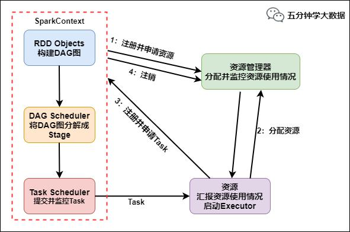
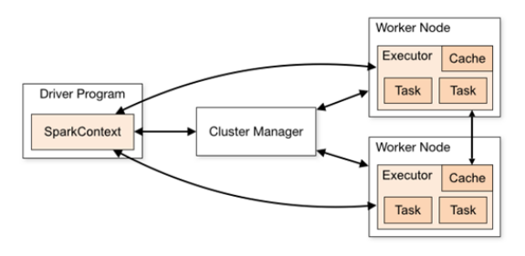
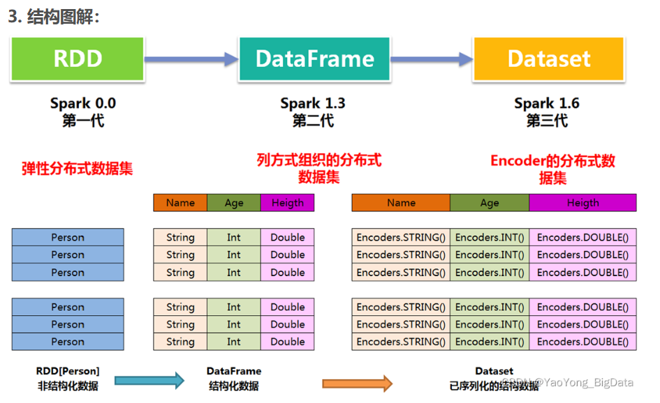
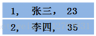
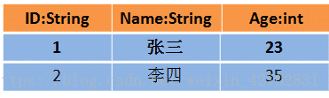
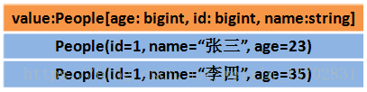

[toc]

# `Spark`在`Hadoop`高可用模式下读写`HDFS`
- 第一种：通过配置文件的形式

```
val sc = new SparkContext()

sc.hadoopConfiguration.set("fs.defaultFS", "hdfs://cluster1");
sc.hadoopConfiguration.set("dfs.nameservices", "cluster1");

sc.hadoopConfiguration.set("dfs.ha.namenodes.cluster1", "nn1,nn2");
sc.hadoopConfiguration.set("dfs.namenode.rpc-address.cluster1.nn1", "namenode001:8020");
sc.hadoopConfiguration.set("dfs.namenode.rpc-address.cluster1.nn2", "namenode002:8020");

sc.hadoopConfiguration.set("dfs.client.failover.proxy.provider.cluster1", 		      "org.apache.hadoop.hdfs.server.namenode.ha.ConfiguredFailoverProxyProvider");
```

- 第二种：通过`Java`代码

```
val conf = new SparkConf().setAppName("Spark Word Count") 
val sc = new SparkContext()

sc.hadoopConfiguration.addResource("cluster1/core-site.xml")
sc.hadoopConfiguration.addResource("cluster1/hdfs-site.xml")


hdfs-site.xml
<property>
	<name>dfs.nameservices</name>
	<value>mycluster</value>
</property>
<property>
	<name>dfs.ha.namenodes.mycluster</name>
	<value>nn1,nn2</value>
</property>
<property>
	<name>dfs.namenode.rpc-address.mycluster.nn1</name>
	<value>node01:8020</value>
</property>
<property>
	<name>dfs.namenode.rpc-address.mycluster.nn2</name>
	<value>node02:8020</value>
</property>
<property>
	<name>dfs.namenode.http-address.mycluster.nn1</name>
	<value>node01:50070</value>
</property>
<property>
	<name>dfs.namenode.http-address.mycluster.nn2</name>
	<value>node02:5007</value>
</property>
```

# 运行流程



1. `SparkContext`向资源管理器注册并向资源管理器申请`Executor`；
2. 资源管理器分配`Executor`，然后资源管理器启动`Executor`；
3. `Executor`发送心跳至资源管理器；
4. `SparkCOntext`构建`DAG`有向无环图；
5. 将`DAG`分解成`Stage (TaskSet)`；
6. 把`Stage`发送给`TaskScheduler`;
7. `Executor`向`SparkContext`申请`Task`;
8. `TaskScheduler`将`Task`发送给`Executor`运行；
9. `SparkContex`将应用程序代码发送给`Executor`;
10. `Task`在`Executor`上运行，运行完毕释放所有资源。

**总结：**任务向资源管理器注册，并启动`Driver`，然后向资源管理器申请资源`Executor`，资源管理器分配并启动`Executor`，`Executor`向`Driver`注册。`Driver`构建有向无环图`DAG`，并将任务分解成`Stage(TaskSet)`，`Task`被发送到`Executor`, `Executor`启动线程池来执行这些`Task`

# 构成组件



- `master`：管理集群和节点，不参与计算。
  - 负责资源的调度和分配，并进行集群的监控等职责

- `worker`：计算节点，进程本身不参与计算，和 `master` 汇报。
- `Driver`：运行程序的 `main` 方法，创建 `spark context` 对象。
  - 将用户程序转化为作业
  - 在`Executor`之间调度任务
  - 跟踪`Executor`的执行情况
  - 通过`UI`展示查询运行情况
- `spark context`：控制整个 `application` 的生命周期，包括 `dagsheduler` 和 `task scheduler` 等组件。
- `client`：用户提交程序的入口。
- `Executor`：负责在 `Spark` 作业中运行具体任务（`Task`）
  - 通过自身的块管理器（`Block Manager`）为用户程序中要求缓存的 `RDD` 提供内存式存储
  - 负责运行组成`Spark`应用的任务，并将结果返回给驱动器进程


# 作业参数

- `executor-cores` —— 每个executor使用的内核数，默认为1
- `num-executors` —— 启动executors的数量，默认为2
- `executor-memory` —— executor内存大小，默认1G
- `driver-cores` —— driver使用内核数，默认为1
- `driver-memory` —— driver内存大小，默认512M

# RDD机制的理解

`RDD`分布式弹性数据集，是一种数据结构，是`Spark`框架上的通用数据结构。所有的算子都是基于`RDD`来执行的，不同的场景会有不同的`RDD`实现类，但是都可以进行相互转换。`RDD`执行过程中会形成`DAG`图，然后形成血缘关系保证容错性。从物理角度来看`RDD`存储的是`Block`和`Node`之间的映射。

`RDD是Spark`提供的核心抽象，弹性分布式数据集。

`RDD`在逻辑上是一个`HDFS`文件，在抽象上是一种元素集合，包含了数据。它是被分区的，可以分为多个分区，每个分区分布在集群中的不同节点上，从而让`RDD`中的数据可以并行操作。

假如有个`RDD`有`90w`数据，3个`partition`，则每个分区上有`30w`数据，`RDD`通常过`Hadoop`上的文件，即`HDFS`或`HIVE`表来创建，还可以通过应用程序中的集合来创建；`RDD`最重要的特性就是容错性，可以自动从节点失败中恢复过去。即如果某个节点上的`RDD partition`因为节点故障，导致数据丢失，那么`RDD`可以通过自己的数据来源重新计算该`partition`。

`RDD`的数据默认存放在内存中，但是当内存资源不足时，`Spark`会自动将`RDD`数据写入磁盘。假如某结点内存只能处理 20W 数据，那么这 20W 数据就会放入内存中计算，剩下 10W 放到磁盘中。`RDD` 的弹性体现在于 `RDD` 上自动进行内存和磁盘之间权衡和切换的机制。

- 弹性
  -  存储的弹性：内存与磁盘的自动切换；
  - 容错的弹性：数据丢失可以自动恢复；
  - 计算的弹性：计算出错重试机制；
  -  分片的弹性：可根据需要重新分片

- 分布式：数据存储在大数据集群不同节点上
- 数据集：`RDD`封装了计算逻辑，并不保存数据
- 数据抽象：`RDD`是一个抽象类，需要子类具体实现
- 不可变：`RDD`封装了计算逻辑，是不可以改变的，想要改变，只能产生新的`RDD`，在新的`RDD`里面封装计算逻辑

# 算子

- ***单value***
  - `map`：输入一个数据，输出一个数据
  - `mapPartitions`：对一个分区的数据进行处理
  - `mapPartitionsWithIndex`：对一个分区的数据进行处理，同时输出带上分区`id`。
  - `flatMap`：输入一个数据，扁平化输出
  - `glom`：
  - `groupBy`:
  - `filter`：过滤
  - `sample`：
  - `distinct`：
  - `coalesce`:  重分区，不走`shuffle`
  - `repartition`：重分区，走`shuffle`
  - `sortBy`：排序
  - `pipe`

- ***双value***
  - `intersection`：当两个RDD进行intersection后,将保留两者共有的 
  - `union`：当两个RDD进行intersection后,将保留两者
  - `subtract`：当两个RDD进行intersection后,将保留两者不相同的。
  - `zip`:

- ***Key-Value***
  - `partitionBy` 
  - `reduceByKey` :  底层实现`combineByKey`，会预聚合 
  - `groupByKey`：底层实现`combineByKey` ， 直接发送到`reduce`
  - `aggregateByKey`
  - `foldByKey` 
  - `combineByKey` 
  - `sortByKey`
  - `mapValues`
  - `join` 
  - `cogroup`
- ***action***
  - `reduce`
  - `collect`
  - `count`
  - `first`
  - `take`
  - `takeOrdered`
  - `aggregate`
  - `fold`
  - `countByKey`
  - `save`
  - `foreach`

# map与`mapPartition`区别

（1）`map`：每次处理一条数据

（2）`mapPartitions`：每次处理一个分区数据

# Repartition和Coalesce区别

两者都是用来改变`RDD`的`partition`数量的，repartition底层调用的就是`coalesce`方法：`coalesce(numPartitions, shuffle = true)`

`repartition`一定会发生`shuffle`，`coalesce`根据传入的参数来判断是否发生`shuffle`

- **增大`rdd`的`partition`数量**使用`repartition`

- **减少`partition`数量**时使用`coalesce`

#  `reduceBykey` 与 `groupByKey`

***`reduceByKey:`*** 会将结果发送至`reduce`之前会对每个`mapper`在本地进行`merge` ，有点类似于在`MR`中的`combiner(合并)`。在 `map` 端进行一次 `reduce` 之后，数据量会大幅度减小，从而减小传输，保证 `reduce` 端能够更快的进行结果计算。(**map端预聚合**)

***`groupByKey`:*** `groupByKey` 会对每一个 `RDD` 中的 `value` 值进行聚合形成一个序列(`Iterator`)，此操作发生在 `reduce` 端，所以势必会将所有的数据通过网络进行传输，造成不必要的浪费。如果数据量十分大，可能会造成 `OutOfMemoryError`。（**全部发到reduce端**）

**总结：**在进行大量数据的 `reduce` 操作时候建议使用 `reduceByKey`。不仅可以提高速度，还可以防止使用 `groupByKey` 造成的内存溢出问题。当然他们底层都是使用`combineByKey`来实现的。

# `reduceByKey`、`foldByKey`、`aggregateByKey`、`combineByKey`区别

- `ReduceByKey`  没有初始值 分区内和分区间逻辑相同
- `foldByKey`   有初始值 分区内和分区间逻辑相同
- `aggregateByKey`有初始值 分区内和分区间逻辑可以不同
- `combineByKey`   初始值可以变化结构 分区内和分区间逻辑不同

# `cogroup rdd` 实现原理

**cogroup**：对多个（2~4）`RDD` 中的 `KV` 元素，每个 `RDD` 中相同 `key` 中的元素分别聚合成一个集合。

这个实现根据要进行合并的两个 `RDD` 操作，生成一个 `CoGroupedRDD` 的实例，这个 `RDD` 的返回结果是把相同的 `key` 中两个 `RDD` 分别进行合并操作，最后返回的 `RDD` 的 `value` 是一个 `Pair` 的实例，这个实例包含两个 `Iterable` 的值，第一个值表示的是 `RDD1` 中相同 `KEY` 的值，第二个值表示的是 `RDD2` 中相同 `key` 的值。由于做 `cogroup` 的操作，需要通过 `partitioner` 进行重新分区的操作，因此，执行这个流程时，需要执行一次 `shuffle` 的操作。

**总结：**

- `join`就是简单的把两0个`RDD`按照相同的`key`给拼在一起，返回：`<key, Tuple2<value, value>>`
  - 有多少条关联数据，就有多少个输出 
  - 单个`RDD`不做提前聚合

- `cogroup` 是把两个RDD按照`key`拼起来，会汇总得到的`value` 。返回：`<key, Tuple2<Iterable<value>, Iterable(value)>>`
  - 有多少个`key`，就有多少个输出
  - 单个`RDD`基于`key`做提前聚合

# 宽窄依赖

- **窄依赖：**父`RDD`的一个分区只能被子`RDD`的一个分区依赖 （一对一）
  - 窄依赖的多个分区可以并行计算
  - 窄依赖的一个分区的数据如果丢失只需要重新计算对应的分区的数据就可以了

- **宽依赖：**父`RDD`的一个分区被子`RDD`的多个分区依赖 （多对对）
  - 划分`Stage`(阶段)的依据:对于宽依赖
  - 必须等到上一阶段计算完成才能计算下一阶段

# 为什么要划分`stage`

**并行计算**。

一个复杂的业务逻辑如果有 `shuffle`，那么就意味着前面阶段产生结果后，才能执行下一个阶段，即下一个阶段的计算要依赖上一个阶段的数据。那么我们按照 `shuffle` 进行划分(也就是按照宽依赖就行划分)，就可以将一个 `DAG` 划分成多个 `Stage`阶段，在同一个 `Stage` 中，会有多个算子操作，可以形成一个 `pipeline` 流水线，流水线内的多个平行的分区可以并行执行。

**总结：**划分`Stage`为了进行并行计算，每个`Stage`内部都可以进行并行计算，等到当前`Stage`都处理完毕，才会执行下一个阶段。

# 如何划分 DAG 的 stage
对于窄依赖，`partition` 的转换处理在 `stage` 中完成计算，不划分(将窄依赖尽量放在在同一个 `stage` 中，可以实现流水线计算)。
对于宽依赖，由于有 `shuffle` 的存在，只能在父 `RDD` 处理完成后，才能开始接下来的计算，也就是说需要要划分 `stage`。

# stage划分算法

核心算法：**回溯算法**

**从后往前回溯/反向解析，遇到窄依赖加入本 Stage，遇见宽依赖进行 Stage 切分。**

`Spark` 内核会从触发 `Action` 操作的那个 `RDD` 开始**从后往前推**，首先会为最后一个 `RDD` 创建一个 `Stage`，然后继续倒推，如果发现对某个 `RDD` 是宽依赖，那么就会将宽依赖的那个 `RDD` 创建一个新的 `Stage`，那个 `RDD` 就是新的 `Stage` 的最后一个 `RDD`。然后依次类推，继续倒推，根据窄依赖或者宽依赖进行 `Stage` 的划分，直到所有的 `RDD` 全部遍历完成为止。

1.  `Application`：初始化一个`SparkContext`即生成一个`Application`；
2. `Job`：一个`Action`算子就会生成一个`Job`；
3. ``Stage``：`Stage`等于宽依赖的个数加1；
4. `Task`：一个`Stage`阶段中，最后一个`RDD`的分区个数就是`Task`的个数。

**总结：**`Stage`的划分是从尾向开始倒推，`action`作为`ResultShuffle`，如果遇到`shuffle`算子则划分为新的`Stage`，也就是说每个`Stage`里面最多只有一个`Shuffle`算子或者是一个`action`算子。

# 数据倾斜的处理

某一个或者某几个 `partition` 的数据特别大，导致这几个 `partition` 上的计算需要耗费相当长的时间。

在 `spark` 中同一个应用程序划分成多个 `stage`，这些 `stage` 之间是串行执行的，而一个 `stage` 里面的多个 `task` 是可以并行执行，`task` 数目由 `partition` 数目决定，如果一个 `partition` 的数目特别大，那么导致这个 `task` 执行时间很长，导致接下来的 `stage` 无法执行，从而导致整个 `job` 执行变慢。

定位数据倾斜，是`OOM`，还是任务执行缓慢。通过看日志，看`WebUI`。

**解决方法**

1. **避免不必要的 `shuffle`**，将 `reduce-side-join` 提升为 `map-side-join`
2. **分拆发生数据倾斜的记录**，分成几个部分进行，然后合并 join 后的结果
3. **改变并行度**，可能并行度太少了，导致个别 task 数据压力大
4. **两阶段聚合**，先局部聚合，再全局聚合
5. **自定义 `partitioner`**，分散 `key` 的分布，使其更加均匀
5. **对key加盐或哈希值来拆分key**  将数据分散到不同的 partition

# `OOM`问题的解决方案

- `map`类型的算子执行中内存溢出如`flatmap`, `mapPartition`

  - 原因：`map` 端过程产生大量对象导致内存溢出：这种溢出的原因是在单个 `map` 中产生了大量的对象导致的针对这种问题。

  - 解决方案

    - 增加堆内内存

    - 减少每个 `Task` 处理数据量
      - 在不增加内存的情况下，可以减少每个 `Task` 处理数据量，使每个 `Task` 产生大量的对象时，`Executor` 的内存也能够装得下。具体做法可以在会产生大量对象的`map` 操作之前调用 `repartition` 方法，分区成更小的块传入 `map`。

- `shuffle` 后内存溢出如 `join`，`reduceByKey`，`repartition`。
  - `shuffle`内存溢出的情况可以说都是`shuffle`后，单个文件过大导致的。
    - 在`shuffle`的使用，需要传入一个`partitioner`。`Spark`中默认`shuffle`操作是`HashPatitioner`，默认值是父 `RDD`中最大的分区数．这个参数 `spark.default.parallelism`只对`HashPartitioner`有效．
    - 如果是别的`partitioner`导致的`shuffle`内存溢出就需要重写`partitioner`代码了．
  
- `driver` 内存溢出
  - 用户在`Dirver`端口生成大对象，比如创建了一个大的集合数据结构。解决方案：
    - 将大对象转换成`Executor`端加载，比如调用`sc.textfile`
    - 评估大对象占用的内存，增加 `dirver` 端的内存
  - 从`Executor`端收集数据`collect`回`Dirver`端，建议将`driver`端对`collect`回来的数据所作的操作，转换成`executor`端`rdd`操作。

# 数据的管理器

每个数据分片都对应具体物理位置，数据的位置是被**`blockManager`**管理。

无论数据是在磁盘，内存还是`tacyan`，都是由**`blockManager`**管理。

# 内存管理

`Spark`的内存管理是负责管理Spark应用程序中内存使用的组件，包括堆内存和堆外内存。内存管理的主要作用是优化`Spark`应用程序的性能和吞吐量，并避免因为内存不足导致应用程序执行失败的情况。

**堆内存管理**：`Spark`将堆内存划分为两部分：用于存储`RDD`数据和使用的内存。堆内存管理器负责对内存的使用进行监控和管理，根据当前内存使用情况，**自动调整内存分配策略**，以优化内存使用和任务执行性能。

**堆外内存管理**：`Spark`使用堆外内存（`Off-heap Memory`）来存储`Spark`内部的数据结构和缓存。堆外内存管理器负责对内存的使用进行监控和管理，自动回收不使用的内存，并根据当前内存使用情况自动调整内存分配策略。

**内存分配策略**：`Spark`的内存管理器根据应用程序的内存需求和当前内存使用情况，**自动调整内存分配**策略。内存分配策略包括`Static、Dynamic和User-defined`等，用户可以根据自己的需求进行配置。

**内存管理模式**：Spark的内存管理器支持两种内存管理模式：`Execution Memory`和`Storage Memory`。`Execution Memory`用于存储RDD操作的中间结果，而`Storage Memory`用于存储缓存的RDD数据。内存管理器会根据使用情况自动调整`Execution Memory`和`Storage Memory`的大小。

**内存溢出处理**：当`Spark`应用程序使用的内存超出了可用内存时，内存管理器会自动进行内存回收和调整，并尝试将任务重新分配到其他可用的资源上执行，以避免内存溢出和应用程序执行失败的情况。

```
cache()方法将数据存储在内存中，但如果内存不足，数据可能会溢出到磁盘中。
persist()方法允许指定持久化级别，可以选择将数据存储在内存中、磁盘中或两者兼备。
```

# `Spark`程序如何修改`Task`执行数

- 输入数据有很多`task`，尤其是有很多小文件的时候，有多少个输入`block`就会有多少个`task`启动；
- `spark` 中有`partition`的概念，每个`partition`都会对应一个`task`，`task`越多，在处理大规模数据的时候，就会越有效率。不过`task`并不是越多越好。

参数可以通过 `spark_home/conf/spark-default.conf` 配置文件设置:

- 针对 `spark sql` 的 `task` 数量：`spark.sql.shuffle.partitions=50`
- 非 `spark sql` 程序设置生效：`spark.default.parallelism=10`

# join 操作优化经验

`join` 其实常见的就分为两类：`map-side join` 和 `reduce-side join`。

当**大表和小表** `join` 时，用 `map-side join` 能显著提高效率。

在分布式计算系统中，框架提供的 `join` 操作一般会将所有数据根据 `key` 发送到所有的 `reduce` 分区中去，也就是 `shuffle` 的过程。造成大量的网络以及磁盘 `IO` 消耗，运行效率极其低下，这个过程一般被称为 `reduce-side-join`。

如果有张表**较小**的话，我们则可以自己实现在`map`端实现数据关联，跳过大量数据进行`shuffle`的过程，运行时间得到大量缩短，根据不同数据可能会有几倍到数十倍的性能提升。

在大数据量的情况下，`join`是一中非常昂贵的操作，需要在`join`之前应尽可能的**先缩小数据量**。

1. 若两个`RDD`都有重复的`key`，`join`操作会使得数据量会急剧的扩大。所有最好先使用`distinct`或者`combineByKey`操作来减少`key`空间或者用`cogroup`来处理重复的`key`，而不是产生所有的交叉结果。在`combine`时，进行机智的分区，可以避免第二次`shuffle`。 (减少数据量)
2. 如果只在一个`RDD`出现重复的`key`，那将在无意中丢失你的数据。所以使用外连接会更加安全，这样你就能确保左边的`RDD`或者右边的`RDD`的数据完整性，在`join`之后再过滤数据。（使用外连接，再过滤）
3. 如果我们容易得到`RDD`的可以的有用的子集合，那么可以先用`filter`或者`reduce`，再用 `join`。(先减少数据在过滤)

# `Spark shuffle & MR shuffle`

| Spark shuffle                                                | MR shuffle                                                   |
| ------------------------------------------------------------ | ------------------------------------------------------------ |
| 将`mapper`的输出进行`partition`，不同的`partition`送到不同的`reducer` | 将`mapper`的输出进行`partition`，不同的`partition`送到不同的`reducer` |
| 默认不排序                                                   | 默认是排序的                                                 |
| `spark` 没有明显的阶段划分，只有不同的 `stage` 和算子操作    | 可以划分成 `split，map()、spill、merge、shuffle、sort、reduce()`等阶段 |
| 不落盘                                                       | 落盘                                                         |

# `Spark SQL` 执行的流程

1. `parser`：基于`antlr`框架对`sql`解析，生成**抽象语法树**。
2. 变量替换：通过正则表达式找出符合规则的字符串，替换成系统缓存环境的变量
3. `parser`：将`antlr`的`tree`转成`spark catalyst`的`LogicPlan`，也就是 未解析的逻辑计划；详细参考`AstBuild`, `ParseDriver`
4. `analyzer`：通过分析器，结合`catalog`，把`logical plan`和实际的数据绑定起来，将**未解析的逻辑计划** 生成 **逻辑计划**；详细参考`QureyExecution`
5. 缓存替换：通过`CacheManager`，替换有相同结果的`logical plan`（逻辑计划）
6. `logical plan`优化，基于规则的优化；优化规则参考`Optimizer`，优化执行器`RuleExecutor`
7. 生成`spark plan`，也就是**物理计划**；参考`QueryPlanner`和`SparkStrategies`
8. `spark plan`准备阶段
9. 构造`RDD`执行，涉及`spark`的`wholeStageCodegenExec`机制，基于`janino`框架生成`java`代码并编译

**解析 -> 编译 -> 优化 -> 执行**

抽象语法树 -> 逻辑计划 -> 物理计划

# `Spark SQL`是如何将数据写到`Hive`表的

- 方式一：是利用 `Spark RDD` 的 `API` 将数据写入`hdfs`形成`hdfs`文件，之后再将`hdfs`文件和 `hive`表做加载映射。

- 方式二：利用`Spark SQL`将获取的数据`RDD`转换成`DataFrame`，再将`DataFrame`写成缓存表，最后利用`Spark SQL`直接插入`hive`表中。

对于利用`Spark SQL`写`hive`表官方有两种常见的 API，
  - 第一种是利用 `JavaBean` 做映射，
  - 第二种是利用 `StructType` 创建`Schema`做映射。

# Spark 为啥比MR运行效率高

1. 基于内存计算，减少低效的磁盘交互；
2. 高效的调度算法，基于`DAG`；
3. 容错机制`Linage`（记录RDD的元数据信息和转换行为，当该RDD的部分分区数据丢失，根据这些信息来重新运算和恢复丢失的数据分区）。

重点部分就是`DAG`和`Linage`

# 使用场景

`Hadoop/MapReduce` 和`Spark`最适合的都是做离线型的数据分析，但`Hadoop`特别适合是单次分析的数据量“很大”的情景，而`Spark`则适用于数据量不是很大的情景。

1. 一般情况下，对于中小互联网和企业级的大数据应用而言，单次分析的数量都不会“很大”，因此可以优先考虑使用`Spark`。
2. 业务通常认为`Spark`更适用于机器学习之类的“迭代式”应用，`80GB`的压缩数据（解压后超过`200GB`），`10`个节点的集群规模，跑类似`“sum+group-by”`的应用，`MapReduce`花了 5 分钟，而`spark`只需要 2 分钟。

# 宕机迅速恢复

1. 适当**增加 `spark standby master`**
2. **编写`shell`脚本，定期检测`master`状态**，出现宕机后对`master`进行重启操作

# 持久化原理

`spark`非常重要的一个功能特性就是可以将`RDD`持久化在内存中。

调用`cache()`和`persist()`方法即可。`cache()`和`persist()`的区别在于

- `cache()`是`persist()`的一种简化方式，`cache()`的底层就是调用`persist()`的无参版本 `persist(MEMORY_ONLY)`，将数据持久化到内存中。

如果需要从内存中清除缓存，可以使用`unpersist()`方法。`RDD`持久化是可以手动选择不同的策略的。在调用`persist()`时传入对应的`StorageLevel`即可。

# Checkpoint 检查点机制

当`Spark`应用程序特别复杂，从初始的`RDD`开始到最后整个应用程序完成了很多步骤中，而且整个应用程序运行时间特别长，这种情况下就比较适合使用`checkpoint`。

对于特别复杂的`Spark`应用，会出现某个反复使用的`RDD`，即使之前使用了持久化但由于节点的故障导致数据丢失，如果没有容错机制，那么需要重新从开头开始计算。

`checkpoint`首先会调用`SparkContext`的`setCheckPointDir()`方法，设置一个容错的文件系统的目录；然后对`RDD`调用`checkpoint()`方法；之后在`RDD`所处的`job`运行结束之后，会启动一个单独`Job`，将`checkpoint`的`RDD`数据写入之前设置的文件系统，进行高可用，容错的持久化操作。

检查点机制在`Spark Streaming`用来保障容错性，它可以使`Spark Streaming`阶段性的把应用数据存储到可靠的存储系统，方便恢复时使用。

- 控制发生失败时需要重算的状态数。（就近恢复，无需从头开始算）
- 提供驱动器程序容错。如果流计算应用中的驱动器程序崩溃了，你可以重启驱动器程序并让驱动器程序从检查点恢复。

# 持久化与检查点的区别

- 持久化
  - 数据由`BlockManager`管理，存储在磁盘，内存
  - 血缘关系不变
  - 数据丢失的可能性更大
- 检查点
  - 血缘关系会被切断
  - 数据保存在第三方存储系统
  - 数据丢失的可能性较低

# Spark Streaming 的基本工作原理

`Spark Streaming`是`Spark core`的一种扩展，可以用于进行大规模、高吞吐、容错的实时数据流处理

接受实时输入数据流，然后将数据拆分成`batch`，比如每收集一秒的数据封装成一个`batch`，然后将每个`batch`交给`spark`的计算引擎进行处理，最后会生产处一个结果数据流，其中的数据也是一个一个的`batch`组成的。

# `DStream` 基本工作原理

`DStream` 是`spark streaming` 提供的一种高级抽象，代表了一个持续不断的数据流。

`DStream`内部其实不断产生`RDD`，每个`RDD`包含了一个时间段的数据。

`Spark streaming` 一定是有一个输入的`DStream`接收数据，按照时间划分成一个一个的 `batch`，并转化为一个 `RDD`，`RDD` 的数据是分散在各个子节点的 `partition` 中。

# `Spark` 整合 `kafka` 两种模式

- **receiver 方式**
  - 数据由专门一个`executor`来拉取，内存压力大
  - 通过`WAL`预写日志，保证数据不丢失，数据要复制两份
  - 由`zk`来维护偏移量，**此方式效率低，容易出现数据丢失**
- **Direct 方式**
  - 数据由`executor`来拉取，数据分散，内存压力小
  -  并行读取，`kafka` 分区与 `RDD` 分区一一映射
  - 自身维护偏移量，不容易丢失数据
  - 消费一次且仅消费一次

# 主备切换机制

`Master`实际上可以配置两个，`Spark`原生的`standalone`模式是支持`Master`主备切换的。当`Active Master`节点挂掉以后，我们可以将 `Standby Master` 切换为 `Active Master`。

`Spark Master` 主备切换可以基于两种机制，一种是基于文件系统的，一种是基于 `ZooKeeper` 的。

- 基于**文件系统的主备切换机制**，需要在 `Active Master` 挂掉之后**手动**切换到 `Standby Master` 上；
- 基于 **`Zookeeper` 的主备切换机制**，可以实现**自动**切换 `Master`。

# HA主从切换影响到集群已有作业的运行？

因为程序在运行之前，已经申请过资源了，`driver`和`Executors`通讯，不需要和`master`进行通讯的。

# 哪些源数据保存到 Zookeeper 里面

`Spark`通过`spark.deploy.zookeeper.dir`指定`mater`元数据在`zookeeper`中保存的位置，包括 `Worker`，`Driver` 和 `Application` 以及 `Executors`。`standby` 节点要从 `zk` 中，获得元数据信息，恢复集群运行状态，才能对外继续提供服务，作业提交资源申请等，在恢复前是不能接受请求的。

# hadoop vs spark

- `hadoop`
  - 使用 `MapReduce` 计算架构
  - 只有`map` 和 `reduce `两种操作，表达能力比较欠缺
  - 在 `MR` 过程中会重复的读写` hdfs`，造成大量的磁盘` io` 读写操作
  - 适合高时延环境下批处理计算
  - 在一个 `job` 里面能做的处理很有限
- `spark`
  - 基于内存的分布式计算架构
  - 提供更加丰富的数据集操作类型
  - 适合低时延环境下计算的应用；
  - 基于内存的迭代式计算模型，可以分为 n 个阶段
  - 计算模型更加灵活，可以提供更强大的功能
  - `OOM` 内存溢出等情况

| MR                                                           | Spark                                                        |
| ------------------------------------------------------------ | ------------------------------------------------------------ |
| 抽象层次低，需要使用手工代码来完成程序编写，使用上难以上手   | Spark 采用 RDD 计算模型，简单容易上手                        |
| 只提供 map 和 reduce 两个操作，表达能力欠缺；                | Spark 采用更加丰富的算子模型，包括 map、flatmap、groupbykey、reducebykey 等； |
| 一个 job 只能包含 map 和 reduce 两个阶段，复杂的任务需要包含很多个 job，这些 job 之间的管理以来需要开发者自己进行管理； | Spark 中一个 job 可以包含多个转换操作，在调度时可以生成多个 stage，而且如果多个 map 操作的分区不变，是可以放在同一个 task 里面去执行； |
| 中间结果存放在 hdfs 中；                                     | Spark 的中间结果一般存在内存中，只有当内存不够了，才会存入本地磁盘，而不是 hdfs； |
| 只有等到所有的 map task 执行完毕后才能执行 reduce task；     | Spark 中分区相同的转换构成流水线在一个 task 中执行，分区不同的需要进行 shuffle 操作，被划分成不同的 stage 需要等待前面的 stage 执行完才能执行。 |
| 只适合 batch 批处理，时延高，对于交互式处理和实时处理支持不够； | Spark streaming 可以将流拆成时间间隔的 batch 进行处理，实时计算。 |

# 累加器

累加器：分布式共享**只写变量**。（`Executor`和`Executor`之间不能读数据）

累加器用来把`Executor`端变量信息聚合到`Driver`端。在`Driver`程序中定义的变量，在`Executor`端的每个`Task`都会得到这个变量的一份新的副本，每个`task`更新这些副本的值后，传回`Driver`端进行`merge`，从而实现累加。

# 广播变量

分布式共享**只读变量**，每个`Executor `只有一个共享变量。

广播变量用来高效分发较大的对象。向所有工作节点发送一个较大的只读值，以供一个或多个`Spark`操作使用。

# 当Spark涉及到数据库的操作时，如何减少Spark运行中的数据库连接数？

使用`foreachPartition`代替foreach，在`foreachPartition`内获取数据库的连接。

# `TopN`

- 方法一
  - 对 key 对数据进行聚合（groupByKey）
  - 对 value 利用 sortBy或sortWith排序
- 方法二
  - 取出所有的key
  - 对key进行迭代，每次取出一个key利用spark的排序算子进行排序
- 方法三
  - 自定义分区器，按照key进行分区，使不同的key进到不同的分区
  - 对每个分区运用spark的排序算子进行排序

# 背压机制

根据处理能力动态的拉取数据

根据`JobScheduler`反馈作业的执行信息来动态调整`Receiver`数据接收率。

#  `SparkStreaming`实现`Exactly Once`

- **方法一: 使用事务**

  实现`Exactly Once`语义的关键是保证处理消息和提交偏移量的原子性. 所以只要把这两个操作放到一个事务里, 不管是先处理消息和还是先提交偏移量都可以保证消息不丢失和不重复。

  比如手动维护消费消息的偏移量, 并把偏移量放到`MySQL`中, 然后数据的落盘也放到`MySQL`中, 而`MySQL`是支持事务的, 那么我们就可以保证着两个操作的原子性了.

  **缺点**

  - 对存储层有依赖, 只能**使用支持事务的存储层**
  - 事务性能不高
  - 并且一个存储层容易存在单点故障压力过大,  如果做分布式又需要做分布式事务增加了复杂性

- **方法二: 手动提交偏移量 + 幂等性**

  确保真正处理完数据后再提交偏移量, 但是可能提交偏移量失败, 导致重复消费了, 这时就要做数据的幂等性保存了, 即数据无论被保存多少次效果都是一样的, 不会存在重复数据。

# Spark如何与Hadoop集成

`Spark`可以与 `Hadoop` 集成，以便在 `Hadoop` 集群上使用 `Spark`进行数据处理，`Spark` 和`Hadoop`的集成有两种方式：

- **通过 `Hadoop` 的 `Yarn` 调度器来启动`Spark`应用程序**

  `spark-submit --class <main-class> --master yarn --deploy-mode cluster <application-jar>`

  其中，`--master`参数指定为`yarn`，`--deploy-mode`参数指定为`cluster`，表示将`Spark`应用程序部署到`YARN`集群中运行。

- **通过`Spark`的独立集群管理器来管理 `Spark `集群**

  使用`Spark`的独立集群管理器启动`Spark`应用程序。可以使用以下命令提交应用程序：
  `$ spark-submit --class <main-class> --master spark://<spark-master-hostname>:7077 <application-jar>`

  其中，`--master`参数指定为`spark://<spark-master-host`

在使用`Spark`与`Hadoop`进行数据处理之前，首先需要**配置`Spark`与`Hadoop`的环境变量**，以便`Spark`能够与`Hadoop`集群进行通信。具体来说，需要将`Hadoop`的配置文件（如`core-site.xml`、`hdfs-site.xml`等）和`Hadoop`的`jar`包添加到`Spark`的`classpath`中。

# Driver 和 Executor 通信方式

`Driver `和 `Executor` 之间通过 `RPC` 进行通信

当 `Spark` 应用程序启动时，`Driver` 节点会启动并创建一个 `SparkContext`对象，`SparkContext`对象是**整个应用程序的入口点**，**负责与集群管理器通信**以请求资源并分配任务。`Driver`节点会将应用程序代码和依赖项分发到集群中的各个`Worker`节点，并在`Executor`上启动任务。`Executor`节点是`Worker`节点上的进程，用于执行**具体的计算任务**。当`Executor`启动时，它会向`Driver`节点注册并请求任务。`Driver`节点会将任务发送到`Executor`节点，并将计算结果发送回`Driver`节点。

在`RPC`通信期间，`Driver`和`Executor`节点之间会通过**序列化**和**反序列化**数据来传递信息。`Spark`使用`Java`序列化或`Kryo`序列化来序列化和反序列化数据，以实现高效的数据传输和处理。

**总之**，`Spark`的`Driver`和`Executor`之间通过`RPC`进行通信，并通过序列化和反序列化数据来传递信息。这种通信方式是`Spark`应用程序的核心，对于应用程序的性能和效率至关重要。

# `RDD & DF & DS`










# 任务调度过程

spark 的任务调度器是负责将 `spark` 任务程序中的任务分配给集群中的可用资源（内存，`CPU`，磁盘)等。任务调度器的主要作用是实现任务的并行执行和资源的高效利用，提高` spark `的性能和吐吞量

```
任务调度器将这些 RDD 操作转化为有向无环图 DAG，DAG 代表任务之间的依赖关系；

任务调度器将DAG中的每个节点划分成一系列的任务，并将任务按照依赖关系划分为多个 stage；

任务调度器将这些 stage 提交给资源调度器 (YARN),并请求资源执行；

资源调度器将可用资源分配给每个 stage，并将每个 stage 分配给执行器节点；

在每个 Executor 节点上，任务调度器按照 stage 中的依赖关系，将任务分配给可用线程进行执行；

执行的结果返回给任务调度器，任务调度器将结果进行合并和处理，然后将结果返回给应用程序。
```

# Spark History Server

```
Spark History Server 是一个 Web 服务，用于存储和查看以前运行过的 Spark 应用程序的运行历史。它允许用户查看应用程序的执行统计信息，包括作业的完成时间、运行时间、执行计划和阶段信息等，从而可以对应用程序的性能和行为进行更深入的分析和诊断。

Spark History Server 可以从 Spark 的事件日志中读取应用程序的详细信息，并将其存储在磁盘上，以便后续查看。用户可以使用 Spark UI 中的“Event Logs”页面将事件日志传输到集中式存储系统中，例如 HDFS 或 Amazon S3 等。然后，可以使用 Spark History Server 来查看已经存储在集中式存储系统中的事件日志。

通过 Spark History Server，用户可以了解 Spark 应用程序的性能瓶颈和问题，并采取相应的措施来改进其性能和稳定性。例如，如果 Spark 应用程序中存在数据倾斜或资源利用率不足的问题，可以通过查看 Spark History Server 中的信息来定位问题的根本原因，并尝试采取一些优化措施来改进应用程序的性能和效率。
```

# shuffle操作

`Shuffle`操作是指将数据重新分配并组合以进行聚合操作的过程。`Shuffle`操作通常会在`Spark`中产生大量的网络`I/O`。

# stage 的作用

```
在 spark 中，一个 stage 指的是一个任务的逻辑分片。在 spark 中，一个任务可以被分成一系列的 stage，每个 stage 都是由一组数据的转换操作组成的。

一个 stage 可以包含多个任务，这些任务可以并行执行，因为它们之间不存在依赖关系。但是，一个 stage 内部的任务必须按照一定的顺序执行，因为它们之间存在依赖关系

在 Spark 使用 stage 来实现任务调度和执行，将一个大任务划分为多个小 stage，然后按照依赖关系进行调度和执行。这种划分和调度可以提高 spark 的并行度和性能，同时也能避免资源浪费

在 spark 的物理执行计划中，每个 stage 都被分配给一个执行器，并在该执行器上执行。因此，stage 的大小和数量可以影响 spark 应用程序的性能和资源利用率。
```

# Spark SQL和Hive区别

|                  | Spark SQL                                                    | Hive                                                         |
| ---------------- | ------------------------------------------------------------ | ------------------------------------------------------------ |
| **执行引擎**     | 使用Spark作为执行引擎                                        | 使用MapReduce或Tez作为执行引擎                               |
| **性能**         | 使用内存计算技术和RDD（弹性分布式数据集）来实现高性能计算    | 使用MapReduce来执行作业，需要从磁盘读取和写入大量数据        |
| **数据源**       | 支持多种数据源，包括Hive表、Parquet文件、JSON文件、CSV文件、JDBC数据源等 | 只支持Hive表和HDFS上的文件                                   |
| **数据仓库**     | 面向数据仓库的工具，可以用于处理和分析大量结构化数据         | 面向数据仓库的工具，可以用于处理和分析大量结构化数据         |
| **元数据存储**   | 使用元数据存储来管理表和分区的元数据,Spark SQL使用`Hive Metastore`或`ZooKeeper`来存储元数据， | 使用元数据存储来管理表和分区的元数据，Hive使用自己的`Metastore`服务来存储元数据。 |
| **UDF支持**      | 支持用户自定义函数（UDF），可以扩展SQL功能                   | 支持用户自定义函数（UDF），可以扩展SQL功能                   |
| **工具生态系统** | Spark SQL和Hive都有丰富的工具生态系统，例如Spark、Hue、Zeppelin等，可以方便地进行数据处理和分析。 | Spark SQL和Hive都有丰富的工具生态系统，例如Spark、Hue、Zeppelin等，可以方便地进行数据处理和分析。 |

总之，`Spark SQL`和`Hive`都是用于在`Hadoop`生态系统中进行数据处理和分析的工具，它们之间有一些区别和相似之处。

# 组件

## 执行器

```
在Spark中，执行器是运行在集群节点上的进程，负责执行任务（Task）。每个执行器都有自己的 JVM，可以在运行时自动启动和关闭，因此可以在不同的节点上运行。执行器根据驱动程序（Driver Program）的指示，从集群管理器（Cluster Manager）中请求资源，并在本地执行任务。每个执行器都负责执行一部分计算任务，并在完成后将结果返回给驱动程序。

执行器在Spark集群中扮演着非常重要的角色。通过将任务分发到不同的执行器上，Spark可以实现分布式计算，并在每个执行器上并行处理数据。这种分布式计算的方式可以提高计算性能和可伸缩性。Spark执行器的设计使得它可以在各种类型的集群管理器上运行，例如Standalone，Apache Mesos和Hadoop YARN等。
```

## 分区

```
在Spark中，一个分区（Partition）是一个数据集的逻辑部分，可以被并行处理。Spark RDD 是Spark中最基本的抽象，它将数据划分为不同的分区并在集群中分布式存储。分区使得数据可以并行处理，提高了Spark作业的性能和可伸缩性。

具体来说，Spark分区可以将数据划分为多个逻辑块，每个逻辑块都被处理器内核处理。这意味着一个Spark作业可以同时在多个分区上执行，以获得更好的性能和吞吐量。Spark根据硬件配置和数据集的大小自动确定要使用的分区数量，但用户也可以手动设置分区数量。

在Spark中，数据被划分为分区后，可以在分布式集群上并行处理。Spark提供了许多操作来操作和转换分区中的数据，例如map、filter和reduceByKey等。这些操作可以在各个分区上并行执行，使得数据处理更加高效。

总的来说，Spark分区的作用是提高Spark作业的性能和可伸缩性，通过并行处理数据并在集群中分布式存储，使得数据处理更加高效。
```

## DAG

```
DAG 是 Directed Acyclic Graph 的缩写，指有向无环图，Spark 中的 DAG 是任务调度的重要概念。在 Spark 中，任务的依赖关系被表示为一个有向无环图，任务被表示为图中的节点，依赖关系被表示为节点间的有向边。

Spark DAG 是一种优化执行计划的数据结构，将任务按照依赖关系划分成多个阶段，每个阶段中的任务可以并行执行。通过 DAG，Spark 可以将多个具有依赖关系的任务划分成多个阶段，对每个阶段进行优化处理，最终形成一条任务执行的有向无环图，最大程度地提高了任务的并行度，从而加速数据处理的速度。

可以对任务进行合并和剪枝，减少任务之间的依赖，提高任务的并行度和执行效率。

可以将一个大任务切分成多个小任务，将这些小任务分配到多个节点上执行，从而减少节点间的数据传输和任务调度开销。

可以将复杂的计算过程拆分成多个阶段，每个阶段分别执行，提高任务执行效率和并行度。

在 Spark 中，DAG 的构建过程是自动进行的，开发人员只需要编写数据处理逻辑即可。Spark 会根据任务之间的依赖关系构建 DAG，对 DAG 进行优化，生成最终的执行计划。因此，开发人员可以将精力集中在数据处理的业务逻辑上，无需关注任务的调度和优化细节。
```

## 集群故障的机制

```
容错机制：Spark 借助 RDD 的容错特性来处理节点故障。当某个节点发生故障时，Spark 会自动将该节点上的 RDD 分区重新计算，确保计算结果的正确性。

任务重试：如果某个节点上的任务失败了，Spark 会自动将该任务重新分配到其他可用节点上执行，以保证任务的完成。

动态资源分配：Spark 可以根据当前集群资源的使用情况来动态分配资源，以避免资源的浪费和拥堵。

高可用性：Spark 提供了高可用性机制，可以通过 ZooKeeper 或 Hadoop HDFS 来实现主节点的自动切换，从而保证集群的高可用性。

监控和日志：Spark 提供了丰富的监控和日志工具，可以帮助用户实时监控集群的运行情况，并及时发现和处理故障。例如，Spark Web UI 可以展示应用程序的执行情况和资源使用情况，Spark 日志可以记录应用程序的详细运行信息，帮助用户分析和调试问题。

综上所述，Spark 提供了一系列机制来处理集群环境中的故障，以确保应用程序的高可用性和容错性。用户可以根据自己的需求和实际情况选择适合的机制来提高集群的可靠性和稳定性。
```

## 序列化

```
Spark 序列化是将对象转换为字节流以便在网络上传输或在磁盘上持久化存储的过程。在 Spark 中，数据需要在各个节点之间传输，以便进行并行计算。为了提高计算效率，Spark 使用了内存计算和缓存技术，因此需要将对象序列化并存储在内存中。此外，Spark 还需要对数据进行分区，每个分区的数据也需要进行序列化和反序列化。

Spark 序列化的重要性在于它对性能和效率的影响。Spark 序列化的效率和速度会影响整个作业的执行时间和资源消耗。如果序列化和反序列化过程不高效，可能会导致作业运行速度变慢或者出现性能问题。因此，优化 Spark 序列化的效率对于提高整个作业的性能和效率非常重要。

Spark 默认使用 Java 序列化，但是 Java 序列化存在效率问题。为了提高效率，Spark 还提供了一些其他的序列化方式，如 Kryo 和 Protobuf，它们可以提供更高的序列化和反序列化速度，并且支持更多的数据类型和格式。此外，用户还可以通过调整 Spark 序列化的配置参数来优化序列化效率，例如调整序列化方式、批处理大小、缓存大小等。
```

## 容错机制

```
1.RDD lineage
Spark通过RDD的lineage机制实现容错。每个RDD都包含一组指向其父RDD的指针，因此可以通过重新计算丢失的分区来恢复丢失的数据。

当一个分区的数据丢失时，Spark会查找这个丢失分区的父RDD，找到这个分区所属的父分区，然后重新计算这个分区的数据。如果这个父分区也丢失了，那么继续往上找，直到找到一个已经计算过的分区，然后根据这个分区重新计算丢失的分区。

2.数据副本
Spark会将数据存储在多个节点上，以便在某个节点发生故障时可以使用另一个节点上的数据进行恢复。Spark中默认情况下会将每个分区的数据副本存储在两个节点上，这样即使一个节点发生故障，另一个节点上的数据也可以用来恢复丢失的数据。

3.任务重试
当Spark中的一个任务失败时，Spark会尝试重新执行这个任务。如果任务失败是由于网络或其他临时问题引起的，重试通常可以解决这个问题。

4.Spark Standby节点
在Spark Standby节点上运行的Spark集群可以提供高可用性。如果主节点发生故障，Standby节点会立即接管主节点的工作，并保持系统可用性。

总的来说，Spark实现容错的方式是多种多样的，包括RDD lineage、数据副本、任务重试、Spark Standby节点等。这些机制保证了Spark的可靠性和鲁棒性。
```

## Spark 的优化策略

**延迟计算：**允许 `Spark` 在处理数据时推迟计算，直到需要输出结果时才进行计算。这样做可以减少不必要的计算量和内存开销，提高计算效率。
**数据本地性**：优化通过将计算任务尽可能地调度到数据所在的节点上来实现的。这种优化策略可以减少数据传输的开销，提高计算性能。具体实现方法包括：尽量将数据缓存在内存中、在同一个节点上调度相邻的计算任务、使用本地磁盘等。
**Shuffle：** 会将数据按照某个键值进行分组，然后将相同键值的数据分发到不同的节点上进行计算。`Spark` 的 `Shuffle` 优化可以通过优化分组算法、合并小文件、优化数据压缩等方式来提高计算性能。

**宽依赖转窄依赖**：尽量使用窄依赖关系，减少宽依赖关系的使用，可以提高计算性能。

**内存管理**：`Spark` 默认会将内存分为两部分：一部分用于存储数据，一部分用于存储计算过程中的临时数据。在实际使用中，可以通过调整内存大小、使用序列化、调整 JVM 参数等方式来优化内存管理，提高计算性能。

## 动态分区

Spark的动态分区是指在使用Spark进行数据写入操作时，根据数据的特征动态地创建分区，并将数据写入到相应的分区中。

## 调优

```
OutOfMemoryError: Java heap space 错误：当内存不足时，Spark作业可能会遇到此错误。解决方法包括增加堆大小、降低内存使用量、使用Spark的持久化存储、调整内存分配模型等。

Spark性能问题：性能问题可能由多个因素引起，例如I/O瓶颈、内存问题、任务分配等。解决方法包括优化代码、增加硬件资源、使用持久化存储等。

资源不足：Spark作业需要大量的内存和CPU资源。当资源不足时，作业可能会失败或运行缓慢。解决方法包括增加集群规模、增加节点、分配更多资源给Spark任务。

数据丢失：当某些节点失败时，Spark作业可能会丢失数据。解决方法包括启用Spark的容错机制、使用持久化存储、定期备份数据等。

数据压缩：启用数据压缩可以减少数据在磁盘和网络上的传输量，从而提高性能。Spark 支持多种压缩格式，如 Snappy、Gzip、LZO等。

并行度设置：在 Spark 应用程序中，任务并行度的设置会影响整个应用程序的性能。可以通过设置并行度参数来提高性能，例如设置并行度参数 spark.default.parallelism 和 spark.sql.shuffle.partitions。

缓存和持久化：Spark 提供了缓存和持久化的功能，可以将经常使用的数据缓存到内存中，从而避免频繁的磁盘 I/O，提高性能。

使用合适的算法和数据结构：在编写Spark应用程序时，应该选择合适的算法和数据结构来处理数据，这可以避免不必要的计算，提高性能。

合理使用资源：合理使用Spark集群中的资源，例如避免不必要的网络传输、避免过度调度等，可以提高性能

数据分区
数据分区的合理设置可以使得数据分布更加均匀，避免出现数据倾斜，从而提高作业的运行效率。对于读取数据的操作，可以通过设置并行度或分区数来控制读取数据的速度，从而避免资源浪费。

内存管理
Spark的内存管理分为内存池和垃圾回收两个部分。内存池用于管理内存分配和回收，垃圾回收用于回收不再使用的内存空间。通过设置内存分配和垃圾回收机制，可以有效地管理内存，避免内存溢出和资源浪费，提高作业的运行效率。

任务调度
Spark任务调度可以通过设置作业的调度策略和资源分配策略来优化任务调度。其中，作业的调度策略可以通过设置任务的执行顺序、并行度和数据分区来提高任务执行效率，资源分配策略可以通过设置任务的资源限制和优先级来避免资源浪费。

网络传输
网络传输是影响Spark性能的一个重要因素，可以通过设置网络传输的并行度、缓冲区大小和压缩等参数来优化网络传输性能，从而提高Spark作业的性能和效率。

数据倾斜
数据倾斜是Spark作业常见的问题之一，可以通过数据预处理、数据重分区、随机抽样等方法来解决数据倾斜问题，从而提高作业的执行效率和稳定性。

缓存优化
Spark可以通过缓存数据来避免重复计算和磁盘IO，提高作业的执行效率。缓存优化可以通过合理设置缓存策略和缓存大小来优化缓存性能，从而提高Spark作业的性能和效率。

硬件资源
最后，调优Spark程序还需要考虑硬件资源，包括CPU、内存、磁盘和网络等方面。可以通过合理选择硬件配置、优化系统设置和资源分配策略来提高作业的执行效率和稳定性。

总的来说，调优Spark程序需要综合考虑多个方面的因素，从而优化作业的执行效率和稳定性。
```

## checkpoint的实现原理

一种将`RDD`数据物化到稳定存储介质中的机制，以便在出现故障或其他情况下重新计算丢失的数据。

```
1.通过避免长时间的RDD依赖链，减少RDD计算时间。

2.通过将RDD数据物化到磁盘上，减少内存占用和GC压力。

3.在任务执行时出现故障或者其他情况时，可以重新计算丢失的数据，提高任务的容错性。
```

1.  当启用`Checkpoint`时，`Spark`会将`DAG`中所有`的RDD`依赖关系存储下来。

2.  当一个`RDD`被标记`为Checkpoint`时，`Spark`会从该`RDD`向后遍历依赖链，直到找到第一个已经被`Checkpoint的RDD`。

3.  `Spark`将从第一个已`Checkpoint`的`RDD`开始，重新计算整个依赖链中的所有`RDD`，并将计算结果写入稳定存储介质中。

4.  一旦`Checkpoint`的数据被写入磁盘，`Spark`将从磁盘上读取数据而不是重新计算，以加快计算速度。

启用`Checkpoint`会导致额外的磁盘`IO`开销，因此应该谨慎使用，并根据具体场景选择合适的`Checkpoint`间隔和存储介质。同时，`Checkpoint`会生成大量的小文件，会占用大量的磁盘空间，需要进行定期清理。

## Spark Task Barrier，它如何实现高效的迭代处理

```
Spark Task Barrier 是一种机制，用于实现 Spark 中的高效迭代处理。迭代算法通常需要多次迭代，而每次迭代都需要对数据集执行相同的操作，这样会导致大量的数据移动和网络开销。Spark Task Barrier 通过将多个任务分成不同的阶段，每个阶段在执行之前都会等待所有任务都完成当前阶段的操作。这样可以确保每个任务在进入下一阶段之前都已经完成了前一阶段的操作，从而减少了数据移动和网络开销。

在Spark中，Task Barrier是通过一些特殊的 RDD（例如 CoalescedRDD 和 Barrier RDD）来实现的。当使用Task Barrier时，Spark会在每个任务之间插入一个特殊的屏障（barrier），这个屏障会等待所有任务都完成当前操作之后才会继续执行下一步操作。在任务完成当前操作之后，它会将数据写入内存中的共享缓存区，以便其他任务可以读取这些数据而不需要重新计算。这个共享缓存区可以通过 Broadcast 变量或 Spark 的共享变量来实现。

在源码中，Spark Task Barrier 的实现主要依赖于 Spark 的任务调度器（TaskScheduler），以及 RDD 的 partitioner 和 mapPartitionsWithIndex 等方法。在每个阶段结束之前，任务调度器会等待所有任务都完成当前操作，然后再继续执行下一阶段。同时，partitioner 和 mapPartitionsWithIndex 等方法则用于实现数据的分区和传递，以及将数据写入和读取共享缓存区等操作。
```

## Spark的动态资源分配实现主要涉及组件

```
CoarseGrainedExecutorBackend：该组件是Executor的后台进程，主要负责管理Executor和与Driver的通信。当Driver需要请求增加Executor数量时，CoarseGrainedExecutorBackend会向集群管理器发送增加Executor的请求。

SchedulerBackend：该组件是任务调度器后台的实现，主要负责管理可用Executor的数量。当Driver向集群管理器请求增加Executor数量时，SchedulerBackend会根据当前的资源利用情况来决定是否增加Executor的数量，并将可用Executor的信息发送给Driver。

ExternalShuffleManager：该组件是Spark的外部混洗服务。当Spark应用程序需要进行数据混洗时，ExternalShuffleManager会负责将数据写入磁盘或从磁盘读取数据。

YarnAllocator和CoarseGrainedSchedulerBackend：这两个组件是Spark在Yarn上的实现。YarnAllocator负责向Yarn申请资源，而CoarseGrainedSchedulerBackend则负责管理Executor和向Driver汇报可用Executor的信息。

在源代码中，动态资源分配的实现主要涉及CoarseGrainedExecutorBackend、SchedulerBackend、ExternalShuffleManager等类的实现。具体来说，CoarseGrainedExecutorBackend实现了向集群管理器发送请求增加Executor数量的逻辑，而SchedulerBackend实现了根据资源利用情况来决定是否增加Executor的数量，并将可用Executor的信息发送给Driver的逻辑。ExternalShuffleManager则负责管理数据混洗的实现。
```

## Spark 的内存管理器以及优化集群环境中的内存使用

```
Spark 的内存管理器主要负责管理 Spark 应用程序中的内存分配、回收和使用情况监控等工作，其中主要包括堆内存和堆外内存两部分。

堆内存是指 JVM 堆内存中的部分内存，用于存储 Java 对象，由 JVM 进行垃圾回收，这部分内存主要由 Spark 的 JVM 内存管理器进行管理，其中包括了一些机制，如分代内存分配、堆内存回收和堆外内存转储等。

堆外内存是指 JVM 堆外内存，主要用于存储 Spark 中的数据序列化和反序列化所需的中间数据，以及进行 Shuffle 操作时的数据存储，这部分内存由 Spark 的内存管理器进行管理。

静态内存管理器（StaticMemoryManager）：该内存管理器为每个 Executor 预先分配一定数量的内存，该内存量在 Executor 生命周期内保持不变。这种内存管理器适合于那些内存需求相对稳定的 Spark 应用。

动态内存管理器（UnifiedMemoryManager）：该内存管理器根据当前 Executor 上的任务的内存需求，动态地调整内存的分配量。这种内存管理器适用于那些内存需求变化较大的 Spark 应用。

在 Spark 中，内存管理器还提供了一些功能，例如支持使用内存进行数据处理和管理缓存数据等，从而在集群环境中优化内存使用。此外，Spark 还提供了一些与内存相关的配置参数，可以根据不同的应用场景进行调整。
```

## 跨集群进行数据分区和分布

```
外部数据源：Spark 可以通过支持不同的外部数据源来跨集群进行数据分布，例如读取和写入 Hadoop 分布式文件系统（HDFS）、Amazon S3、Cassandra、HBase 等。使用外部数据源，Spark 可以将数据分散在不同的集群之间。

透明数据访问（TDA）：透明数据访问是一种跨集群访问数据的机制，它通过将数据的访问封装在抽象层中来实现。Spark 中的 TDA 机制支持访问不同的数据源，例如 HDFS、Cassandra、HBase 等，并提供了一致的 API 来访问这些数据源。

Spark on Kubernetes：Spark 提供了在 Kubernetes 上运行的支持，这样就可以跨多个 Kubernetes 集群运行 Spark 应用程序。使用 Kubernetes，Spark 可以自动管理资源，并将数据分布在不同的 Kubernetes 集群之间。

Spark Standalone Cluster：Spark 也可以在独立的集群上运行。在这种情况下，Spark 可以使用独立的集群管理器来管理资源，例如 YARN 或 Mesos。Spark 独立集群可以通过启动多个 Spark 集群来跨集群分布数据。

总之，Spark 提供了多种机制来跨集群进行数据分布和分区，开发人员可以根据自己的需求选择最适合的机制。
```

## Spark DAG Scheduler对推测执行的支持

```
Spark DAGScheduler支持推测执行（Speculative Execution），是一种通过在多个计算节点上并行执行同一个任务的方式来提高任务执行效率的技术。

在Spark中，当某个节点上的任务执行时间较长时，系统会自动启动一个备份任务，并在另一台计算节点上执行该任务，如果备份任务能够更快地完成，则将其结果返回给主节点，否则仍然采用主节点计算的结果。这样，即使某个节点出现了延迟，也可以在不影响整个计算进程的情况下提高整个计算任务的完成速度。

在源码中，Spark DAGScheduler通过调用TaskSetManager的addPendingTask方法来启动备份任务，同时通过调用TaskSetManager的handleTaskCompletion方法来判断任务是否已经完成。如果任务未完成，则通过TaskSetManager的speculatableTasks属性来获取备份任务，如果备份任务可用，则启动备份任务执行。
```

## Block Store在缓存数据中的作用

```
在Spark中，Block Store是Spark BlockManager中用于缓存数据的组件。BlockManager通过将数据存储在内存中的数据块来提高Spark应用程序的性能。Block Store管理着这些数据块的存储和检索。

Block Store的主要作用是为Spark应用程序提供快速的内存访问。在Spark应用程序中，通过将数据块存储在Block Store中，可以避免多次读取和写入磁盘的开销，从而显著提高应用程序的性能。Block Store还允许在Spark应用程序中高效地共享数据块，以便在多个任务之间共享数据。

在源代码中，Block Store是通过使用类org.apache.spark.storage.BlockManager来实现的。BlockManager维护一个Block Store，其中包含缓存在内存中的所有数据块。BlockManager还实现了一些方法来存储、检索和删除数据块，并处理在多个节点之间共享数据块的过程。具体来说，BlockManager可以将数据块写入内存或磁盘，并根据需要将其从内存中释放。此外，BlockManager还实现了数据块的复制和传输机制，以确保数据的高可用性和数据的高效共享。
```

## Task Set Manager 在管理任务依赖和调度方面的作用

`Spark DAG Scheduler` 的 `Task Set Manager` (TSM) 是一个任务集管理器，它负责管理一个` TaskSet` 中的所有任务，包括任务的依赖关系、调度、重试等。

```
管理任务依赖关系：TSM 可以通过分析 DAG（有向无环图）来确定任务之间的依赖关系，进而将任务分组成 TaskSet。对于一个 TaskSet 中的所有任务，TSM 会检查它们的依赖关系，确保所有依赖关系都满足。

调度任务：TSM 会根据集群资源状况和任务优先级等因素，将 TaskSet 中的任务分配给可用的 Executor 进行执行。TSM 还会根据任务执行情况进行监控和管理，包括任务完成情况、任务失败重试等。

处理任务重试：在任务执行过程中，如果出现异常或错误，TSM 会捕获这些异常并根据策略进行任务重试。例如，在网络异常的情况下，TSM 可能会重试失败的任务，以减少任务执行时间。

通过以上功能，TSM 可以管理任务的依赖关系，调度任务的执行，处理任务执行过程中的异常和错误，从而提高任务的执行效率和稳定性。
```

## 随机排序的工作

```
在 Spark 中，随机排序可以通过调用 sortBy 函数来实现。该函数可以接受一个可选的参数，即 numPartitions，该参数用于指定分区的数量。默认情况下，sortBy 将数据分成与原始 RDD 中相同数量的分区。

随机排序的实现方式与分区器有关。如果数据已经分区，则可以直接对每个分区进行排序。否则，Spark 会使用 HashPartitioner 将数据分区，其中使用的哈希函数基于键的哈希值。然后，Spark 对每个分区进行排序，最后将排序后的结果合并起来。

在实际应用中，为了提高随机排序的性能，可以使用一些优化策略，例如合并排序算法、外部排序算法等。此外，还可以调整分区数量以及选择适当的分区器等方式来提高性能。

hashMapShuffer -> 优化后的hashMapShuffle -> sortMapShuffle -> bypassSortMapShuffle
```

## 分区

在` Spark` 中，`Partitioner` 是一个抽象类，用于控制如何对数据进行分区。它定义了一个方法 `numPartitions()`，用于指定分区的数量。实际上，数据混洗是通过对 `RDD` 进行重新分区实现的，这涉及到对数据的重新分组和排序。`Partitioner` 通过将数据分配到不同的分区中来控制数据的重新分组。**Spark 提供了两种类型的 Partitioner：**

- `HashPartitioner`：通过哈希函数将数据均匀地分配到不同的分区中。

  使用 `Partitioner` 可以优化数据混洗的性能，减少网络传输的开销和磁盘 `IO` 的负载。具体来说，`Partitioner` 可以控制数据混洗的局部性，使得同一分区内的数据可以在同一个节点上进行处理，从而减少数据传输和 `IO` 操作的次数。此外，`Partitioner `还可以控制数据的平衡性，从而避免出现某个节点的负载过高的情况。

- `RangePartitioner`：将数据根据排序后的顺序分配到分区中。它通常用于对有序数据进行重新分区。

在 `Spark` 的源代码中，Partitioner 定义在 `org.apache.spark.Partitioner` 包中。实现自定义的 `Partitioner` 可以通过继承该抽象类来实现。

## 广播机制基于分布式缓存实现

```
首先，驱动程序将要广播的变量进行序列化，然后将序列化后的数据通过BlockManager分发到集群的各个节点。

接着，每个节点在接收到广播数据后，会将数据缓存到本地内存或磁盘中，并返回一个包含广播变量信息的Broadcast对象。

当任务需要访问广播变量时，它会从Broadcast对象中获取广播变量的引用，并在本地内存中直接访问该变量，避免了不必要的反序列化和网络传输开销。


Broadcast类：代表一个序列化的广播变量，该类包含一个唯一标识符、一个序列化的值以及一个类型标记等信息，用于在集群节点间传输广播数据。

TorrentBroadcast类：是Broadcast类的一种具体实现，它负责将广播数据切分成多个块，并将每个块分别缓存到集群节点的本地内存或磁盘中，以便任务访问时能够高效地读取数据。

BlockManager类：是Spark中的分布式缓存系统，它负责将广播数据分发到集群节点、管理缓存的数据块以及提供缓存数据的访问接口等功能。

BlockManagerMaster类：是BlockManager的主节点，负责管理所有BlockManager的注册、卸载以及数据块的位置信息等，以便客户端能够快速地访问缓存数据。

综上所述，Spark中的Broadcast机制通过序列化和分布式缓存等技术，实现了在集群节点间高效共享只读数据的功能，从而提高了任务的执行效率。
```

## 驱动程序

```
Spark 驱动程序是 Spark 应用程序的主程序，是整个集群中的控制中心。驱动程序运行用户定义的代码，定义和执行作业和任务，以及管理 Spark 应用程序的整个生命周期。

1. 创建 SparkContext 对象：SparkContext 对象是 Spark 应用程序与 Spark 集群交互的接口，包括了与集群的连接、资源调度、任务调度等功能。

2. 创建 RDD：驱动程序通过对输入数据的转换操作创建 RDD，这些 RDD 最终会被分配给不同的节点进行处理。

3. 创建任务：Spark 采用分布式计算模型，将作业划分成不同的任务，由各个节点并行执行。驱动程序根据 RDD 的依赖关系创建任务，并将它们提交给 TaskScheduler 进行调度。

4. 监控任务：驱动程序可以监控正在执行的任务，收集任务执行的状态信息，并对任务执行过程中出现的错误进行处理。

5. 收集结果：当所有任务执行完成后，驱动程序负责将结果收集起来，对结果进行汇总或输出。

总之，驱动程序是 Spark 应用程序的核心，负责协调整个集群的资源和任务执行，确保整个应用程序能够顺利执行。
```

##  RPC系统

```
Spark RPC（Remote Procedure Call）系统是 Spark 架构中的一个组件，它允许不同节点之间进行通信和数据交换。它主要负责管理节点之间的消息传递和函数调用，用于实现分布式应用程序中的远程过程调用。

Spark 中使用的 RPC 系统是基于 Netty 框架实现的。它允许 Spark 集群中的节点之间进行异步的、非阻塞式的通信，支持多种消息传递协议，如 Akka、Java NIO、Java BIO 等。

Spark 的各个组件之间通过 RPC 系统进行通信，包括驱动程序、Executor、Shuffle Manager、Block Manager 等。具体来说，Spark 驱动程序使用 RPC 系统向 Executor 发送任务，并在任务执行完成后获取结果；Shuffle Manager 使用 RPC 系统向其他节点请求数据；Block Manager 使用 RPC 系统向其他节点请求数据块。

Spark RPC 系统的主要优点是它提供了一种高效的、可靠的、异步的通信机制，可用于跨集群的节点之间进行通信和数据传递。同时，Spark 的 RPC 系统也支持负载均衡和故障恢复等功能，保证了系统的高可用性和稳定性。
```

## `BlockManager `

```
在 Spark 架构中，BlockManager 的作用是管理内存和磁盘上的数据块（block），并提供数据块之间的传输。BlockManager 是 Spark 中的一个核心组件，用于存储和管理 RDD 的数据分区、缓存和共享数据。

每个 Spark 执行器（Executor）上都有一个 BlockManager，负责管理该执行器上的数据块。BlockManager 根据内存使用情况自动将数据块划分为内存存储和磁盘存储，以优化内存使用和数据访问速度。此外，BlockManager 还可以将数据块复制到其它执行器上，以实现数据共享和高可用性。

BlockManager 在 Spark 集群中的不同节点之间进行通信，以实现数据块的传输和共享。在 Spark 集群中，一个执行器可以通过网络将数据块传输给另一个执行器，以实现跨节点的数据共享和任务执行。这使得 Spark 可以有效地利用分布式计算集群中的计算资源，以实现高性能的数据处理和分析。
```

## 数据的序列化和反序列化

```
Spark使用Java序列化和Kryo两种序列化框架来序列化和反序列化数据。

Java序列化框架是Java标准库提供的一种序列化机制，它将对象转换为字节流，以便在网络上传输或存储到磁盘上。Java序列化需要将整个对象图转换为字节流，因此会产生大量的字节流和额外的开销。在Spark中，Java序列化框架通常用于序列化Java对象和字符串等数据类型。

Kryo是一种高效的Java序列化框架，可以快速序列化和反序列化数据。相比于Java序列化，Kryo序列化的数据量更小，序列化和反序列化的速度更快。在Spark中，Kryo序列化框架通常用于序列化复杂的对象，如RDD和DataFrame等数据类型。
```

## Block Transfer Service

`Spark Block Transfer Service` 是 `Spark` 的一个组件，用于在不同节点之间传输数据块。它的作用是在` Spark` 集群中快速高效地传输数据块，以便在执行任务时能够有效地共享数据。

```
NIO（New I/O）：使用 NIO 传输数据可以提高网络 I/O 的效率，同时减少内存使用量和 GC（Garbage Collection）的开销。

数据压缩：Spark Block Transfer Service 支持数据压缩，可以在数据传输过程中对数据进行压缩，从而减少数据的传输量，提高数据传输的效率。

Spark Block Transfer Service 还使用多种协议来传输数据，包括基于 Netty 的 NIO 协议、HTTP 和 HDFS 等协议，以便在不同的环境中进行优化。同时，它还支持通过配置文件来调整传输参数，以满足不同应用场景的需求。
```

## Spark Shuffle Manager

```
Spark Shuffle Manager 是 Spark 中负责管理数据混洗（shuffle）的组件。数据混洗是指在 Spark 集群中将数据重新分配和重组的过程，通常发生在需要将一个 RDD（或 DataFrame/Dataset）中的数据按照某种方式重新分布到不同节点的另一个 RDD（或 DataFrame/Dataset）中的操作中，比如 groupByKey 或 join 等。

Spark Shuffle Manager 有多种实现方式，包括 Hash Shuffle Manager、Sort Shuffle Manager 和 Tungsten Shuffle Manager 等

Map 端 Shuffle：在 Map 端（即 map 算子）将数据写到磁盘的过程中，将数据根据目标 reduce 分区编号写到对应的 shuffle 文件中。

Reduce 端 Shuffle：在 Reduce 端（即 reduce 算子）读取 map 端 shuffle 文件时，通过 Shuffle Manager 获取对应的 shuffle 数据所在位置，并将其读取到内存中进行后续计算。

Shuffle 操作优化：Shuffle Manager 还会根据配置进行一些优化，比如根据数据大小选择 Sort Shuffle Manager 或 Hash Shuffle Manager，或者根据内存限制等参数调整 reduce 端 fetch 数据的并发度等。

Shuffle Manager 是 Spark 中非常重要的组件，它的性能优化对于整个 Spark 应用的性能和稳定性都有很大的影响。
```

## TaskScheduler

```
Spark的TaskScheduler是一个负责将作业拆分成任务并将任务分配给集群中的可用执行器的组件。它管理了调度Spark集群中的任务执行，并与集群管理器协同工作以分配资源。

TaskScheduler将作业拆分成任务并将它们提交给执行器以运行。它通过使用集群管理器来获得关于集群资源使用的信息，以便有效地将任务分配给执行器。


FIFO（先进先出）调度器 - 将任务提交给执行器并按照它们的提交顺序运行它们。

Fair调度器 - 允许多个用户共享集群，而不是每个用户都独占整个集群。它根据各个任务的资源需求，平衡地将任务分配给执行器。

Capacity调度器 - 分配资源给不同的作业，并在一个集群中运行多个作业，同时保证对于每个作业分配的资源不会超过其容量。


在提交应用程序时，应用程序向Spark提交一个作业。
作业被分成一系列的任务。
每个任务都被提交到TaskScheduler中。
TaskScheduler使用集群管理器中的可用资源来分配任务。
TaskScheduler通过网络将任务分配给可用的执行器。
执行器执行任务并将结果返回给Spark应用程序。
在这个过程中，TaskScheduler根据可用的资源、任务需求和集群状态来决定在何时将任务分配给执行器。它还处理失败任务的重新执行，以确保Spark应用程序可以成功地完成。
```

## DAGScheduler 是优化执行计划

```
Spark DAGScheduler是Spark作业的调度器，负责将逻辑执行计划转换成物理执行计划，优化执行顺序并执行作业中的所有任务。

当Spark应用程序调用操作时，DAGScheduler将通过Spark的逻辑执行计划创建有向无环图（DAG），其中每个操作表示为DAG中的一个节点，每个操作的依赖关系表示为边缘。然后，DAGScheduler将执行计划转换为物理执行计划，该计划将操作映射到可以在集群上执行的任务。这些任务在多个节点上并行执行，并通过Spark的任务调度器进行调度。

宽依赖转换为窄依赖：DAGScheduler将宽依赖（即操作之间的依赖关系需要对数据进行混洗）转换为窄依赖（即操作之间的依赖关系不需要对数据进行混洗）。这样可以减少混洗操作，提高执行效率。
任务合并：DAGScheduler会尝试将多个任务合并为单个任务，以减少通信开销并提高执行效率。
任务共享：DAGScheduler会尝试在多个操作之间共享任务，以减少任务的创建和启动开销，并提高执行效率。
数据本地化：DAGScheduler会将任务调度到数据所在的节点上执行，以减少数据传输开销，并提高执行效率。

通过这些优化，DAGScheduler可以生成一个高效的物理执行计划，并在集群上执行Spark作业，从而提高作业的执行效率。
```

## 针对流水线任务和数据局部性进行优化

```
1.窄依赖和宽依赖
Spark 中的每个 RDD 都有一个或多个父 RDD，这种关系可以被分为窄依赖和宽依赖。当父 RDD 中的每个分区最多与一个子 RDD 的分区相关联时，这是一个窄依赖。如果每个父 RDD 分区与多个子 RDD 分区相关联，则这是一个宽依赖。Spark 会尽量使用窄依赖而避免使用宽依赖，因为窄依赖只需要在父 RDD 分区和子 RDD 分区之间进行简单的转换操作，而宽依赖需要进行数据的混洗和重新分配，开销较大。

2.数据本地性
Spark 会尽量在计算节点上处理数据，以减少数据的网络传输。为了更好地利用数据本地性，Spark 会将计算任务分配给尽可能接近数据的节点。此外，Spark 还提供了一些控制数据本地性的方法，如 cache() 和 persist() 函数可以将 RDD 的数据缓存到内存中，避免重复计算和数据重新加载，提高计算效率。

3.合并任务
Spark 可以将多个计算任务合并成一个任务来执行，从而减少任务调度和网络通信的开销。可以使用 coalesce() 函数来将多个小分区合并成一个大分区，或使用 repartition() 函数将一个 RDD 重新分区并合并分区。

4.数据分区
Spark 中的分区是数据的逻辑分组，可以通过控制分区的数量来提高计算效率。分区数量的选择需要权衡内存使用和计算效率。如果分区太少，则可能导致单个计算节点上的负载过大；如果分区太多，则可能导致过多的任务调度和网络通信开销。可以使用 repartition() 函数来重新分区 RDD，并调整分区的数量。

通过上述优化方式，Spark 可以更好地处理流水线任务和数据局部性，提高计算效率和性能。
```

## 动态分配

在 Spark 中，资源动态分配是指 Spark 应用程序能够根据当前任务的需求自动分配更多或释放不必要的资源，从而优化集群的利用率

```
spark.dynamicAllocation.enabled：设置为 true，启用资源动态分配。
spark.shuffle.service.enabled：设置为 true，启用外部 shuffle 服务，提高 shuffle 性能并释放 executor 的内存，以便更好地执行任务。
spark.dynamicAllocation.minExecutors：指定动态分配资源的最小 executor 数量。
spark.dynamicAllocation.maxExecutors：指定动态分配资源的最大 executor 数量。
spark.dynamicAllocation.initialExecutors：指定启动应用程序时要启动的 executor 数量。
根据任务需求自动分配或释放资源，Spark 使用以下两种策略：

基于 Executor 的策略：Spark 根据当前任务的需求，自动增加或减少 executor 的数量，以便更好地利用集群的资源。如果 executor 数量不足以处理所有任务，则 Spark 会自动增加 executor 数量；如果有多余的 executor，则 Spark 会自动释放这些 executor。

基于内存的策略：Spark 根据当前任务的需求，自动调整 executor 的内存分配。如果一个任务需要更多内存，则 Spark 会自动降低每个 executor 的内存分配；如果有多余的内存，则 Spark 会自动增加每个 executor 的内存分配。

spark.dynamicAllocation.executorIdleTimeout：指定 executor 闲置多长时间后自动释放。
spark.dynamicAllocation.cachedExecutorIdleTimeout：指定缓存的 executor 闲置多长时间后自动释放。
spark.dynamicAllocation.sustainedSchedulerBacklogTimeout：指定 scheduler backlog 处于持续状态的时间长度，超过该时间后 Spark 会增加 executor 的数量。
```

## 数据分区和混洗

```
数据分区：
Spark将数据分为一组数据块（即RDD分区），以并行处理数据。为了最大化资源利用率，应将每个分区的大小控制在100 MB到1 GB之间。可以通过以下方法对数据进行分区：

按键分区：对于 key-value 数据，可以使用哈希函数按键将数据划分到不同的分区中，这可以确保所有具有相同键的数据都位于同一分区中。可以使用 partitionBy() 方法指定分区方式。

自定义分区：如果需要更精细的分区控制，可以自定义分区函数来决定如何将数据分割成分区。

数据混洗：
数据混洗是在 Spark 算子之间传输数据时进行的操作，其中需要将相同键的数据重新分发到不同的节点上。这会导致网络传输和磁盘 I/O 的开销，因此应尽量避免数据混洗。以下是几种最常用的避免数据混洗的方法：

预先分区：对于输入数据已知的情况，可以预先将数据划分为相同的分区，以便在算子之间进行传输时不会进行混洗。
常规连接：在连接两个 RDD 时，如果其中一个 RDD 的键分布比另一个 RDD 的键分布更加均匀，则可以避免数据混洗，因为 Spark 可以在 map 阶段对其进行处理。
合并操作：在某些情况下，可以使用合并操作（如 reduceByKey() 或 aggregateByKey()），而不是使用分组和排序操作来避免数据混洗。
总之，在 Spark 中，数据分区和混洗的处理对于性能至关重要，需要根据具体情况进行优化。
```

## 使用哪些优化技术来提高性能

```
1.分区与并行处理：将数据划分为多个分区并在多个节点上并行处理，从而提高处理效率。

2.内存管理：通过调整内存使用策略，如调整堆内存与堆外内存的比例、启用内存压缩等方式，来提高内存利用率和运行效率。

3.数据本地化：将计算任务分发到存储数据的节点上运行，避免数据在网络中的传输，从而提高处理速度。

4.Shuffle 优化：通过调整 shuffle 的方式来优化执行计划，如使用 Sort-based Shuffle、Tungsten Shuffle 等方式，减少数据倾斜等问题。

5.SQL 优化：使用 Catalyst 优化器进行 SQL 语句的优化，如使用谓词下推、投影消减等技术，减少不必要的计算和数据传输。

6.广播变量：通过将小数据集广播到所有节点上，避免重复计算，减少数据传输，提高效率。

7.缓存：使用 Spark 的缓存机制将经常使用的数据集存储到内存中，避免重复计算和数据传输，提高效率。

8.外部存储优化：通过选择合适的外部存储格式、压缩算法等方式来提高数据读写的效率，如使用 Parquet、ORC 等列式存储格式。

9.硬件配置优化：选择合适的硬件配置，如增加节点数量、调整节点规格等方式，提高集群的计算能力。

10.代码优化：通过调整代码实现方式、算法等方式来提高计算效率，如使用基于 DataFrame 的 API、使用 UDF 等技术。

这些技术可以单独或组合使用，根据具体的情况来进行优化。
```

## Spark Tungsten

```
Spark Tungsten 是 Spark 1.6 引入的一项技术，旨在通过重新设计 Spark 的内存管理、代码生成和序列化来提高 Spark 的性能。

内存管理：Tungsten 采用内存管理模块 Off-Heap Memory Manager 来替代原来的堆内存管理。Off-Heap Memory Manager 可以直接操作物理内存，避免了 GC 的开销，提高了内存管理的效率。

代码生成：Tungsten 借助代码生成技术来消除 JVM 中的开销，通过 JIT 编译器将 Spark 的逻辑代码转化为本地机器码。这样可以避免反射调用和动态字节码生成等开销，并且可以提高 CPU 的利用率。

序列化：Tungsten 引入了一种新的高效的二进制序列化机制，称为 UnsafeRow。与原有的 Java 序列化机制相比，UnsafeRow 可以在序列化和反序列化时避免创建对象，从而提高了序列化的效率。

通过这些优化，Spark Tungsten 可以显著提高 Spark 的性能，特别是在 CPU 密集型的计算场景下，例如排序、聚合和 join 操作。
```

## Catalyst 优化器

```
Spark Catalyst 优化器是 Spark SQL 中的一个重要组件，它负责将用户提交的 SQL 查询语句进行优化，并生成最优的查询计划。这个优化器的主要目的是提高 Spark SQL 的性能，通过尽可能地减少数据的传输和处理，来提升查询的速度和效率。

Spark Catalyst 优化器包含了多个模块，其中最重要的模块是逻辑优化器和物理优化器。逻辑优化器会将查询语句转化成一个逻辑执行计划，该计划不考虑数据的具体存储和处理方式，而是针对查询本身进行优化。物理优化器则会将逻辑执行计划转化成物理执行计划，该计划会考虑数据的存储和处理方式，从而选择最优的执行方式。

Spark Catalyst 优化器在提高 Spark SQL 性能方面发挥了非常重要的作用。它可以在执行 SQL 查询语句之前自动进行优化，使查询过程更快速、更高效。具体来说，它可以提高查询的并行性、减少数据传输和处理、自动合并多个查询计划等等。


使用分区和缓存：在对数据进行操作时，使用分区和缓存可以减少数据的传输和处理，从而提高性能。
减少数据的移动：尽可能地减少数据的移动可以减少网络带宽和 I/O 开销，从而提高性能。
使用合适的数据格式：使用合适的数据格式可以减少数据的存储空间和传输开销，从而提高性能。
选择合适的执行引擎：选择合适的执行引擎可以根据数据的特点和查询的类型来提高性能。
对查询进行分析和调优：对查询进行分析和调优可以发现潜在的性能问题，并提供相应的解决方案
```

# Spark SQL 优化

Spark SQL将SQL语句解析成逻辑计划。 将逻辑计划转化为物理计划，并进行优化。 执行物理计划，将结果返回给用户。

```
Spark SQL 优化指的是在 SQL 查询过程中对查询计划进行优化的过程，以提高查询性能和减少资源消耗。

Spark SQL 优化主要包括逻辑优化和物理优化两个阶段。逻辑优化是在 SQL 查询语句经过解析之后，对查询的语义进行分析，生成一个逻辑执行计划（Logical Plan），并对该计划进行优化，例如谓词下推、列裁剪等操作。物理优化是在逻辑计划生成之后，对其进行转换为物理执行计划（Physical Plan），并进行优化，例如 join 顺序调整、分区裁剪等操作。物理执行计划可以看做是对逻辑执行计划的具体实现方式，包括数据读取、算子计算、数据输出等操作。

Spark SQL 优化的具体实现主要依赖于 Catalyst 优化引擎，Catalyst 是 Spark SQL 中的一套基于规则和代价的优化引擎，它将逻辑计划和物理计划抽象成一种树形结构，并提供了一系列的规则来对这些树进行优化和转换。Catalyst 还支持自定义的规则和优化策略，使得用户可以根据具体需求进行定制化优化。

除了 Catalyst，Spark SQL 还利用了一些其他的技术来实现查询优化，例如统计信息、代码生成、二次编译等技术。这些技术都可以帮助 Spark SQL 在查询性能和资源消耗方面取得更好的效果。
```

# 分布式环境中实现高可用和可扩展性

**集群管理机制**：Spark集群通常由一组工作节点（worker）和一个主节点（master）组成。主节点负责协调工作节点的任务，并监控任务的状态和健康状况。如果主节点发生故障，集群管理系统会自动重新选举一个新的主节点来维护集群的正常运行。

**资源管理和任务调度**：Spark使用资源管理器来管理集群资源，如CPU、内存和磁盘等。任务调度器会将任务分配到可用的工作节点上，以便最大限度地利用集群的资源。

**数据分区和并行处理**：Spark将数据分割成多个分区，并在分布式环境中并行处理每个分区。可以最大程度地利用集群的计算资源，并在处理大规模数据时提高性能。

**故障恢复和数据复制**：Spark支持故障恢复和数据复制机制，以确保任务的正确执行。

**扩展性和性能优化**：Spark支持水平扩展和纵向扩展，可以根据需求添加或删除工作节点，以满足不断增长的数据处理需求。

# 容错机制

- **Master** 异常退出

Master会进行主备切换，接着移除未响应Master切换信息的driver(application)和Worker，然后重新调度driver执行

- **Worker**异常退出

就是Worker挂了会被Master移除，Worker上的Driver有可能会被重新调度执行或者直接移除。

- **Executor**异常退出

如果发现 Executor 出现异常退出，则调用 Master.schedule 方法，尝试获取可用的 Worker 节点并重新启动 Executor。

- **RDD**的容错机制

  - **RDD Lineage血统层容错**

    基于RDD的各项transformation构成了compute chain，在部分计算结果丢失的时候可以根据Lineage重新恢复计算

  - **Checkpoint容错**

    基于RDD的各项transformation构成了compute chain，在部分计算结果丢失的时候可以根据Lineage重新恢复计算

# 机器学习

## 常用算法

**分类算法**：逻辑回归、决策树、随机森林、朴素贝叶斯、支持向量机等；

**回归算法**：线性回归、岭回归、Lasso回归、弹性网络回归等；

**聚类算法**：K均值、高斯混合模型等；

**推荐算法**：协同过滤等；

**降维算法**：主成分分析等。

## 模型训练与预测

```
数据准备：将原始数据转换成可供 Spark MLlib 使用的格式。这可能涉及数据清理、特征提取、特征选择、标准化等操作。通常可以使用 Spark SQL、Spark DataFrame、RDD 等数据结构进行数据转换和处理。

模型选择：选择合适的模型算法。Spark MLlib 提供了许多机器学习算法，包括回归、分类、聚类、协同过滤等。可以根据任务类型和数据特征选择最合适的算法。

模型训练：使用训练数据对模型进行训练。在 Spark 中，可以使用 Estimator 类来定义和训练模型。Estimator 通常需要设置参数和超参数，并使用 fit() 方法对数据进行训练。

模型评估：使用测试数据对训练好的模型进行评估。Spark MLlib 提供了许多评估指标，如准确率、召回率、F1 值、AUC 等。

模型优化：根据评估结果对模型进行调整和优化。可以调整模型参数和超参数，并使用交叉验证等技术进行模型选择和优化。

模型保存：将训练好的模型保存到磁盘或者分布式存储系统中，以便后续使用。Spark MLlib 提供了多种保存格式，如 MLlib 格式、PMML 格式、HDFS 格式等。

模型部署和预测：将保存好的模型部署到生产环境中，并使用新的数据进行预测。可以使用 Spark Streaming、Spark SQL、Spark DataFrame 等技术进行实时预测或批处理预测。

总体来说，Spark 的机器学习库提供了丰富的功能和工具，可以帮助开发者快速构建和部署机器学习模型。需要根据具体任务和数据特征选择合适的算法和工具，并进行适当的调整和优化，以达到最优的模型性能。
```

## MLflow 以及它如何用于机器学习模型管理

```
MLflow是一个开源的机器学习平台，它旨在简化机器学习的开发、部署和管理。MLflow提供了一组工具和API，用于管理完整的机器学习生命周期，包括数据准备、实验跟踪、模型训练、评估、调整和部署。

实验跟踪：记录实验运行的参数、代码、数据、指标和输出，并将其保存到本地或远程存储库中，以便后续分析和比较。
模型管理：为训练的模型添加标签和元数据，以便在大规模部署中进行跟踪和管理。
模型注册：在分布式团队中共享训练的模型，并轻松地将其部署到生产环境中。
模型部署：支持将模型部署到各种环境中，例如REST API、批量作业、Apache Spark等。
```

