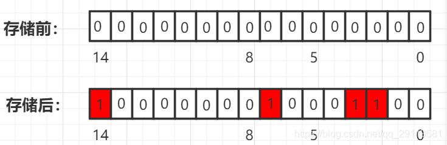

[toc]

# 简介

`BitMap`的基本思想就是用一个**`bit`位**来标记某一个元素的状态，而`key`为该元素。由于采用了`Bit`为单位来存储数据，因此在存储空间方面，可以大大节省

```
如果有20亿的int，那么占用得内存：20亿 * 4 / (1024 * 1024 * 1024) = 7.5G
如果使用位存储 20亿 * 1 / (8 * 1024 * 1024 * 1024) = 0.233G
```



# 应用场景

`BitMap`非常适合对整型的海量数据进行**查询统计**、**排序**、**去重**；适合对两个集合做**交集**、**并集**运算。

## 快速排序

1.  需要开辟一个大小的`bit`空间(2^n)，每个`bit`位都设置为`0`；
2. 将元素与`bit`空间映射，`key`为元素值。如果元素能映射到，`bit`位置为`1`;
3. 遍历`bit`空间，将`bit`位为`1`的输出，即可以达到排序的目的。

## 快速去重

1. 可以使用`2bits`对一个数字的状态进行存储，初始状态00，如 00：不存在，01：有一个，10：有重复；
2. 将这大量数据放入`bit`空间，将状态设置为01；如果状态为11的时候，则保存状态位不变，表示出现多次；
3. 最后统计状态位为01的个数，就可以得到不可重复的数字。

## 快速查找

int数组中的一个元素是4字节占32位，那么除以32就知道元素的下标，对32求余数（%32）就知道它在哪一位，如果该位是1，则表示存在。