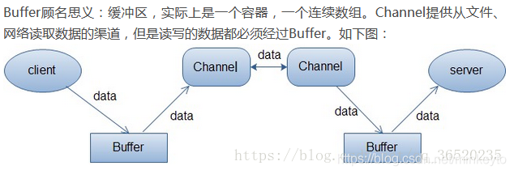
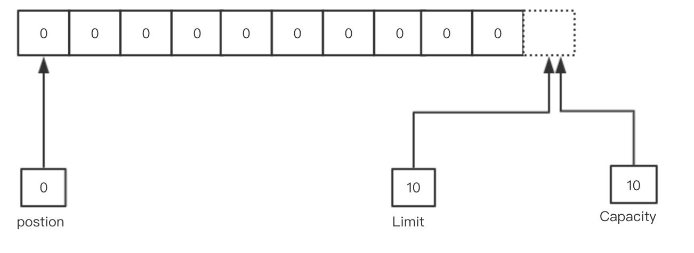
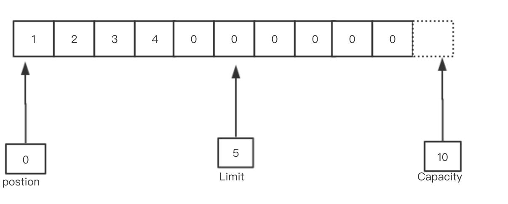
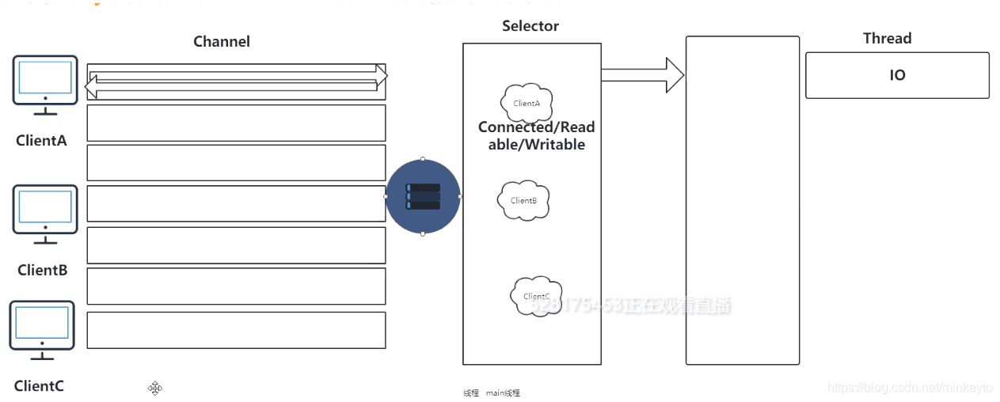

|                             NIO                              |                            IO                            |
| :----------------------------------------------------------: | :------------------------------------------------------: |
|                      以块的方式处理数据                      |           以最基础的字节流的形式去写入和读出的           |
|             以最基础的字节流的形式去写入和读出的             | 用OutputStream和InputStream 输入流的形式来进行处理数据的 |
|                       通道是可以双向的                       |                      流只能是单向的                      |
| 缓冲区（其实也就是一个字节数组）还可以进行分片，可以建立只读缓冲区、直接缓冲区和间接缓冲区 |                                                          |
|                   采用的是多路复用的IO模型                   |                       阻塞的IO模型                       |



## 通道

通道是对原 I/O 包中的流的模拟。到任何目的地(或来自任何地方)的所有数据都必须通过一个 Channel 对象（通道）。

一个 Buffer 实质上是一个容器对象。发送给一个通道的所有对象都必须**首先放到缓冲区中**；同样地，从通道中读取的任何数据都要**读到缓冲区**中。Channel是一个对象，可以通过它读取和写入数据。

## 缓冲区

- Buffer 是一个对象， 它包含一些要写入或者刚读出的数据。

- 在 NIO 库中，所有数据都是用缓冲区处理的。在读取数据时，它是直接读到缓冲区中的。在写入数据时，它是写入到缓冲区中的。任何时候访问 NIO 中的数据，您都是将它放到缓冲区中。
- 缓冲区实质上是一个数组。通常它是一个字节数组，但是也可以使用其他种类的数组。但是一个缓冲区不 仅仅 是一个数组。缓冲区提供了对数据的结构化访问，而且还可以跟踪系统的读/写进程

# NIO的底层

- capacity 缓冲区数组的总长度
- position 下一个要操作的数据元素的位置
- limit 缓冲区数组中不可操作的下一个元素的位置，limit<=capacity
- mark 用于记录当前 position 的前一个位置或者默认是 0

1. 这一步其实是当我们刚开始初始化这个buffer数组

   ```
   IntBuffer intBuffer = IntBuffer.allocate(10);
   ```

   

2. 当往buffer数组中开始写入的时候几个字节的时候，position会移动数据的结束的下一个位置，这个时候需要把buffer中的数据写到channel管道中，所以此时就需要用这个`buffer.flip()`方法

   ```
   intBuffer.flip()
   ```

   

3. 当调用完2中的方法时，这样的话其实就可以知道你刚刚写到buffer中的数据是在position---->limit之间，然后下一步调用`clear()` 。这时底层操作系统就可以从缓冲区中正确读取这 5 个字节数据发送出去了。在下一次写数据之前我们在调一下 clear() 方法。缓冲区的索引状态又回到初始位置。

   ```
   intBuffer.clear()
   ```

   

```
public void selector() throws IOException {
//先给缓冲区申请内存空间
        ByteBuffer buffer = ByteBuffer.allocate(1024);
     //打开Selector为了它可以轮询每个 Channel 的状态
        Selector selector = Selector.open();
        ServerSocketChannel ssc = ServerSocketChannel.open();
        ssc.configureBlocking(false);//设置为非阻塞方式
        ssc.socket().bind(new InetSocketAddress(8080));
        ssc.register(selector, SelectionKey.OP_ACCEPT);//注册监听的事件
        while (true) {
            Set selectedKeys = selector.selectedKeys();//取得所有key集合
            Iterator it = selectedKeys.iterator();
            while (it.hasNext()) {
                SelectionKey key = (SelectionKey) it.next();
                if ((key.readyOps() & SelectionKey.OP_ACCEPT) == SelectionKey.OP_ACCEPT) {
                    ServerSocketChannel ssChannel = (ServerSocketChannel) key.channel();
                 SocketChannel sc = ssChannel.accept();//接受到服务端的请求
                    sc.configureBlocking(false);
                    sc.register(selector, SelectionKey.OP_READ);
                    it.remove();
                } elseif
                ((key.readyOps() & SelectionKey.OP_READ) == SelectionKey.OP_READ) {
                    SocketChannel sc = (SocketChannel) key.channel();
                    while (true) {
                        buffer.clear();
                        int n = sc.read(buffer);//读取数据
                        if (n <= 0) {
                            break;
                        }
                        buffer.flip();
                    }
                    it.remove();
                }
            }
        }
}
```



### NIO的工作流程步骤

1. 首先是先创建ServerSocketChannel 对象，和真正处理业务的线程池
2. 然后给刚刚创建的ServerSocketChannel 对象进行绑定一个对应的端口，然后设置为非阻塞
3. 然后创建Selector对象并打开，然后把这Selector对象注册到ServerSocketChannel 中，并设置好监听的事件，监听 SelectionKey.OP_ACCEPT
4. 接着就是Selector对象进行死循环监听每一个Channel通道的事件，循环执行 Selector.select() 方法，轮询就绪的 Channel
5. 从Selector中获取所有的SelectorKey（这个就可以看成是不同的事件），如果SelectorKey是处于 OP_ACCEPT 状态，说明是新的客户端接入，调用 ServerSocketChannel.accept 接收新的客户端。
6. 然后对这个把这个接受的新客户端的Channel通道注册到ServerSocketChannel上，并且把之前的OP_ACCEPT 状态改为SelectionKey.OP_READ读取事件状态，并且设置为非阻塞的，然后把当前的这个SelectorKey给移除掉，说明这个事件完成了
7. 如果第5步的时候过来的事件不是OP_ACCEPT 状态，那就是OP_READ读取数据的事件状态，然后调用本文章的上面的那个读取数据的机制就可以了

### Netty的工作流程步骤

1. 创建 NIO 线程组 EventLoopGroup 和 ServerBootstrap。
2. 设置 ServerBootstrap 的属性：线程组、SO_BACKLOG 选项，设置 NioServerSocketChannel 为 Channel，设置业务处理 Handler
3. 绑定端口，启动服务器程序。
4. 在业务处理 TimeServerHandler 中，读取客户端发送的数据，并给出响应