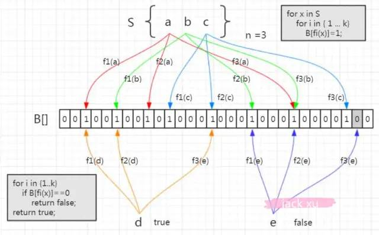

[toc]

# 背景

布隆过滤器是一种概率型数据结构，它的特点是高效的插入和查询，能确定某个字符串一定存在或者可能存在。

**布隆过滤器不存储具体数据，所以占用空间小，查询结果存在误差，但误差可控，同时不支持删除操作。**

# 构成

布隆过滤器本质上和散列表一样，但是布隆过滤器为了节约内存，使用的**位图**

# 理论

```
当一个元素加入位图时，通过k个hash函数将元素映射到位图的k个点上，并将位图设置为1。当进行检索时，对元素进行k个hash函数 元素后，检查对应的k个点都是否为1；如果有不为1的点，那么认为该值是不存在，如果全部为1，则可能存在。
```



如图：集合中有3个元素，当我们要存时，会经过f1(a)，f2(a)，f3(a)三个哈希函数的计算，在相应的位图上存入1。当取的时候，元素a通过f1(a)函数计算，发现这个位置上是1，没问题，第二个位置也是1，第三个位置上也是 1，这时候我们说这个a在布隆过滤器中是存在的。

再来看另一个元素，e 元素。我们要判断它在容器里面是否存在，一样地要用这三个函数去计算。第一个位置是 1，第二个位置是 1，第三个位置是 0。那么e元素能不能判断是否在布隆过滤器中？答案是肯定的，e一定不存在。你想啊，如果e存在的话，他存进去的时候这三个位置都置为1，现在查出来有一个位置是0，证明他没存进去。

> *从容器的角度来说：*
>
> - *如果布隆过滤器判断元素在集合中存在，不一定存在*
> - *如果布隆过滤器判断不存在，一定不存在*

> *从元素的角度来说：*
>
> - *如果元素实际存在，布隆过滤器一定判断存在*
> - *如果元素实际不存在，布隆过滤器可能判断存在*

```
<dependency>
	<groupId>com.google.guava</groupId>
    <artifactId>guava</artifactId>
    <version>29.0-jre</version>
</dependency>
```

```
    private static final int insertions = 1000000;
    private static double fpp = 0.0002;

    public static void main(String[] args) {
        BloomFilter<String> bf = BloomFilter.create(Funnels.stringFunnel(Charsets.UTF_8), insertions, fpp);

        Set<String> sets = new HashSet<>(insertions);

        List<String> lists = new ArrayList<>(insertions);

        for (int i = 0; i < insertions; i++) {
            String uuid = UUID.randomUUID().toString();
            bf.put(uuid);
            sets.add(uuid);
            lists.add(uuid);
        }

        int rightNum = 0, wrongNum = 0;

        for (int i = 0; i < 10000; i++) {
            String data = i % 100 == 0 ? lists.get(i / 100) : UUID.randomUUID().toString();

            if (bf.mightContain(data)) {
                if (sets.contains(data)) {
                    rightNum++;
                    continue;
                }

                wrongNum++;
            }
        }

        BigDecimal percent = new BigDecimal(wrongNum).divide(new BigDecimal(9900), 2, RoundingMode.HALF_UP);
        BigDecimal bingo = new BigDecimal(9900 - wrongNum).divide(new BigDecimal(9900), 2, RoundingMode.HALF_UP);
        System.out.println("在100W个元素中，判断100个实际存在的元素，布隆过滤器认为存在的：" + rightNum);
        System.out.println("在100W个元素中，判断9900个实际不存在的元素，误认为存在的：" + wrongNum + "，命中率：" + bingo + "，误判率：" + percent);
    }
```

# Redis实现布隆过滤器

可以把数据放在redis中，用redis来实现布隆过滤器，这就需要我们自己设计映射函数，自己度量二进制向量的长度.

```
/**
 * 布隆过滤器核心类
 *
 * @param <T>
 * @author jack xu
 */
public class BloomFilterHelper<T> {
    private int numHashFunctions;
    private int bitSize;
    private Funnel<T> funnel;

    public BloomFilterHelper(int expectedInsertions) {
        this.funnel = (Funnel<T>) Funnels.stringFunnel(Charset.defaultCharset());
        bitSize = optimalNumOfBits(expectedInsertions, 0.03);
        numHashFunctions = optimalNumOfHashFunctions(expectedInsertions, bitSize);
    }

    public BloomFilterHelper(Funnel<T> funnel, int expectedInsertions, double fpp) {
        this.funnel = funnel;
        bitSize = optimalNumOfBits(expectedInsertions, fpp);
        numHashFunctions = optimalNumOfHashFunctions(expectedInsertions, bitSize);
    }

    public int[] murmurHashOffset(T value) {
        int[] offset = new int[numHashFunctions];

        long hash64 = Hashing.murmur3_128().hashObject(value, funnel).asLong();
        int hash1 = (int) hash64;
        int hash2 = (int) (hash64 >>> 32);
        for (int i = 1; i <= numHashFunctions; i++) {
            int nextHash = hash1 + i * hash2;
            if (nextHash < 0) {
                nextHash = ~nextHash;
            }
            offset[i - 1] = nextHash % bitSize;
        }

        return offset;
    }

    /**
     * 计算bit数组长度
     */
    private int optimalNumOfBits(long n, double p) {
        if (p == 0) {
            p = Double.MIN_VALUE;
        }
        return (int) (-n * Math.log(p) / (Math.log(2) * Math.log(2)));
    }

    /**
     * 计算hash方法执行次数
     */
    private int optimalNumOfHashFunctions(long n, long m) {
        return Math.max(1, (int) Math.round((double) m / n * Math.log(2)));
    }
}
```

```
public class RedisBloomFilter<T> {
    @Autowired
    private RedisTemplate redisTemplate;

    /**
     * 删除缓存的KEY
     *
     * @param key KEY
     */
    public void delete(String key) {
        redisTemplate.delete(key);
    }

    /**
     * 根据给定的布隆过滤器添加值，在添加一个元素的时候使用，批量添加的性能差
     *
     * @param bloomFilterHelper 布隆过滤器对象
     * @param key               KEY
     * @param value             值
     * @param <T>               泛型，可以传入任何类型的value
     */
    public <T> void add(BloomFilterHelper<T> bloomFilterHelper, String key, T value) {
        int[] offset = bloomFilterHelper.murmurHashOffset(value);
        for (int i : offset) {
            redisTemplate.opsForValue().setBit(key, i, true);
        }
    }

    /**
     * 根据给定的布隆过滤器添加值，在添加一批元素的时候使用，批量添加的性能好，使用pipeline方式(如果是集群下，请使用优化后RedisPipeline的操作)
     *
     * @param bloomFilterHelper 布隆过滤器对象
     * @param key               KEY
     * @param valueList         值，列表
     * @param <T>               泛型，可以传入任何类型的value
     */
    public <T> void addList(BloomFilterHelper<T> bloomFilterHelper, String key, List<T> valueList) {
        redisTemplate.executePipelined(new RedisCallback<Long>() {
            @Override
            public Long doInRedis(RedisConnection connection) throws DataAccessException {
                connection.openPipeline();
                for (T value : valueList) {
                    int[] offset = bloomFilterHelper.murmurHashOffset(value);
                    for (int i : offset) {
                        connection.setBit(key.getBytes(), i, true);
                    }
                }
                return null;
            }
        });
    }

    /**
     * 根据给定的布隆过滤器判断值是否存在
     *
     * @param bloomFilterHelper 布隆过滤器对象
     * @param key               KEY
     * @param value             值
     * @param <T>               泛型，可以传入任何类型的value
     * @return 是否存在
     */
    public <T> boolean contains(BloomFilterHelper<T> bloomFilterHelper, String key, T value) {
        int[] offset = bloomFilterHelper.murmurHashOffset(value);
        for (int i : offset) {
            if (!redisTemplate.opsForValue().getBit(key, i)) {
                return false;
            }
        }
        return true;
    }
}
```

```
public static void main(String[] args) {
        RedisBloomFilter redisBloomFilter = new RedisBloomFilter();
        int expectedInsertions = 1000;
        double fpp = 0.1;
        redisBloomFilter.delete("bloom");
        BloomFilterHelper<CharSequence> bloomFilterHelper = new BloomFilterHelper<>(Funnels.stringFunnel(Charset.defaultCharset()), expectedInsertions, fpp);
        int j = 0;
        // 添加100个元素
        List<String> valueList = new ArrayList<>();
        for (int i = 0; i < 100; i++) {
            valueList.add(i + "");
        }
        long beginTime = System.currentTimeMillis();
        redisBloomFilter.addList(bloomFilterHelper, "bloom", valueList);
        long costMs = System.currentTimeMillis() - beginTime;
        log.info("布隆过滤器添加{}个值，耗时：{}ms", 100, costMs);
        for (int i = 0; i < 1000; i++) {
            boolean result = redisBloomFilter.contains(bloomFilterHelper, "bloom", i + "");
            if (!result) {
                j++;
            }
        }
        log.info("漏掉了{}个,验证结果耗时：{}ms", j, System.currentTimeMillis() - beginTime);
    }
```

注意这里用的是`addList`，他的底层是pipelining管道，而add方法的底层是一个个for循环的setBit，这样的速度效率是很慢的，但是他能有返回值，知道是否插入成功，而pipelining是不知道。

# 布隆过滤器工作位置

第一步是将数据库所有的数据加载到布隆过滤器。

第二步当有请求来的时候先去布隆过滤器查询，如果bf说没有，

第三步直接返回。

# 应用场景

- 缓存穿透的解决：服务端（server）请求数据时，缓存和数据库都不包含数据，最终请求压力全部涌向数据库。
- 热key限流
- 

# 总结

- 布隆过滤器对value进行多次hash，将其hash值作为索引在`bitMap`数组对应的位置中插入`1`；
- 如果在数组上匹配不到数据，那么该数据**一定不存在**；
- 如果在数组上能匹配到数据，那么这个数据只是**可能存在**。

