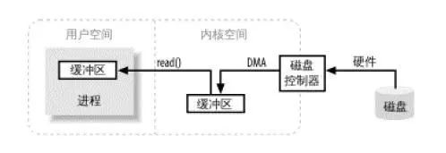
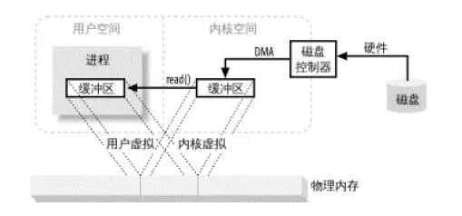

# 传统IO

基于传统的IO方式，底层实际上通过调用`read()`和`write()`来实现。通过`read()`把数据**从硬盘读取到内核缓冲区**，**再复制到用户缓冲区**；然后再通过`write()`写入到`socket缓冲区`，最后写入网卡设备。

整个过程发生了**4次用户态和内核态的上下文切换**和**4次拷贝**，具体流程如下：


1. 用户进程通过`read()`方法向操作系统发起调用，此时上下文从用户态转向内核态
2. DMA控制器把数据从硬盘中拷贝到读缓冲区
3. CPU把读缓冲区数据拷贝到应用缓冲区，上下文从内核态转为用户态，`read()`返回
4. 用户进程通过`write()`方法发起调用，上下文从用户态转为内核态
5. CPU将应用缓冲区中数据拷贝到socket缓冲区
6. DMA控制器把数据从socket缓冲区拷贝到网卡，上下文从内核态切换回用户态，`write()`返回

**用户空间**指的就是**用户进程的运行空间**，**内核空间**就是**内核的运行空间**。如果**进程**运行**在内核空间**就是内核态，运行**在用户空间**就是用户态。为了安全起见，他们之间是互相隔离的，而在用户态和内核态之间的上下文切换也是比较耗时的。

**零拷贝技术**是指计算机执行操作时，**CPU不需要先将数据从某处内存复制到另一个特定区域**，这种技术通常用于通过网络传输文件时节省CPU周期和内存带宽。对于零拷贝而言，**并非真的是完全没有数据拷贝的过程**，只不过是**减少用户态和内核态的切换次数**以及**CPU拷贝的次数**。

### 缓冲区

缓冲区是所有I/O的基础，I/O讲的无非就是把数据移进或移出缓冲区；进程执行I/O操作，就是向操作系统发出请求，让它要么把缓冲区的数据排干(写)，要么填充缓冲区(读)；下面看一个java进程发起read请求加载数据大致的流程图：



> 进程发起read请求之后，内核接收到read请求之后，会先检查内核空间中是否已经存在进程所需要的数据，如果已经存在，则直接把数据copy给进程的缓冲区；如果没有，内核随即向磁盘控制器发出命令，要求从磁盘读取数据，磁盘控制器把数据直接写入内核read缓冲区，这一步通过DMA完成；接下来就是内核将数据copy到进程的缓冲区； 

> 如果进程发起write请求，同样需要把用户缓冲区里面的数据copy到内核的socket缓冲区里面，然后再通过DMA把数据copy到网卡中，发送出去； 

关于零拷贝提供了两种方式分别是：mmap+write方式，sendfile方式；

### 虚拟内存

1. 一个以上的虚拟地址可以指向同一个物理内存地址， 

2. 虚拟内存空间可大于实际可用的物理地址； 

   利用第一条特性可以把内核空间地址和用户空间的虚拟地址映射到同一个物理地址，这样DMA就可以填充对内核和用户空间进程同时可见的缓冲区了



### mmap+write方式

使用mmap+write方式代替原来的read+write方式，mmap是一种内存映射文件的方法，即将一个文件或者其它对象映射到进程的地址空间，实现文件磁盘地址和进程虚拟地址空间中一段虚拟地址的一一对映关系；这样就可以省掉原来内核read缓冲区copy数据到用户缓冲区，但是还是需要内核read缓冲区将数据copy到内核socket缓冲区


1. 用户进程通过`mmap()`方法向操作系统发起调用，上下文从用户态转向内核态
2. DMA控制器把数据从硬盘中拷贝到读缓冲区
3. **上下文从内核态转为用户态，mmap调用返回**
4. 用户进程通过`write()`方法发起调用，上下文从用户态转为内核态
5. **CPU将读缓冲区中数据拷贝到socket缓冲区**
6. DMA控制器把数据从socket缓冲区拷贝到网卡，上下文从内核态切换回用户态，`write()`返回

### sendfile方式

sendfile系统调用在内核版本2.1中被引入，目的是简化通过网络在两个通道之间进行的数据传输过程。sendfile系统调用的引入，不仅减少了数据复制，还减少了上下文切换的次数。数据传送只发生在内核空间，所以减少了一次上下文切换；但是还是存在一次copy，能不能把这一次copy也省略掉，Linux2.4内核中做了改进，将Kernel buffer中对应的数据描述信息（内存地址，偏移量）记录到相应的socket缓冲区当中，这样连内核空间中的一次cpu copy也省掉了。


1. 用户进程通过`sendfile()`方法向操作系统发起调用，上下文从用户态转向内核态
2. DMA控制器把数据从硬盘中拷贝到读缓冲区
3. CPU将读缓冲区中数据拷贝到socket缓冲区
4. DMA控制器把数据从socket缓冲区拷贝到网卡，上下文从内核态切换回用户态，`sendfile`调用返回

`sendfile`方法IO数据对用户空间完全不可见，所以只能适用于完全不需要用户空间处理的情况，比如静态文件服务器。

### sendfile+DMA Scatter/Gather


整个过程发生了**2次用户态和内核态的上下文切换**和**2次拷贝**，其中更重要的是完全没有CPU拷贝，具体流程如下：

1. 用户进程通过`sendfile()`方法向操作系统发起调用，上下文从用户态转向内核态
2. DMA控制器利用scatter把数据从硬盘中拷贝到读缓冲区离散存储
3. CPU把读缓冲区中的文件描述符和数据长度发送到socket缓冲区
4. DMA控制器根据文件描述符和数据长度，使用scatter/gather把数据从内核缓冲区拷贝到网卡
5. `sendfile()`调用返回，上下文从内核态切换回用户态

`DMA gather`和`sendfile`一样数据对用户空间不可见，而且需要硬件支持，同时输入文件描述符只能是文件，但是过程中完全没有CPU拷贝过程，极大提升了性能。

# 总结

由于CPU和IO速度的差异问题，产生了DMA技术，通过DMA搬运来减少CPU的等待时间。

传统的IO`read+write`方式会产生2次DMA拷贝+2次CPU拷贝，同时有4次上下文切换。

而通过`mmap+write`方式则产生2次DMA拷贝+1次CPU拷贝，4次上下文切换，通过内存映射减少了一次CPU拷贝，可以减少内存使用，适合大文件的传输。

`sendfile`方式是新增的一个系统调用函数，产生2次DMA拷贝+1次CPU拷贝，但是只有2次上下文切换。因为只有一次调用，减少了上下文的切换，但是用户空间对IO数据不可见，适用于静态文件服务器。

`sendfile+DMA gather`方式产生2次DMA拷贝，没有CPU拷贝，而且也只有2次上下文切换。虽然极大地提升了性能，但是需要依赖新的硬件设备支持。

## **Java零拷贝**

```
File file = new File("E:\\data\\logs\\log2");
long len = file.length();
byte[] ds = new byte[(int) len];
// nio提供的FileChannel提供了map()方法，该方法可以在一个打开的文件和MappedByteBuffer之间建立一个虚拟内存映射，
// MappedByteBuffer继承于ByteBuffer，类似于一个基于内存的缓冲区，只不过该对象的数据元素存储在磁盘的一个文件中
// MapMode：映射的模式，可选项包括：READ_ONLY，READ_WRITE，PRIVATE； 
// Position：从哪个位置开始映射，字节数的位置； 
// Size：从position开始向后多少个字节；
MappedByteBuffer mappedByteBuffer = new FileInputStream(file)
          .getChannel().map(FileChannel.MapMode.READ_ONLY, 0, len);

for (int offset = 0; offset < len; offset++) {
	byte b = mappedByteBuffer.get();
    ds[offset] = b;
}

Scanner scan = new Scanner(new ByteArrayInputStream(ds)).useDelimiter(" ");

while (scan.hasNext()) {
	System.out.println(scan.next() + " ");
}
        
        
String[] files = new String[1];
files[0] = "E:\\data\\logs\\log2";

for (int i = 0; i < files.length; i++) {
	FileInputStream fis = new FileInputStream(files[i]);
    FileChannel channel = fis.getChannel();
    // transferTo()允许将一个通道交叉连接到另一个通道，而不需要一个中间缓冲区来传递数据； 
    channel.transferTo(0, channel.size(), Channels.newChannel(System.out));
    channel.close();
    fis.close();
}
```

## **Netty零拷贝**

netty提供了零拷贝的buffer，在传输数据时，最终处理的数据会需要对单个传输的报文，进行组合和拆分，Nio原生的ByteBuffer无法做到，netty通过提供的Composite(组合)和Slice(拆分)两种buffer来实现零拷贝。

```
    public class CompositeChannelBuffer extends AbstractChannelBuffer {

        private final ByteOrder order;
        private ChannelBuffer[] components;
        private int[] indices;
        private int lastAccessedComponentId;
        private final boolean gathering;

        public byte getByte(int index) {
            int componentId = componentId(index);
            return components[componentId].getByte(index - indices[componentId]);
        }
```

components用来保存的就是所有接收到的buffer，indices记录每个buffer的起始位置，lastAccessedComponentId记录上一次访问的ComponentId；CompositeChannelBuffer并不会开辟新的内存并直接复制所有ChannelBuffer内容，而是直接保存了所有ChannelBuffer的引用，并在子ChannelBuffer里进行读写，实现了零拷贝。


